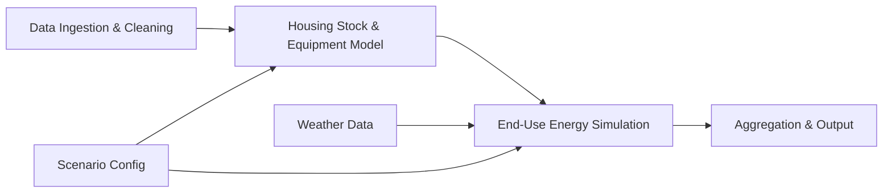
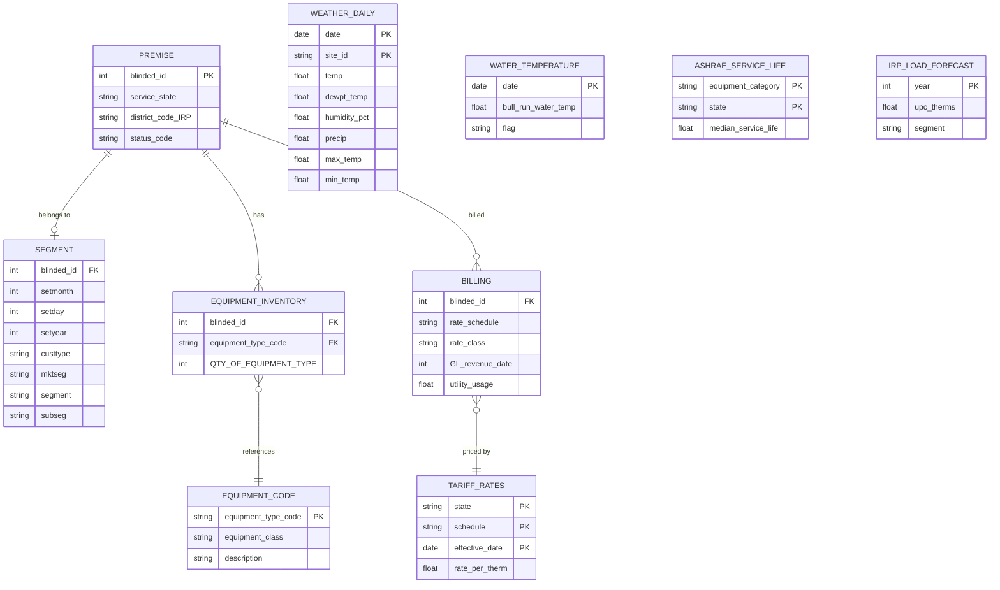

# Design Document: NW Natural End-Use Forecasting Model

## Overview

This design describes a bottom-up residential end-use demand forecasting model for NW Natural's Integrated Resource Planning (IRP) process. The model disaggregates residential natural gas demand by end use (space heating, water heating, cooking, clothes drying, fireplaces/decorative, and other), enabling scenario analysis for technology adoption, electrification, and efficiency improvements.

The system is a Python-based prototype built for academic capstone delivery. It ingests NW Natural's blinded premise, equipment, segment, and weather data, constructs a housing stock model with equipment inventories, simulates per-unit energy consumption driven by weather and equipment characteristics, and aggregates results to system-level demand projections. Scenarios are defined via configuration and run independently for comparison.

### Data Folder Organization

Data is organized by source provenance:

```
Data/
+-- NWNatural Data/            # Supplied by NW Natural (blinded/proprietary)
|   +-- billing_data_blinded.csv
|   +-- BullRunWaterTemperature.csv
|   +-- DailyCalDay1985_Mar2025.csv
|   +-- DailyGasDay2008_Mar2025.csv
|   +-- equipment_codes.csv
|   +-- equipment_data_blinded.csv
|   +-- premise_data_blinded.csv
|   +-- segment_data_blinded.csv
|   +-- small_billing_data_blinded.csv
|   +-- Portland_snow.csv
+-- 2022 RBSA Datasets/        # NEEA Residential Building Stock Assessment
+-- 2017-RBSA-II-Combined-Database/  # NEEA RBSA-II site-level survey data (2017)
+-- rbsam_y1/                  # NEEA RBSA sub-metered end-use data Year 1 (2012-2013, 4 TXT ~328MB each)
+-- rbsam_y2/                  # NEEA RBSA sub-metered end-use data Year 2 (2013-2014, 5 TXT ~300MB each)
+-- rbsa-metering-data-dictionary-2016-2017.xlsx  # Data dictionary for rbsam metering files
+-- 2017-RBSA-II-Database-User-Manual.pdf         # User manual for 2017 RBSA-II database
+-- ashrae/                    # ASHRAE public database exports
+-- 10-Year Load Decay Forecast (2025-2035).csv  # NW Natural 2025 IRP UPC forecast
+-- prior load decay data description.txt        # Era framework and RBSA vintage mapping
+-- prior load decay data reconstructed.txt      # Historical UPC 2005-2025
+-- prior load decay data simulated.txt          # Year-by-year UPC multipliers
+-- or_rate_case_history.csv   # Manually extracted tariff data (team-created)
+-- or_rates_oct_2025.csv
+-- or_wacog_history.csv
+-- wa_rate_case_history.csv
+-- wa_rates_nov_2025.csv
+-- wa_wacog_history.csv
+-- Baseload Consumption Factors.csv              # DOE/RECS/RBSA baseload parameters
+-- Baseload Consumption factors.py               # Reference implementation
+-- Baseload Consumption factors explanation.txt   # Methodology documentation
+-- nw_energy_proxies.csv                          # Building envelope UA, Weibull params, baseload (compact)
+-- nw_energy_proxies.py                           # Reference loader for nw_energy_proxies.csv
+-- nw_energy_proxies explanation.txt              # Documentation for proxy parameters
+-- Integrated Resource Plan (IRP),.txt             # IRP UPC forecast context and methodology
+-- equipment life math.txt                        # DOE/NEMS Weibull parameter documentation
+-- NW Natural Service Territory Census data.csv   # County FIPS codes for NWN service territory (16 counties)
+-- B25034-5y/                 # Downloaded ACS B25034 national-level data (2010-2024, backup/reference)
+-- B25034-5y-county/          # ACS 5-Year B25034 county-level data for NWN service territory (2009-2023, 16 counties)
+-- B25040-5y-county/          # ACS 5-Year B25040 (House Heating Fuel) county-level (2009-2023, 16 counties)
+-- B25024-5y-county/          # ACS 5-Year B25024 (Units in Structure) county-level (2009-2023, 16 counties)
+-- Residential Energy Consumption Servey/  # EIA RECS microdata (1993-2020)
|   +-- recs2020_public_v7.csv             # 2020 RECS (799 cols, state-level geo)
|   +-- recs2015_public_v4.csv             # 2015 RECS (759 cols, division-level)
|   +-- 2009/recs2009_public.csv           # 2009 RECS (940 cols)
|   +-- 2005/RECS05alldata.csv             # 2005 RECS (1075 cols)
|   +-- 2001/                              # 2001 RECS (fixed-width, reference only)
|   +-- 1997/                              # 1997 RECS (fixed-width, reference only)
|   +-- 1993/                              # 1993 RECS (fixed-width, reference only)
# Note: Green Building Registry data is fetched via API at runtime, not stored as files
+-- PSU projection data/        # PSU Population Research Center county forecasts
|   +-- 2025/                  # Region 4: Benton, Lane, Lincoln, Linn, Marion, Polk (YEAR/POPULATION/TYPE)
|   +-- 2024/                  # Region 3: Clackamas, Clatsop, Columbia, Multnomah, Washington, Yamhill + Region 2 (YEAR/POPULATION)
|   +-- 2023/                  # Region 1: Coos (wide format: areas as rows, select years as columns)
+-- noaa_normals/               # NOAA 30-year Climate Normals (1991-2020) for all 11 NWN weather stations
|   +-- {ICAO}_daily_normals.csv   # Daily normal temp (avg/max/min), HDD, CDD (365 rows per station)
|   +-- {ICAO}_monthly_normals.csv # Monthly normal temp, HDD, CDD (12 rows per station)
+-- ofm_april1_housing.xlsx     # WA OFM postcensal housing unit estimates (2020-2025, all WA counties)
# Note: Census ACS B25034 county-level data is fetched via Census API at runtime
```

### Key Design Decisions

1. **End-use categories derived from equipment_codes.csv**: The equipment_class and equipment_type_code fields map directly to end-use categories. The HEAT class covers space heating, WTR covers water heating, FRPL covers fireplaces, and OTHR is further subdivided by code (RRGE/09CR -> cooking, RDRY/C9DR -> drying, etc.).

2. **Weather station assignment by district**: Premises are assigned to weather stations based on district_code_IRP. A static mapping table links each IRP district to its nearest weather station SiteId.

3. **Heating Degree Day (HDD) driven space heating**: Space heating consumption is modeled as a function of HDD (base 65F) computed from daily temperature data, scaled by equipment efficiency and housing characteristics.

4. **Bull Run water temperature for water heating**: Water heating demand uses the temperature differential between a target hot water temperature (typically 120F) and incoming cold water temperature (proxied by Bull Run water temperature data).

5. **Baseload end uses as flat annual consumption**: Non-weather-sensitive end uses (cooking, drying, fireplaces, decorative) are modeled as constant annual consumption per equipment unit, adjusted by equipment efficiency.

6. **Tariff-based billing-to-therms conversion**: Billing data contains dollar amounts, not therms. Historical tariff rates are reconstructed from six manually extracted CSV files: or_rate_case_history.csv, or_rates_oct_2025.csv, or_wacog_history.csv (Oregon), and wa_rate_case_history.csv, wa_rates_nov_2025.csv, wa_wacog_history.csv (Washington). The total rate per therm = base distribution charge + WACOG. Current residential rates: OR Schedule 2 = $1.41220/therm, WA Schedule 2 = $1.24164/therm. Historical rates are reconstructed by working backward from current rates using rate case granted percentages and WACOG history.

7. **Scenario parameters as configuration dictionaries**: Each scenario is a Python dictionary specifying technology adoption rates, efficiency trajectories, and electrification targets, enabling independent runs with shared baseline logic.

8. **RBSA 2022 as building characteristics proxy**: The 2022 Residential Building Stock Assessment (RBSA) dataset from NEEA provides Pacific Northwest-specific building characteristics missing from NW Natural's blinded data. Key RBSA tables used:
   - SiteDetail.csv -- Conditioned area (sqft), home vintage, bedrooms, bathrooms, heating/cooling zones, building type, gas utility, NWN service flag, site case weights
   - Mechanical_HeatingAndCooling.csv -- HVAC system types, fuel, AFUE/COP efficiency ratings, vintage, capacity (BTUh)
   - Mechanical_WaterHeater.csv -- Water heater type (storage/tankless), fuel, efficiency (EF), capacity, vintage
   - Appliance_Stove_Oven.csv -- Cooking equipment fuel type (gas/electric)
   - Appliance_Laundry.csv -- Dryer fuel type (gas/electric), heat pump dryer flag
   - Building_Shell_One_Line.csv -- Envelope U-values (ceiling, wall, floor, window), whole-house UA
   RBSA sites are filtered to NWN_SF_StrataVar = 'NWN' or Gas_Utility = 'NW NATURAL GAS' to match NW Natural's service territory. Site case weights enable population-level estimates.

9. **ASHRAE equipment service life and maintenance cost data**: Equipment useful life assumptions and maintenance costs are sourced from the ASHRAE public database, downloaded as state-specific XLS files:
   - OR-ASHRAE_Service_Life_Data.xls -- Median service life (years) by equipment type for Oregon
   - WA-ASHRAE_Service_Life_Data.xls -- Median service life (years) by equipment type for Washington
   - OR-ASHRAE_Maintenance_Cost_Data.xls -- Annual maintenance cost by equipment type for Oregon
   - WA-ASHRAE_Maintenance_Cost_Data.xls -- Annual maintenance cost by equipment type for Washington
   ASHRAE service life data replaces the hardcoded USEFUL_LIFE defaults in config.py with empirically grounded median lifetimes by equipment category. State-specific values are used where premises can be matched to OR or WA.

10. **NW Natural IRP load decay data as validation and calibration target**: NW Natural's 2025 IRP provides Use Per Customer (UPC) load decay data that serves as both a historical calibration reference and a forward-looking validation target. Four files in Data/ capture this:
   - 10-Year Load Decay Forecast (2025-2035).csv -- Forward UPC projection at -1.19%/yr from 648 therm baseline
   - prior load decay data reconstructed.txt -- Historical UPC by year back to 2005 (835 -> 648 therms)
   - prior load decay data simulated.txt -- Year-by-year UPC multipliers vs 2025 baseline
   - prior load decay data description.txt -- Three-era framework with decay rates and RBSA vintage mapping
   
   The three-era framework provides vintage-level calibration anchors: pre-2010 homes (~820 therms, 80% AFUE), 2011-2019 (~720 therms, 90%+ AFUE condensing), 2020+ (~650 therms, heat pump hybrids). Historical decay rates: -1.15%/yr (2005-2015), -1.55%/yr (2015-2020), -1.19%/yr (2020-2025). The model's bottom-up UPC projections are compared against these top-down forecasts at both aggregate and vintage-cohort levels.

11. **Weibull survival model for equipment replacement**: Equipment replacement timing uses a Weibull survival function S(t) = e^(-(t/eta)^beta) rather than a deterministic age cutoff. The scale parameter eta is derived from ASHRAE median service life data, and the shape parameter beta (default 3.0 for HVAC, 2.5 for appliances) controls the failure rate distribution. This produces a realistic spread of replacements over time rather than all units of the same vintage failing simultaneously.

12. **Green Building Registry (GBR) API as supplemental building data source**: The Green Building Registry API (api.greenbuildingregistry.com) provides Home Energy Score data, energy audit results, and building characteristics for properties in NW Natural's service territory. Data is queried by zip code for zip codes within the NW Natural service area. GBR data supplements RBSA by providing property-level energy performance metrics (Home Energy Score, estimated annual energy use, insulation levels, window types) that can refine building shell assumptions and validate RBSA-derived distributions. API access requires an API key stored in environment variables (not committed to source).

13. **Baseload consumption factors from DOE/RECS/RBSA/NEEA**: Non-weather-sensitive end-use consumption is parameterized using a structured lookup table (Baseload Consumption Factors.csv) combining DOE RECS 2020 PNW estimates, RBSA 2022 metered data, and NEEA metering studies. Three files in Data/ capture this:
   - Baseload Consumption Factors.csv -- Structured parameter table with Category/SubCategory/Parameter/Value/Unit/Source columns
   - Baseload Consumption factors.py -- Reference implementation for vintage-based site load calculation
   - Baseload Consumption factors explanation.txt -- Methodology documentation and source justification
   
   Key baseload values: cooking 30 therms/yr (RECS 2020), drying 20 therms/yr (RECS 2020), fireplace 55 therms/yr (RBSA metered). Standing pilot loads add 46-82 therms/yr for pre-2015 equipment. Water heater standby losses are vintage-stratified: pre-1990 (75 therms/yr), 1991-2003 (55), 2004-2014 (40), 2015+ (20). Adjustment multipliers: 1.2x thermosiphon penalty for uninsulated plumbing, 1.15x Gorge wind/cold effect. The CSV also includes DOE/NEMS Weibull parameters (furnace beta=2.1/alpha=21.5, water heater beta=2.8/alpha=13.5) that can cross-validate ASHRAE-derived values.

14. **NW Energy Proxies as compact parameter reference**: The nw_energy_proxies.csv file provides a compact, machine-readable parameter set combining building envelope UA values by vintage era (RBSA 2022), DOE/NEMS Weibull parameters, and key baseload factors. Three files in Data/:
   - nw_energy_proxies.csv -- Compact CSV with envelope, equipment, baseload, and adjustment parameters
   - nw_energy_proxies.py -- Reference Python loader
   - nw_energy_proxies explanation.txt -- Full documentation with vintage-era construction types and modeling notes
   
   Envelope UA values by era: pre-1950 (U=0.250), 1951-1980 (U=0.081), 1981-2010 (U=0.056), 2011+ (U=0.038). These can supplement RBSA Building_Shell_One_Line.csv for premises without detailed audit data.

15. **Portland snow data for peak day analysis**: Daily snowfall and snow depth data for Portland (1985-2025) from `Portland_snow.csv` provides a weather severity indicator. Snow events correlate with peak gas demand days due to extreme cold and increased space heating load. The data can flag historical peak demand events and validate the model's behavior during extreme weather scenarios.

16. **RBSA sub-metered end-use data (rbsam) for load shape validation**: The NEEA RBSA Metering (RBSAM) dataset provides 15-minute interval sub-metered electric end-use data for ~400 Pacific Northwest homes across two years:
   - `Data/rbsam_y1/` — Year 1 (Sep 2012 – Sep 2013), 4 tab-delimited TXT files (~328 MB each). Columns: siteid, time, AC kWh (HVAC), Dryer kWh, Dishwasher kWh, Freezer kWh, Refrigerator kWh, etc. Timestamps in SAS datetime format (e.g., `18SEP12:12:50:00`).
   - `Data/rbsam_y2/` — Year 2 (Apr 2013 – Apr 2014), 5 tab-delimited TXT files (~300 MB each). Columns: siteid, time, DHW_1, Dryer, Oven, Freezer, Refrig, TV, Service, etc.
   - `Data/rbsa-metering-data-dictionary-2016-2017.xlsx` — Data dictionary mapping column names to end-use categories and measurement units.
   
   Although this is electric (not gas) metering data, it serves three purposes in the gas model: (a) validating baseload consumption factor assumptions by comparing electric end-use load shapes against gas equivalents, (b) understanding diurnal and seasonal load patterns for end uses that have both gas and electric variants (cooking, drying, water heating), and (c) providing empirical end-use disaggregation ratios that can inform the model's allocation of total consumption to individual end uses.

17. **2017 RBSA-II Combined Database as supplemental building stock reference**: The 2017 RBSA-II Combined Database (`Data/2017-RBSA-II-Combined-Database/`) provides an earlier vintage of the NEEA residential building stock assessment with 43 CSV files covering site details, mechanical systems, envelope characteristics, appliances, and demographics. Key tables: `SiteDetail.csv`, `Mechanical_Heating.csv`, `Mechanical_WaterHeater.csv`, `Appliance_Stove_Oven.csv`, `Appliance_ClothesDryer.csv`, `BuildingOneLine.csv`, `Envelope_*.csv`. This dataset supplements the 2022 RBSA by providing a temporal comparison point for tracking building stock evolution (e.g., efficiency improvements, fuel switching trends between 2017 and 2022). The `Data/2017-RBSA-II-Database-User-Manual.pdf` documents the survey methodology and data structure.

18. **Census ACS B25034 (Year Structure Built) for housing vintage distribution**: The U.S. Census Bureau's American Community Survey table B25034 provides county-level housing unit counts by decade of construction (2020+, 2010-2019, 2000-2009, ..., pre-1939). Data is fetched via the Census API at runtime for the 16 counties in NW Natural's service territory (13 Oregon, 3 Washington), identified by FIPS codes in `NW Natural Service Territory Census data.csv`. Two API endpoints are used:
   - ACS 1-Year (`api.census.gov/data/{year}/acs/acs1`) — most current estimates, but only available for counties with 65,000+ population (covers ~7-8 of the 16 NWN counties: Multnomah, Washington, Clackamas, Lane, Marion, Clark, and possibly Linn)
   - ACS 5-Year (`api.census.gov/data/{year}/acs/acs5`) — available for all counties regardless of population size, but represents a 5-year rolling average
   
   The API query uses the `ucgid` predicate with county-level fully qualified GEO IDs (format: `0500000US{state_fips}{county_fips}`). Multiple counties are comma-separated in a single request. Example: `?get=NAME,group(B25034)&ucgid=0500000US41051,0500000US53011,...`
   
   This data serves two purposes: (a) validating the model's housing stock vintage distribution against Census counts — the model's premise vintage mix (derived from NW Natural's segment data and RBSA) should roughly align with Census B25034 proportions for the same counties, and (b) providing an independent estimate of new construction volume by decade that can inform the `housing_growth_rate` parameter in scenario projections. No API key is required for the Census API.

19. **Census ACS B25040 (House Heating Fuel) for gas market share tracking**: Table B25040 provides county-level counts of occupied housing units by primary heating fuel: utility gas, bottled/tank gas (propane), electricity, fuel oil/kerosene, coal/coke, wood, solar, other, and no fuel. Downloaded via Census API (same pattern as B25034) for all 16 NW Natural service territory counties, ACS 5-year, 2009-2023. This data directly measures the gas heating market share in each county over time — critical for: (a) calibrating the model's baseline gas equipment penetration rates against Census counts, (b) tracking electrification trends (gas-to-electric switching) as a validation signal for scenario projections, and (c) estimating the addressable market for gas space heating in each county.

20. **Census ACS B25024 (Units in Structure) for housing type distribution**: Table B25024 provides county-level counts of housing units by structure type: 1-unit detached, 1-unit attached, 2 units, 3-4 units, 5-9 units, 10-19 units, 20-49 units, 50+ units, mobile home, and boat/RV/van. Downloaded via Census API for all 16 NW Natural service territory counties, ACS 5-year, 2009-2023. This data validates the model's single-family vs. multi-family split (RESSF vs. RESMF segments) and provides independent housing type distributions for comparison against NW Natural's segment data.

21. **PSU Population Research Center county forecasts for housing growth projections**: Portland State University's Population Research Center publishes official Oregon county-level population and housing unit forecasts, mandated by state law for coordinated planning. Downloaded data is in `Data/PSU projection data/`:
   - `2025/` — Region 4 forecasts for 6 NW Natural Oregon counties: Benton, Lane, Lincoln, Linn, Marion, Polk. CSV format: YEAR, POPULATION (comma-formatted), TYPE (Estimate/Forecast). Historical estimates (1990-2020) plus forecasts to 2075.
   - `2024/` — Region 3 forecasts for 6 NW Natural Oregon counties: Clackamas, Clatsop, Columbia, Multnomah, Washington, Yamhill. CSV format: YEAR, POPULATION (no TYPE column). Forecasts to 2074. Note: Multnomah uses a different format (UGB-level population in select years, not annual county totals) — requires special parsing.
   
   - `2023/` — Region 1 forecast for Coos County. Wide CSV format: rows are areas (county total + cities/UGBs), columns are select years (2022-2072 at irregular intervals). Published June 2022.
   
   Coverage: All 13 Oregon NW Natural counties have population forecasts. Three CSV format variants must be handled: (1) 2025 files have 3 columns (YEAR, POPULATION, TYPE), (2) 2024 files have 2 columns (YEAR, POPULATION), (3) 2023 Coos file uses wide format (areas as rows, years as columns). Multnomah is UGB-level with 5-year intervals.
   
   Population forecasts drive housing unit projections via persons-per-household ratios. These provide the most authoritative basis for the `housing_growth_rate` scenario parameter for Oregon counties. Washington state counties (Clark, Skamania, Klickitat) require separate sources (WA OFM).
   
   Source: https://www.pdx.edu/population-research/past-forecasts

22. **WA OFM postcensal housing unit estimates for Washington county housing stock**: The Washington State Office of Financial Management (OFM) publishes annual April 1 postcensal estimates of housing units by county and jurisdiction. The file `Data/ofm_april1_housing.xlsx` contains the "Housing Units" sheet with 28 columns: Line, Filter, County, Jurisdiction, then 6 years of data (2020 Base Census through 2025 Postcensal), each with 4 metrics: Total Housing Units, One Unit, Two or More Units, and Mobile Homes/Specials. Filter=1 rows are county totals. This data fills the gap for the 3 Washington NW Natural service territory counties (Clark, Skamania, Klickitat) that are not covered by PSU Population Research Center forecasts. It provides: (a) current housing unit counts by structure type for validating the model's SF/MF segment split in WA counties, (b) year-over-year housing growth rates (2020-2025) for calibrating the `housing_growth_rate` scenario parameter for WA, and (c) a structure-type breakdown (one-unit vs. multi-unit vs. mobile home) that maps to NW Natural's RESSF/RESMF/mobile home segments.

23. **NOAA 30-year Climate Normals for weather-normalized baseline simulation**: NOAA Climate Normals (1991-2020 period) provide the standard "typical weather year" for each of the 11 weather stations in NW Natural's weather data. Downloaded via the NOAA CDO API (NORMAL_DLY and NORMAL_MLY datasets) into `Data/noaa_normals/`. Each station has two files:
   - `{ICAO}_daily_normals.csv` — 365 rows with columns: station, ghcnd_id, date, DLY-TAVG-NORMAL, DLY-TMAX-NORMAL, DLY-TMIN-NORMAL, DLY-HTDD-NORMAL (heating degree days), DLY-CLDD-NORMAL (cooling degree days). Temperatures in Fahrenheit.
   - `{ICAO}_monthly_normals.csv` — 12 rows with columns: station, ghcnd_id, month, MLY-TAVG-NORMAL, MLY-TMAX-NORMAL, MLY-TMIN-NORMAL, MLY-HTDD-NORMAL, MLY-CLDD-NORMAL.
   
   Station coverage: KPDX (Portland), KEUG (Eugene), KSLE (Salem), KAST (Astoria), KDLS (Dallesport/The Dalles), KOTH (North Bend/Coos Bay), KONP (Newport), KCVO (Corvallis), KHIO (Hillsboro), KTTD (Troutdale), KVUO (Vancouver WA). ICAO codes map to GHCND IDs via `ICAO_TO_GHCND` in config.
   
   This data serves three purposes: (a) weather-normalizing the baseline simulation — instead of anchoring to whatever weather happened in the base year, the model can simulate demand under "normal" weather conditions for a fair comparison against historical averages, (b) computing weather adjustment factors — the ratio of actual-year HDD to normal-year HDD provides a multiplier to adjust simulated space heating demand for weather anomalies, and (c) providing a consistent reference point for scenario projections — future-year simulations can use normal weather as the default assumption, with "warm" and "cold" scenarios defined as deviations from normals.
   
   Note: NOAA CDO API values of -7777 indicate insufficient data and should be treated as missing/zero. The API requires a token (stored in environment variable, not committed to source). Rate limit: 5 requests/second, 10,000 requests/day.

24. **EIA RECS microdata as independent end-use validation benchmark**: The Energy Information Administration's Residential Energy Consumption Survey (RECS) provides nationally representative household-level microdata with modeled natural gas consumption disaggregated by end use. Seven survey cycles are available in `Data/Residential Energy Consumption Servey/`:
   - **2020** (`recs2020_public_v7.csv`, 799 columns) -- Most recent survey. Includes state-level geography (`STATE_FIPS`, `state_postal`), allowing direct filtering to OR/WA. NG end-use BTU columns: `BTUNG` (total), `BTUNGSPH` (space heating), `BTUNGWTH` (water heating), `BTUNGCOK` (cooking), `BTUNGCDR` (clothes drying), `BTUNGNEC` (not elsewhere classified), `BTUNGOTH` (other). Housing: `TYPEHUQ`, `YEARMADERANGE`, `TOTSQFT_EN`. Equipment: `EQUIPM`, `FUELHEAT`, `FUELH2O`. Climate: `HDD65`, `CDD65`, `HDD30YR_PUB`, `CDD30YR_PUB`. Weights: `NWEIGHT` (primary), `NWEIGHT1-60` (replicate).
   - **2015** (`recs2015_public_v4.csv`, 759 columns) -- Division-level geography only (`DIVISION`, `REGIONC`). Same NG BTU columns except no `BTUNGOTH`. No state-level filtering possible; use `DIVISION = 9` (Pacific) as proxy.
   - **2009** (`2009/recs2009_public.csv`, 940 columns) -- Division-level. NG columns: `BTUNG`, `BTUNGSPH`, `BTUNGWTH`, `BTUNGOTH` (no cooking/drying split).
   - **2005** (`2005/RECS05alldata.csv`, 1075 columns) -- Division-level. NG columns: `BTUNG`, `BTUNGSPH`, `BTUNGWTH`, `BTUNGAPL` (appliance aggregate).
   - **1993-2001** -- Fixed-width text format with codebook pairs. Retained as historical reference but not loaded by the model due to format complexity and age.
   
   RECS serves as an independent validation source for the model's end-use disaggregation. The primary use case is computing weighted-average gas consumption by end use for Pacific division gas-heated homes (filter: `DIVISION = 9`, `FUELHEAT = 1`) using `NWEIGHT`, then comparing these benchmarks against the model's simulated per-customer consumption by end use. The 2020 survey additionally allows OR/WA-specific filtering via `STATE_FIPS`. Cross-survey trend analysis (2005 to 2020) can validate the model's assumptions about efficiency improvements and end-use share shifts over time.

## Architecture

The model follows a pipeline architecture with four sequential stages:



### Pipeline Stages

1. **Data Ingestion & Cleaning**: Loads CSV files from Data/NWNatural Data/ (proprietary) and Data/ (external sources), filters to residential premises (custtype='R', status_code='AC'), joins premise/equipment/segment/billing tables on blinded_id, reconstructs historical $/therm rates from tariff CSVs, converts billing dollars to estimated therms, handles missing data with documented assumptions.

2. **Housing Stock & Equipment Model**: Builds a representation of the residential housing stock with equipment inventories per premise. Applies scenario-driven equipment transitions (replacements via Weibull survival model, fuel switching) for projection years.

3. **End-Use Energy Simulation**: Computes annual energy consumption per premise per end use. Weather-sensitive end uses (space heating, water heating) are driven by daily weather data. Baseload end uses use flat annual consumption factors.

4. **Aggregation & Output**: Rolls up premise-level demand to system totals by end use, customer segment, district, and year. Produces CSV outputs and comparison datasets against NW Natural's IRP UPC forecast.

### Module Structure

```
src/
+-- config.py              # Constants, file paths, end-use mappings, default parameters
+-- data_ingestion.py      # CSV loading, joining, filtering, cleaning, tariff processing
+-- housing_stock.py       # Housing stock construction and projection
+-- equipment.py           # Equipment inventory, Weibull survival, replacement cycles
+-- weather.py             # Weather data processing, HDD/CDD calculation, station mapping
+-- simulation.py          # End-use energy consumption calculation engine
+-- aggregation.py         # Demand rollup, output formatting, comparison utilities
+-- scenarios.py           # Scenario definition, parameter validation, runner
+-- main.py                # CLI entry point, orchestrates pipeline
```

## Components and Interfaces

### 1. config.py -- Configuration and Mappings

```python
# --- Data file paths ---
# NW Natural-supplied data (proprietary/blinded)
NWN_DATA_DIR = "Data/NWNatural Data"
PREMISE_DATA = f"{NWN_DATA_DIR}/premise_data_blinded.csv"
EQUIPMENT_DATA = f"{NWN_DATA_DIR}/equipment_data_blinded.csv"
EQUIPMENT_CODES = f"{NWN_DATA_DIR}/equipment_codes.csv"
SEGMENT_DATA = f"{NWN_DATA_DIR}/segment_data_blinded.csv"
BILLING_DATA = f"{NWN_DATA_DIR}/billing_data_blinded.csv"
BILLING_DATA_SMALL = f"{NWN_DATA_DIR}/small_billing_data_blinded.csv"
WEATHER_CALDAY = f"{NWN_DATA_DIR}/DailyCalDay1985_Mar2025.csv"
WEATHER_GASDAY = f"{NWN_DATA_DIR}/DailyGasDay2008_Mar2025.csv"
WATER_TEMP = f"{NWN_DATA_DIR}/BullRunWaterTemperature.csv"
PORTLAND_SNOW = f"{NWN_DATA_DIR}/Portland_snow.csv"

# Externally sourced data (team-created / public)
TARIFF_DIR = "Data"
OR_RATES = f"{TARIFF_DIR}/or_rates_oct_2025.csv"
WA_RATES = f"{TARIFF_DIR}/wa_rates_nov_2025.csv"
OR_WACOG = f"{TARIFF_DIR}/or_wacog_history.csv"
WA_WACOG = f"{TARIFF_DIR}/wa_wacog_history.csv"
OR_RATE_CASES = f"{TARIFF_DIR}/or_rate_case_history.csv"
WA_RATE_CASES = f"{TARIFF_DIR}/wa_rate_case_history.csv"

RBSA_DIR = "Data/2022 RBSA Datasets"
RBSA_SITE_DETAIL = f"{RBSA_DIR}/SiteDetail.csv"
RBSA_HVAC = f"{RBSA_DIR}/Mechanical_HeatingAndCooling.csv"
RBSA_WATER_HEATER = f"{RBSA_DIR}/Mechanical_WaterHeater.csv"
RBSA_STOVE_OVEN = f"{RBSA_DIR}/Appliance_Stove_Oven.csv"
RBSA_LAUNDRY = f"{RBSA_DIR}/Appliance_Laundry.csv"
RBSA_SHELL = f"{RBSA_DIR}/Building_Shell_One_Line.csv"

ASHRAE_DIR = "Data/ashrae"
ASHRAE_SERVICE_LIFE_OR = f"{ASHRAE_DIR}/OR-ASHRAE_Service_Life_Data.xls"
ASHRAE_SERVICE_LIFE_WA = f"{ASHRAE_DIR}/WA-ASHRAE_Service_Life_Data.xls"
ASHRAE_MAINTENANCE_COST_OR = f"{ASHRAE_DIR}/OR-ASHRAE_Maintenance_Cost_Data.xls"
ASHRAE_MAINTENANCE_COST_WA = f"{ASHRAE_DIR}/WA-ASHRAE_Maintenance_Cost_Data.xls"

# NW Natural IRP validation data
LOAD_DECAY_FORECAST = "Data/10-Year Load Decay Forecast (2025-2035).csv"
LOAD_DECAY_DESCRIPTION = "Data/prior load decay data description.txt"
LOAD_DECAY_HISTORICAL = "Data/prior load decay data reconstructed.txt"
LOAD_DECAY_SIMULATED = "Data/prior load decay data simulated.txt" 

# Baseload consumption factors
BASELOAD_FACTORS_CSV = "Data/Baseload Consumption Factors.csv"
BASELOAD_FACTORS_PY = "Data/Baseload Consumption factors.py"
BASELOAD_FACTORS_DOC = "Data/Baseload Consumption factors explanation.txt"

# NW Energy Proxies (compact parameter set with envelope UA values)
NW_ENERGY_PROXIES_CSV = "Data/nw_energy_proxies.csv"
NW_ENERGY_PROXIES_PY = "Data/nw_energy_proxies.py"
NW_ENERGY_PROXIES_DOC = "Data/nw_energy_proxies explanation.txt"

# IRP context and equipment life documentation
IRP_CONTEXT_DOC = "Data/Integrated Resource Plan (IRP),.txt"
EQUIPMENT_LIFE_DOC = "Data/equipment life math.txt"

# Green Building Registry API
GBR_API_BASE_URL = "https://api.greenbuildingregistry.com/v1/properties"
GBR_API_KEY_ENV_VAR = "GBR_API_KEY"  # Read from environment variable

# RBSA sub-metered end-use data (RBSAM)
RBSAM_Y1_DIR = "Data/rbsam_y1"
RBSAM_Y2_DIR = "Data/rbsam_y2"
RBSAM_DATA_DICT = "Data/rbsa-metering-data-dictionary-2016-2017.xlsx"

# 2017 RBSA-II Combined Database
RBSA_2017_DIR = "Data/2017-RBSA-II-Combined-Database"
RBSA_2017_USER_MANUAL = "Data/2017-RBSA-II-Database-User-Manual.pdf" 

# Census ACS B25034 (Year Structure Built) API
CENSUS_API_BASE = "https://api.census.gov/data"
CENSUS_ACS1_TEMPLATE = f"{CENSUS_API_BASE}/{{year}}/acs/acs1"
CENSUS_ACS5_TEMPLATE = f"{CENSUS_API_BASE}/{{year}}/acs/acs5"
CENSUS_B25034_GROUP = "B25034"
NWN_SERVICE_TERRITORY_CSV = "Data/NW Natural Service Territory Census data.csv"
B25034_BACKUP_DIR = "Data/B25034-5y"  # Downloaded national-level backup data
B25034_COUNTY_DIR = "Data/B25034-5y-county"  # Downloaded ACS 5-year county-level data (2009-2023)
B25040_COUNTY_DIR = "Data/B25040-5y-county"  # House Heating Fuel by county (2009-2023)
B25024_COUNTY_DIR = "Data/B25024-5y-county"  # Units in Structure by county (2009-2023)
PSU_FORECAST_URL = "https://www.pdx.edu/population-research/past-forecasts"  # Manual download reference
PSU_PROJECTION_DIR = "Data/PSU projection data"  # Downloaded PSU county population forecasts
OFM_HOUSING_XLSX = "Data/ofm_april1_housing.xlsx"  # WA OFM postcensal housing estimates

# NOAA Climate Normals (30-year averages, 1991-2020)
NOAA_NORMALS_DIR = "Data/noaa_normals"
NOAA_CDO_API_BASE = "https://www.ncei.noaa.gov/cdo-web/api/v2"
NOAA_CDO_TOKEN_ENV_VAR = "NOAA_CDO_TOKEN"  # Read from environment variable
# ICAO -> GHCND station ID mapping for NW Natural weather stations
ICAO_TO_GHCND = {
    "KPDX": "GHCND:USW00024229",   # Portland International Airport
    "KEUG": "GHCND:USW00024221",   # Eugene Mahlon Sweet Field
    "KSLE": "GHCND:USW00024232",   # Salem McNary Field
    "KAST": "GHCND:USW00094224",   # Astoria Regional Airport
    "KDLS": "GHCND:USW00024219",   # Dallesport Airport (proxy for The Dalles)
    "KOTH": "GHCND:USW00024284",   # North Bend / Coos Bay
    "KONP": "GHCND:USW00024285",   # Newport Municipal Airport
    "KCVO": "GHCND:USC00351862",   # Corvallis State University
    "KHIO": "GHCND:USW00094261",   # Hillsboro Airport (Portland west)
    "KTTD": "GHCND:USW00024242",   # Troutdale Airport (Portland east)
    "KVUO": "GHCND:USW00094298",   # Vancouver Pearson Airport, WA
}

# End-use category mapping from equipment_type_code
END_USE_MAP: dict[str, str] = {
    "RFAU": "space_heating", "RWLF": "space_heating", "RCHT": "space_heating",
    "RFPLH": "space_heating", "RWLFH": "space_heating", "RCHTH": "space_heating",
    "RVHT": "space_heating", "RBWA": "space_heating", "RHWH": "space_heating",
    "RFLR": "space_heating", "CONVB": "space_heating",
    "RAWH": "water_heating", "RWHI": "water_heating", "RVWH": "water_heating",
    "RFPL": "fireplace",
    "RRGE": "cooking", "09CR": "cooking",
    "RDRY": "drying",
    "RBBQ": "other", "RGLG": "other", "POOL": "other", "SPA": "other",
    "ACOND": "other", "RGBHP": "other", "RMISC": "other",
}

DEFAULT_EFFICIENCY: dict[str, float] = {
    "space_heating": 0.80, "water_heating": 0.60, "fireplace": 0.50,
    "cooking": 0.40, "drying": 0.80, "other": 1.00,
}

# Equipment useful life in years (defaults; overridden by ASHRAE data when available)
USEFUL_LIFE: dict[str, int] = {
    "space_heating": 20, "water_heating": 12, "fireplace": 25,
    "cooking": 15, "drying": 13, "other": 15,
}

# Default Weibull shape parameters (beta) by end-use category
WEIBULL_BETA: dict[str, float] = {
    "space_heating": 3.0, "water_heating": 3.0, "fireplace": 2.5,
    "cooking": 2.5, "drying": 2.5, "other": 2.5,
}

DISTRICT_WEATHER_MAP: dict[str, str] = {
    "PORC": "KPDX",
    # Additional districts mapped during data exploration
}


# EIA Residential Energy Consumption Survey (RECS) microdata
RECS_DIR = "Data/Residential Energy Consumption Servey"
RECS_2020_CSV = f"{RECS_DIR}/recs2020_public_v7.csv"
RECS_2015_CSV = f"{RECS_DIR}/recs2015_public_v4.csv"
RECS_2009_CSV = f"{RECS_DIR}/2009/recs2009_public.csv"
RECS_2005_CSV = f"{RECS_DIR}/2005/RECS05alldata.csv"
RECS_PACIFIC_DIVISION = 9  # Census Division code for Pacific (WA, OR, CA, AK, HI)
RECS_FUELHEAT_GAS = 1      # FUELHEAT code for utility/natural gas
BASE_YEAR = 2025
DEFAULT_BASE_TEMP = 65.0
DEFAULT_HOT_WATER_TEMP = 120.0
```

### 2. data_ingestion.py -- Data Loading and Preparation

```python
def load_premise_data(path: str) -> pd.DataFrame:
    """Load and filter premise data to active residential premises."""
    ...

def load_equipment_data(path: str) -> pd.DataFrame:
    """Load equipment inventory data."""
    ...

def load_segment_data(path: str) -> pd.DataFrame:
    """Load and filter segment data to residential customers."""
    ...

def load_equipment_codes(path: str) -> pd.DataFrame:
    """Load equipment code lookup table."""
    ...

def load_weather_data(path: str) -> pd.DataFrame:
    """Load daily weather data (CalDay or GasDay format)."""
    ...

def load_water_temperature(path: str) -> pd.DataFrame:
    """Load Bull Run water temperature data."""
    ...

def load_snow_data(path: str) -> pd.DataFrame:
    """Load Portland daily snow data (1985-2025). Columns: Year, Month, Day, Date,
    snow (inches), snwd (snow depth). Used for peak day identification and as a
    weather severity indicator for space heating demand spikes."""
    ...

def load_billing_data(path: str) -> pd.DataFrame:
    """Load billing data CSV. Parse utility_usage from dollar strings to float,
    parse GL_revenue_date to year/month."""
    ...

def load_or_rates(path: str) -> pd.DataFrame:
    """Load Oregon current rate schedule. Key: Schedule 2 residential = $1.41220/therm."""
    ...

def load_wa_rates(path: str) -> pd.DataFrame:
    """Load Washington current rate schedule. Key: Schedule 2 residential = $1.24164/therm."""
    ...

def load_wacog_history(path: str) -> pd.DataFrame:
    """Load WACOG history. Annual and Winter WACOG rates 2018-2025."""
    ...

def load_rate_case_history(path: str) -> pd.DataFrame:
    """Load rate case history. Used to reconstruct historical base distribution rates."""
    ...

def build_historical_rate_table(rate_cases, wacog, current_rates, state) -> pd.DataFrame:
    """Reconstruct historical total $/therm by working backward from current rates."""
    ...

def convert_billing_to_therms(billing, rate_table) -> pd.DataFrame:
    """Compute estimated_therms = utility_usage / rate_per_therm."""
    ...

def load_rbsa_site_detail(path: str) -> pd.DataFrame:
    """Load RBSA SiteDetail.csv, filter to NWN service territory."""
    ...

def load_rbsa_hvac(path: str) -> pd.DataFrame:
    """Load RBSA Mechanical_HeatingAndCooling.csv."""
    ...

def load_rbsa_water_heater(path: str) -> pd.DataFrame:
    """Load RBSA Mechanical_WaterHeater.csv."""
    ...

def build_rbsa_distributions(site_detail, hvac, water_heater) -> dict:
    """Compute weighted distributions of building characteristics by building type and vintage."""
    ...

def load_ashrae_service_life(or_path: str, wa_path: str) -> pd.DataFrame:
    """Load ASHRAE service life data for OR and WA."""
    ...

def load_ashrae_maintenance_cost(or_path: str, wa_path: str) -> pd.DataFrame:
    """Load ASHRAE maintenance cost data for OR and WA."""
    ...

def build_useful_life_table(ashrae_service_life: pd.DataFrame) -> dict[str, dict[str, int]]:
    """Build state-specific useful life lookup from ASHRAE data."""
    ...

def load_load_decay_forecast(path: str) -> pd.DataFrame:
    """Load NW Natural 2025 IRP 10-Year Load Decay Forecast (2025-2035).
    Used as validation/comparison target for bottom-up model outputs."""
    ...

def load_historical_upc(path: str) -> pd.DataFrame:
    """Load historical UPC data from prior load decay reconstructed/simulated files.
    Provides year-by-year UPC back to 2005 and era-based calibration anchors:
    pre-2010 (~820 therms), 2011-2019 (~720 therms), 2020+ (~650 therms)."""
    ...

def load_baseload_factors(path: str) -> pd.DataFrame:
    """Load Baseload Consumption Factors.csv. Returns structured DataFrame with
    Category, SubCategory, Parameter, Value, Unit, Source columns. Covers cooking,
    drying, fireplace consumption, pilot light loads, WH standby losses by vintage,
    climate/plumbing adjustment multipliers, and DOE/NEMS Weibull parameters."""
    ...

def calculate_site_baseload(site_vintage: int, is_gorge: bool, has_pipe_insulation: bool,
                            factors: pd.DataFrame) -> float:
    """Calculate total non-weather-sensitive baseload for a site based on vintage,
    climate region, and plumbing characteristics. Applies vintage-stratified standby
    losses, pilot light loads (pre-2015), and adjustment multipliers.
    Reference implementation in Data/Baseload Consumption factors.py."""
    ...

def load_nw_energy_proxies(path: str) -> pd.DataFrame:
    """Load nw_energy_proxies.csv. Compact parameter set with building envelope UA
    values by vintage era, Weibull parameters, and baseload factors."""
    ...

def fetch_gbr_properties(zip_codes: list[str], api_key: str) -> pd.DataFrame:
    """Query Green Building Registry API for properties in given zip codes.
    Returns DataFrame with Home Energy Score, estimated annual energy use,
    insulation levels, window types per property."""
    ...

def build_gbr_building_profiles(gbr_data: pd.DataFrame) -> pd.DataFrame:
    """Extract building shell and efficiency characteristics from GBR data.
    Supplements RBSA distributions with property-level energy performance metrics."""
    ...

def load_rbsam_metering(directory: str, year: int = 1) -> pd.DataFrame:
    """Load RBSA sub-metered end-use data from tab-delimited TXT files.
    Year 1 (rbsam_y1): Sep 2012 - Sep 2013, columns include AC, Dryer, Dishwasher, etc.
    Year 2 (rbsam_y2): Apr 2013 - Apr 2014, columns include DHW, Dryer, Oven, etc.
    Parses SAS datetime timestamps. Returns long-format DataFrame with siteid, timestamp,
    end_use, kwh. WARNING: Files are ~300MB each; use chunked reading or sampling."""
    ...

def load_rbsa_2017_site_detail(path: str) -> pd.DataFrame:
    """Load 2017 RBSA-II SiteDetail.csv for temporal comparison with 2022 RBSA.
    Provides building characteristics, vintage, and equipment data from the earlier survey."""
    ...

def load_service_territory_fips(path: str) -> list[dict]:
    """Load NW Natural Service Territory Census data.csv. Returns list of
    dicts with state, county_name, fips_code for the 16 service territory counties."""
    ...

def fetch_census_b25034(fips_codes: list[str], year: int = 2024, acs_type: str = "acs5") -> pd.DataFrame:
    """Fetch Census ACS B25034 (Year Structure Built) data via Census API for
    specified county FIPS codes. Uses ucgid predicate for county-level queries.
    acs_type='acs1' for 1-year (large counties only), 'acs5' for 5-year (all counties).
    Returns DataFrame with county, total_units, and unit counts by decade built.
    No API key required."""
    ...

def build_vintage_distribution(b25034_data: pd.DataFrame) -> pd.DataFrame:
    """Convert raw B25034 counts into percentage distributions by county and decade.
    Maps Census decade bins to model vintage eras for comparison with housing stock model."""
    ...

def load_b25034_county_files(directory: str) -> pd.DataFrame:
    """Load all downloaded ACS 5-year B25034 county CSV files from B25034-5y-county/.
    Files named B25034_acs5_{year}.csv for years 2009-2023, each containing 16 NWN
    service territory counties. Returns combined DataFrame with year, county, and
    housing unit counts by decade built. Use as offline fallback when Census API
    is unavailable, or for historical time-series analysis of vintage distribution shifts."""
    ...

def load_b25040_county_files(directory: str) -> pd.DataFrame:
    """Load ACS 5-year B25040 (House Heating Fuel) county CSV files. Returns combined
    DataFrame with year, county, and housing unit counts by heating fuel type
    (utility gas, bottled gas, electricity, fuel oil, wood, solar, other, none).
    Key metric: utility gas share = B25040_002E / B25040_001E per county per year."""
    ...

def load_b25024_county_files(directory: str) -> pd.DataFrame:
    """Load ACS 5-year B25024 (Units in Structure) county CSV files. Returns combined
    DataFrame with year, county, and housing unit counts by structure type
    (1-unit detached/attached, 2-4 units, 5-9, 10-19, 20-49, 50+, mobile home).
    Used to validate SF/MF segment split against NW Natural segment data."""
    ...

def load_psu_population_forecasts(directory: str) -> pd.DataFrame:
    """Load PSU Population Research Center county population forecasts from
    Data/PSU projection data/{year}/ subdirectories. Handles two CSV formats:
    2025 files (YEAR, POPULATION, TYPE) and 2024 files (YEAR, POPULATION).
    Multnomah has UGB-level format requiring special parsing. Parses
    comma-formatted population strings to int. Returns combined DataFrame
    with county, year, population, forecast_year (2024 or 2025), and derived
    annual growth rate. Covers all 13 NWN Oregon counties. Three format variants:
    (1) 2025: YEAR, POPULATION, TYPE columns
    (2) 2024: YEAR, POPULATION columns
    (3) 2023 Coos: wide format with areas as rows and select years as columns.
    Extracts county total row for Coos."""
    ...


def load_noaa_daily_normals(directory: str, station: str) -> pd.DataFrame:
    """Load NOAA 30-year daily climate normals for a weather station. Reads
    {station}_daily_normals.csv from the normals directory. Returns DataFrame with
    date, tavg_normal, tmax_normal, tmin_normal, hdd_normal, cdd_normal.
    Replaces -7777 sentinel values with NaN."""
    ...

def load_noaa_monthly_normals(directory: str, station: str) -> pd.DataFrame:
    """Load NOAA 30-year monthly climate normals for a weather station. Returns
    DataFrame with month, tavg_normal, tmax_normal, tmin_normal, hdd_normal, cdd_normal."""
    ...

def compute_weather_adjustment(actual_hdd: float, normal_hdd: float) -> float:
    """Compute weather adjustment factor = actual_hdd / normal_hdd.
    Values > 1.0 indicate colder-than-normal year (higher heating demand).
    Values < 1.0 indicate warmer-than-normal year (lower heating demand).
    Returns 1.0 if normal_hdd is zero or missing."""
    ...

def load_ofm_housing(path: str) -> pd.DataFrame:
    """Load WA OFM postcensal housing unit estimates from xlsx. Reads the 'Housing Units'
    sheet, filters to county-total rows (Filter=1) for Clark, Skamania, and Klickitat counties.
    Returns DataFrame with columns: county, year, total_units, one_unit, two_or_more, mobile_home.
    Years 2020-2025 are unpivoted from wide to long format."""
    ...


def load_recs_microdata(path: str, year: int) -> pd.DataFrame:
    """Load EIA RECS public-use microdata CSV for a given survey year.
    Handles column name differences across survey years (2005-2020).
    Standardizes key columns to common names: division, fuelheat, typehuq,
    yearmaderange, totsqft, btung, btungsph, btungwth, nweight."""
    ...

def build_recs_enduse_benchmarks(recs_data: pd.DataFrame, division: int = 9,
                                  fuelheat: int = 1) -> pd.DataFrame:
    """Compute weighted-average gas consumption by end use for gas-heated homes
    in the specified Census division (default: Pacific = 9). Uses NWEIGHT for
    population-level estimates. Returns DataFrame with end_use, avg_therms,
    weighted_count, share_of_total."""
    ...

def build_premise_equipment_table(premises, equipment, segments, codes) -> pd.DataFrame:
    """Join premise, equipment, segment, and code tables into unified dataset."""
    ...
```

### 3. housing_stock.py -- Housing Stock Model

```python
@dataclass
class HousingStock:
    """Represents the residential housing stock for a given year."""
    year: int
    premises: pd.DataFrame
    total_units: int
    units_by_segment: dict[str, int]
    units_by_district: dict[str, int]

def build_baseline_stock(premise_equipment: pd.DataFrame, base_year: int) -> HousingStock:
    """Construct baseline housing stock from premise-equipment data."""
    ...

def project_stock(baseline: HousingStock, target_year: int, scenario: dict) -> HousingStock:
    """Project housing stock to a future year using growth rates from scenario."""
    ...
```

### 4. equipment.py -- Equipment Tracking and Transitions

#### Mathematical Context: Weibull Survival Model

Equipment replacement is modeled using a Weibull survival function rather than a deterministic age cutoff. The probability of an equipment unit surviving to age *t* is:

$S(t) = e^{-(t/\eta)^\beta}$

Where:
- **S(t)** = survival probability at age *t* (years)
- **eta** = scale parameter, related to the median service life from ASHRAE data. For a given median life *L*: eta = *L* / (ln 2)^(1/beta)
- **beta** = shape parameter controlling the failure rate distribution. beta > 1 indicates increasing failure rate with age (wear-out). Default beta = 3.0 for HVAC/water heating (concentrated failure around median life); beta = 2.5 for appliances (slightly wider spread)

The annual replacement probability for a unit of age *t* is the conditional failure rate:

$P(\text{replace at } t) = 1 - \frac{S(t)}{S(t-1)}$

This produces a realistic distribution of replacements over time. The eta parameter is derived from ASHRAE median service life data (or config.USEFUL_LIFE defaults), and beta is configurable per end-use category.

```python
@dataclass
class EquipmentProfile:
    """Equipment characteristics for a single unit."""
    equipment_type_code: str
    end_use: str
    efficiency: float
    install_year: int
    useful_life: int
    fuel_type: str  # "gas", "electric", "dual"

def weibull_survival(t: float, eta: float, beta: float) -> float:
    """Compute Weibull survival probability S(t) = exp(-(t/eta)^beta)."""
    ...

def median_to_eta(median_life: float, beta: float) -> float:
    """Convert median service life to Weibull scale parameter eta."""
    ...

def replacement_probability(age: int, eta: float, beta: float) -> float:
    """Compute conditional probability of failure at age t given survival to t-1."""
    ...

def build_equipment_inventory(premise_equipment: pd.DataFrame) -> pd.DataFrame:
    """Build equipment inventory with derived attributes. Uses ASHRAE service life
    data (state-specific) when available, falling back to config.USEFUL_LIFE defaults."""
    ...

def apply_replacements(inventory, target_year, scenario) -> pd.DataFrame:
    """Simulate equipment replacements using Weibull survival model and scenario
    technology adoption rates / electrification switching rates."""
    ...
```

### 5. weather.py -- Weather Processing

```python
def compute_hdd(daily_temps: pd.Series, base_temp: float = 65.0) -> pd.Series:
    """Compute Heating Degree Days from daily average temperatures."""
    ...

def compute_cdd(daily_temps: pd.Series, base_temp: float = 65.0) -> pd.Series:
    """Compute Cooling Degree Days from daily average temperatures."""
    ...

def compute_annual_hdd(weather_df: pd.DataFrame, site_id: str, year: int) -> float:
    """Compute total annual HDD for a given weather station and year."""
    ...

def compute_water_heating_delta(water_temp_df, target_temp=120.0, year=None) -> float:
    """Compute average annual temperature differential for water heating demand."""
    ...

def assign_weather_station(district_code: str) -> str:
    """Map a district code to its nearest weather station SiteId."""
    ...
```

### 6. simulation.py -- End-Use Energy Calculation

```python
def simulate_space_heating(equipment, annual_hdd, heating_factor) -> pd.Series:
    """Calculate annual space heating consumption per premise."""
    ...

def simulate_water_heating(equipment, delta_t, gallons_per_day=64.0) -> pd.Series:
    """Calculate annual water heating consumption per premise."""
    ...

def simulate_baseload(equipment, annual_consumption) -> pd.Series:
    """Calculate annual baseload (non-weather-sensitive) consumption per premise."""
    ...

def simulate_all_end_uses(premise_equipment, weather_data, water_temp_data, year, scenario) -> pd.DataFrame:
    """Run full end-use simulation for all premises in a given year."""
    ...
```

### 7. aggregation.py -- Output and Comparison

```python
def aggregate_by_end_use(simulation_results: pd.DataFrame) -> pd.DataFrame: ...
def aggregate_by_segment(simulation_results, segments) -> pd.DataFrame: ...
def aggregate_by_district(simulation_results, premises) -> pd.DataFrame: ...
def compute_use_per_customer(total_demand: float, customer_count: int) -> float: ...
def compare_to_irp_forecast(model_upc, irp_forecast) -> pd.DataFrame:
    """Compare bottom-up UPC projections against NW Natural IRP load decay forecast.
    Returns DataFrame with year, model_upc, irp_upc, difference, pct_difference."""
    ...
def export_results(results, output_path, format='csv') -> None: ...
```

### 8. scenarios.py -- Scenario Management

```python
@dataclass
class ScenarioConfig:
    name: str
    description: str
    base_year: int
    forecast_horizon: int
    housing_growth_rate: float
    electrification_rate: dict[str, float]
    efficiency_improvement: dict[str, float]
    weather_assumption: str  # "normal", "warm", "cold"

def validate_scenario(config: ScenarioConfig) -> list[str]: ...
def run_scenario(config: ScenarioConfig, base_data: dict) -> pd.DataFrame: ...
def compare_scenarios(results: dict[str, pd.DataFrame]) -> pd.DataFrame: ...
```

## Data Models

### Entity Relationship Diagram



### Derived Data Structures

**Premise-Equipment Table** (unified working dataset):

| Column | Type | Source | Description |
|--------|------|--------|-------------|
| blinded_id | int | premise_data | Anonymized premise identifier |
| district_code_IRP | str | premise_data | IRP district for geographic grouping |
| service_state | str | premise_data | OR or WA (for state-specific ASHRAE lookup) |
| segment | str | segment_data | Housing segment (RESSF, RESMF) |
| subseg | str | segment_data | Sub-segment (FRAME, MFG, etc.) |
| mktseg | str | segment_data | Market segment (RES-CONV, RES-SFNC, etc.) |
| set_year | int | segment_data | Year premise was set/connected |
| equipment_type_code | str | equipment_data | Equipment type identifier |
| equipment_class | str | equipment_codes | Equipment class (HEAT, WTR, FRPL, OTHR) |
| end_use | str | derived | End-use category from END_USE_MAP |
| qty | int | equipment_data | Quantity of equipment units |
| efficiency | float | derived/config | Equipment efficiency rating |
| useful_life | int | ASHRAE/config | Median service life (ASHRAE or default) |
| weibull_eta | float | derived | Weibull scale parameter from median life |
| weibull_beta | float | config | Weibull shape parameter by end-use |
| weather_station | str | derived | Assigned weather station SiteId |

**Simulation Output Table**:

| Column | Type | Description |
|--------|------|-------------|
| blinded_id | int | Premise identifier |
| year | int | Simulation year |
| end_use | str | End-use category |
| annual_therms | float | Simulated annual consumption in therms |
| equipment_type_code | str | Equipment type |
| efficiency | float | Equipment efficiency used |
| scenario_name | str | Scenario identifier |

**Aggregated Output Table**:

| Column | Type | Description |
|--------|------|-------------|
| year | int | Projection year |
| end_use | str | End-use category |
| segment | str | Customer segment |
| district | str | IRP district |
| total_therms | float | Total demand in therms |
| customer_count | int | Number of premises |
| use_per_customer | float | Average therms per customer |
| scenario_name | str | Scenario identifier |
