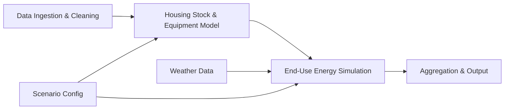

# Design Document: NW Natural End-Use Forecasting Model

## Overview

This design describes the actual implementation of a bottom-up residential end-use demand forecasting model for NW Natural's Integrated Resource Planning (IRP) process. The model disaggregates residential natural gas demand by end use (currently space heating only), enabling scenario analysis for technology adoption, electrification, and efficiency improvements.

The system is a Python-based prototype built for academic capstone delivery. It ingests NW Natural's blinded premise, equipment, segment, and weather data, constructs a housing stock model with equipment inventories, simulates per-unit energy consumption driven by weather and equipment characteristics, and aggregates results to system-level demand projections. Scenarios are defined via JSON configuration files and run independently for comparison.

**Current Scope:** Space heating simulation only. Water heating, cooking, clothes drying, fireplaces, and other end-uses are excluded from the current implementation (planned for future work).

---

## Architecture

The model follows a pipeline architecture with four sequential stages:



### Pipeline Stages

1. **Data Ingestion & Cleaning**: Individual loaders in `src/loaders/` each handle one data source — loading CSV/XLS files from `Data/` or calling APIs. Each loader is runnable standalone (`python -m src.loaders.<name>`) and saves diagnostic output to `output/loaders/`. The `data_ingestion.py` module re-exports all loaders and provides the `build_premise_equipment_table` join that combines premise/equipment/segment/codes into a unified DataFrame.

2. **Housing Stock & Equipment Model**: Builds a representation of the residential housing stock with equipment inventories per premise. Applies scenario-driven equipment transitions (replacements via Weibull survival model, fuel switching) for projection years.

3. **End-Use Energy Simulation**: Computes annual energy consumption per premise per end use. Weather-sensitive end uses (space heating) are driven by daily weather data (HDD calculation). Baseload end uses would use flat annual consumption factors (not yet implemented).

4. **Aggregation & Output**: Rolls up premise-level demand to system totals by end use, customer segment, district, and year. Produces CSV outputs and comparison datasets against NW Natural's IRP UPC forecast.

---

## Module Structure

```
src/
+-- config.py              # Constants, file paths, end-use mappings, default parameters
+-- loaders/               # Individual data loaders (one file per data source, each runnable standalone)
|   +-- __init__.py
|   +-- _helpers.py        # Shared diagnostics: save summary + sample CSV to output/loaders/
|   +-- load_premise_data.py
|   +-- load_equipment_data.py
|   +-- load_segment_data.py
|   +-- load_equipment_codes.py
|   +-- load_weather_data.py
|   +-- load_water_temperature.py
|   +-- load_snow_data.py
|   +-- load_billing_data.py
|   +-- load_or_rates.py
|   +-- load_wa_rates.py
|   +-- load_wacog_history.py
|   +-- load_rate_case_history.py
|   +-- load_billing_to_therms.py
|   +-- load_rbsa_site_detail.py
|   +-- load_rbsa_hvac.py
|   +-- load_rbsa_water_heater.py
|   +-- load_rbsa_distributions.py
|   +-- load_rbsam_metering.py
|   +-- load_rbsa_2017.py
|   +-- load_ashrae_service_life.py
|   +-- load_ashrae_maintenance_cost.py
|   +-- load_useful_life_table.py
|   +-- load_load_decay_forecast.py
|   +-- load_historical_upc.py
|   +-- load_baseload_factors.py
|   +-- load_nw_energy_proxies.py
|   +-- load_gbr_properties.py
|   +-- load_service_territory_fips.py
|   +-- load_census_b25034.py
|   +-- load_b25034_county.py
|   +-- load_b25040_county.py
|   +-- load_b25024_county.py
|   +-- load_psu_forecasts.py
|   +-- load_ofm_housing.py
|   +-- load_noaa_normals.py
|   +-- load_recs_microdata.py
+-- validation/            # Data validation and quality checking modules
|   +-- __init__.py
|   +-- billing_calibration.py
|   +-- data_quality.py
|   +-- final_dashboard.py
|   +-- join_integrity.py
|   +-- metadata_and_limitations.py
|   +-- nwn_data_validation.py
|   +-- range_checking.py
|   +-- test_validation.py
|   +-- validation_report.py
+-- data_ingestion.py      # Re-exports all loaders + build_premise_equipment_table join
+-- housing_stock.py       # Housing stock construction and projection
+-- equipment.py           # Equipment inventory, Weibull survival, replacement cycles
+-- weather.py             # Weather data processing, HDD/CDD calculation, station mapping
+-- simulation.py          # End-use energy consumption calculation engine
+-- aggregation.py         # Demand rollup, output formatting, comparison utilities
+-- scenarios.py           # Scenario definition, parameter validation, runner
+-- main.py                # CLI entry point, orchestrates pipeline
+-- calibration.py         # Model calibration against historical data
+-- census_integration.py  # Census ACS data integration and enrichment
+-- checkpoint_simulation.py # Checkpoint-based simulation for large datasets
+-- envelope_efficiency.py # Building envelope efficiency calculations
+-- parameter_curves.py    # Parameter curve resolution for scenario projections
+-- recs_integration.py    # EIA RECS data integration
+-- scenario_charts.py     # Scenario comparison chart generation
+-- scenario_comparison.py # Scenario comparison utilities
+-- visualization.py       # Data visualization and plotting utilities (Matplotlib-based)
+-- zone_visualization.py  # Geographic zone visualization
+-- equipment_property_test.py      # Property-based testing for equipment module
+-- fuel_switching_property_test.py # Property-based testing for fuel switching
+-- scenario_property_tests.py      # Property-based testing for scenarios
+-- water_heating_property_report.py # Water heating property test reporting
+-- weather_property_report.py      # Weather property test reporting
+-- generate_comparison_chart.py    # Comparison chart generation
+-- generate_zones.py               # Zone generation utilities
+-- housing_stock_visualizations.py # Housing stock visualization
```

Each loader in `src/loaders/` can be run standalone for debugging:
```bash
python -m src.loaders.load_premise_data
```

---

## Key Design Decisions

### 1. End-Use Mapping via Equipment Codes

The model maps equipment type codes to end-use categories via `END_USE_MAP` in `src/config.py`. The current implementation focuses exclusively on space heating (furnaces, boilers, heat pumps). Equipment codes are mapped to one of: `space_heating`, `water_heating`, `cooking`, `clothes_drying`, `fireplace`, or `other`. Only space heating is actively simulated; other end-uses are mapped but not yet modeled.

### 2. Weather Station Assignment by District

Premises are assigned to weather stations based on `district_code_IRP`. A static mapping table (`DISTRICT_WEATHER_MAP` in `src/config.py`) links each IRP district to its nearest weather station SiteId (ICAO code). The model supports 11 weather stations across NW Natural's service territory.

### 3. Heating Degree Day (HDD) Driven Space Heating

Space heating consumption is modeled as a function of HDD (base 65°F) computed from daily temperature data, scaled by equipment efficiency, vintage-based heating multipliers, and segment-based heating multipliers. The formula is:

```
annual_therms = HDD × heating_factor × vintage_multiplier × segment_multiplier / efficiency
```

### 4. Weibull Survival Model for Equipment Replacement

Equipment replacement timing uses a Weibull survival function `S(t) = e^(-(t/eta)^beta)` rather than a deterministic age cutoff. The scale parameter `eta` is derived from ASHRAE median service life data (state-specific for OR/WA), and the shape parameter `beta` (default 3.0 for HVAC, 2.5 for appliances) controls the failure rate distribution. This produces a realistic spread of replacements over time rather than all units of the same vintage failing simultaneously.

### 5. ASHRAE Equipment Service Life Data

Equipment useful life assumptions are sourced from the ASHRAE public database, downloaded as state-specific XLS files:
- `OR-ASHRAE_Service_Life_Data.xls` — Median service life (years) by equipment type for Oregon
- `WA-ASHRAE_Service_Life_Data.xls` — Median service life (years) by equipment type for Washington

ASHRAE service life data replaces the hardcoded `USEFUL_LIFE` defaults in `config.py` with empirically grounded median lifetimes by equipment category.

### 6. NW Natural IRP Load Decay Data as Validation Target

NW Natural's 2025 IRP provides Use Per Customer (UPC) load decay data that serves as both a historical calibration reference and a forward-looking validation target. The model compares bottom-up UPC projections against the IRP 10-year load decay forecast (-1.19%/yr from 648 therm baseline).

### 7. Census ACS Integration for Housing Stock Validation

The model loads Census ACS 5-year data for all 16 NW Natural service territory counties:
- **B25034** (Year Structure Built) — validates housing vintage distribution
- **B25040** (House Heating Fuel) — tracks gas market share over time
- **B25024** (Units in Structure) — validates SF/MF segment split and projects segment shift rates

### 8. EIA RECS Integration for End-Use Benchmarking

The model loads EIA RECS microdata (2005, 2009, 2015, 2020) and computes weighted-average end-use shares for Pacific division gas-heated homes. RECS-derived non-heating ratios are used to estimate total UPC (space heating + water heating + cooking + drying + fireplace) when `use_recs_ratios=true` in scenario config.

### 9. Parameter Curves for Time-Varying Scenario Parameters

The `parameter_curves.py` module supports both scalar and year-indexed curve parameters in scenario configs. For example:
```json
{
  "housing_growth_rate": {"2025": 0.01, "2030": 0.02, "2035": 0.015}
}
```
The `resolve(param, year, default)` function interpolates values for intermediate years.

### 10. Standalone Loaders for Debugging

Each data source has its own loader in `src/loaders/` that can be run standalone:
```bash
python -m src.loaders.load_premise_data
```
This loads the data, prints a summary to console, and saves diagnostic output (summary text + sample CSV) to `output/loaders/`. This design makes it easy to debug individual data sources without running the full pipeline.

---

## Components and Interfaces

### 1. config.py — Configuration and Mappings

```python
# End-use category mappings
END_USE_MAP = {
    "RFAU": "space_heating",  # Forced Air Furnace
    "RFLR": "space_heating",  # Floor Furnace
    "RAWH": "water_heating",  # Residential Water Heating
    "RRGE": "cooking",        # Residential Range
    "RDRY": "clothes_drying", # Residential Dryer
    "RFPL": "fireplace",      # Fire Place
    # ... (100+ equipment codes)
}

# Default efficiency by end-use category
DEFAULT_EFFICIENCY = {
    "space_heating": 0.80,
    "water_heating": 0.60,
    "cooking": 0.75,
    "clothes_drying": 0.65,
    "fireplace": 0.10,
    "other": 0.70,
}

# Default useful life by end-use category (years)
USEFUL_LIFE = {
    "space_heating": 20,
    "water_heating": 13,
    "cooking": 15,
    "clothes_drying": 13,
    "fireplace": 30,
    "other": 15,
}

# Weibull shape parameter (beta) by end-use
WEIBULL_BETA = {
    "space_heating": 3.0,
    "water_heating": 3.0,
    "cooking": 2.5,
    "clothes_drying": 2.5,
    "fireplace": 2.0,
    "other": 2.5,
}

# District to weather station mapping
DISTRICT_WEATHER_MAP = {
    "MULT": "KPDX",  # Multnomah -> Portland
    "WASH": "KPDX",  # Washington -> Portland
    "LANE": "KEUG",  # Lane -> Eugene
    # ... (18 districts)
}

# Vintage-based heating factor multipliers
VINTAGE_HEATING_MULTIPLIER = {
    (0, 1979): 1.35,       # Pre-1980: poor insulation
    (1980, 1999): 1.15,    # 1980-1999: first energy codes
    (2000, 2009): 1.00,    # 2000-2009: baseline
    (2010, 2014): 0.85,    # 2010-2014: improved codes
    (2015, 2099): 0.70,    # 2015+: current code
}

# Segment-based heating factor multipliers
SEGMENT_HEATING_MULTIPLIER = {
    'RESSF': 1.05,          # Single-family
    'RESMF': 0.70,          # Multi-family (shared walls)
    'Unclassified': 1.00,
}
```

### 2. data_ingestion.py — Data Loading and Preparation

```python
def load_premise_data(path: str) -> pd.DataFrame:
    """Load and filter premise data to active residential premises."""
    ...

def load_equipment_data(path: str) -> pd.DataFrame:
    """Load equipment inventory data."""
    ...

def load_segment_data(path: str) -> pd.DataFrame:
    """Load and filter segment data to residential customers."""
    ...

def load_equipment_codes(path: str) -> pd.DataFrame:
    """Load equipment code lookup table."""
    ...

def build_premise_equipment_table(premises, equipment, segments, codes) -> pd.DataFrame:
    """Join premise, equipment, segment, and code tables into unified dataset.
    
    Derives:
    - end_use: via END_USE_MAP
    - efficiency: via DEFAULT_EFFICIENCY (fallback)
    - weather_station: via DISTRICT_WEATHER_MAP
    """
    ...
```

### 3. housing_stock.py — Housing Stock Model

```python
@dataclass
class HousingStock:
    """Represents the residential housing stock for a given year."""
    year: int
    premises: pd.DataFrame
    total_units: int
    units_by_segment: dict[str, int]
    units_by_district: dict[str, int]

def build_baseline_stock(premise_equipment: pd.DataFrame, base_year: int) -> HousingStock:
    """Construct baseline housing stock from premise-equipment data."""
    ...

def project_stock(baseline: HousingStock, target_year: int, scenario: dict) -> HousingStock:
    """Project housing stock to a future year using growth rates from scenario."""
    ...
```

### 4. equipment.py — Equipment Tracking and Transitions

```python
@dataclass
class EquipmentProfile:
    """Equipment characteristics for a single unit."""
    equipment_type_code: str
    end_use: str
    efficiency: float
    install_year: int
    useful_life: int
    fuel_type: str  # "gas", "electric", "dual"

def weibull_survival(t: float, eta: float, beta: float) -> float:
    """Compute Weibull survival probability S(t) = exp(-(t/eta)^beta)."""
    ...

def median_to_eta(median_life: float, beta: float) -> float:
    """Convert median service life to Weibull scale parameter eta."""
    ...

def replacement_probability(age: int, eta: float, beta: float) -> float:
    """Compute conditional probability of failure at age t given survival to t-1."""
    ...

def build_equipment_inventory(premise_equipment: pd.DataFrame) -> pd.DataFrame:
    """Build equipment inventory with derived attributes."""
    ...

def apply_replacements(inventory, target_year, scenario) -> pd.DataFrame:
    """Simulate equipment replacements using Weibull survival model and scenario
    technology adoption rates / electrification switching rates."""
    ...
```

### 5. weather.py — Weather Processing

```python
def compute_hdd(daily_temps: pd.Series, base_temp: float = 65.0) -> pd.Series:
    """Compute Heating Degree Days from daily average temperatures."""
    ...

def compute_annual_hdd(weather_df: pd.DataFrame, site_id: str, year: int) -> float:
    """Compute total annual HDD for a given weather station and year."""
    ...

def assign_weather_station(district_code: str) -> str:
    """Map a district code to its nearest weather station SiteId."""
    ...
```

### 6. simulation.py — End-Use Energy Calculation

```python
def simulate_space_heating(equipment, annual_hdd, heating_factor) -> pd.Series:
    """Calculate annual space heating consumption per premise."""
    ...

def simulate_all_end_uses(premise_equipment, weather_data, water_temp_data, year, scenario) -> pd.DataFrame:
    """Run full end-use simulation for all premises in a given year."""
    ...
```

### 7. aggregation.py — Output and Comparison

```python
def aggregate_by_end_use(simulation_results: pd.DataFrame) -> pd.DataFrame: ...
def aggregate_by_segment(simulation_results, segments) -> pd.DataFrame: ...
def aggregate_by_district(simulation_results, premises) -> pd.DataFrame: ...
def compute_use_per_customer(total_demand: float, customer_count: int) -> float: ...
def compare_to_irp_forecast(model_upc, irp_forecast) -> pd.DataFrame:
    """Compare bottom-up UPC projections against NW Natural IRP load decay forecast."""
    ...
def export_results(results, output_path, format='csv') -> None: ...
```

### 8. scenarios.py — Scenario Management

```python
@dataclass
class ScenarioConfig:
    name: str
    description: str
    base_year: int
    forecast_horizon: int
    housing_growth_rate: float | dict
    electrification_rate: float | dict
    efficiency_improvement: float | dict
    weather_assumption: str  # "normal", "warm", "cold"
    initial_gas_pct: float
    use_recs_ratios: bool
    end_use_scope: str
    max_premises: int
    vectorized: bool

def validate_scenario(config: ScenarioConfig) -> list[str]: ...
def run_scenario(config: ScenarioConfig, base_data: dict) -> pd.DataFrame: ...
def compare_scenarios(results: dict[str, pd.DataFrame]) -> pd.DataFrame: ...
```

### 9. visualization.py — Static Chart Generation

```python
def plot_housing_stock_comparison(baseline_year, baseline_total, projected_data, output_path) -> plt.Figure:
    """Generate a line plot comparing baseline vs projected housing stock."""
    ...

def plot_segment_distribution_comparison(baseline_year, baseline_segments, projected_segments, output_path) -> plt.Figure:
    """Generate a grouped bar chart comparing segment distribution over time."""
    ...

def plot_service_territory_map(baseline_year, baseline_stock, projected_stocks, growth_rate, output_path) -> plt.Figure:
    """Generate a choropleth map of NW Natural service territory by county."""
    ...

def plot_projection_summary(baseline_year, baseline_stock, projected_stocks, growth_rate, output_dir) -> Dict[str, str]:
    """Generate a comprehensive set of comparison plots and save to output directory."""
    ...
```

### 10. main.py — CLI Entry Point

```python
def load_scenario_config(config_path: str) -> ScenarioConfig:
    """Load scenario configuration from JSON file."""
    ...

def load_pipeline_data() -> Tuple[pd.DataFrame, pd.DataFrame, pd.DataFrame, Dict, Dict, pd.DataFrame, Dict]:
    """Load all data required for the pipeline."""
    ...

def run_single_scenario(config, premise_equipment, weather_data, water_temp_data, baseload_factors, output_dir) -> Tuple[pd.DataFrame, Dict]:
    """Run a single scenario and return results."""
    ...

def print_summary_statistics(results_df, metadata) -> None:
    """Print summary statistics to stdout."""
    ...

def main():
    """Main CLI entry point. Parses arguments, loads data, runs scenario(s), and exports results."""
    ...
```

**CLI Usage:**
```bash
# Run single scenario
python -m src.main scenarios/baseline.json

# Run scenario with custom output directory
python -m src.main scenarios/baseline.json --output-dir output/my_run

# Compare two scenarios
python -m src.main scenarios/baseline.json scenarios/high_electrification.json --compare
```

---

## Data Models

### Premise-Equipment Table (Unified Working Dataset)

| Column | Type | Source | Description |
|--------|------|--------|-------------|
| blinded_id | int | premise_data | Anonymized premise identifier |
| district_code_IRP | str | premise_data | IRP district for geographic grouping |
| service_state | str | premise_data | OR or WA (for state-specific ASHRAE lookup) |
| segment | str | segment_data | Housing segment (RESSF, RESMF, MOBILE) |
| subseg | str | segment_data | Sub-segment (FRAME, MFG, etc.) |
| mktseg | str | segment_data | Market segment (RES-CONV, RES-SFNC, etc.) |
| set_year | int | segment_data | Year premise was set/connected |
| equipment_type_code | str | equipment_data | Equipment type identifier |
| equipment_class | str | equipment_codes | Equipment class (HEAT, WTR, FRPL, OTHR) |
| end_use | str | derived | End-use category from END_USE_MAP |
| qty | int | equipment_data | Quantity of equipment units |
| efficiency | float | derived/config | Equipment efficiency rating |
| useful_life | int | ASHRAE/config | Median service life (ASHRAE or default) |
| weibull_eta | float | derived | Weibull scale parameter from median life |
| weibull_beta | float | config | Weibull shape parameter by end-use |
| weather_station | str | derived | Assigned weather station SiteId |

### Simulation Output Table

| Column | Type | Description |
|--------|------|-------------|
| blinded_id | int | Premise identifier |
| year | int | Simulation year |
| end_use | str | End-use category |
| annual_therms | float | Simulated annual consumption in therms |
| equipment_type_code | str | Equipment type |
| efficiency | float | Equipment efficiency used |
| scenario_name | str | Scenario identifier |

### Aggregated Output Table

| Column | Type | Description |
|--------|------|-------------|
| year | int | Projection year |
| end_use | str | End-use category |
| segment | str | Customer segment |
| district | str | IRP district |
| total_therms | float | Total demand in therms |
| customer_count | int | Number of premises |
| use_per_customer | float | Average therms per customer |
| scenario_name | str | Scenario identifier |

---

## Output Files Per Scenario

Each scenario writes results to `scenarios/{scenario_name}/`:

1. **results.csv** — Full results (year × end-use × segment × district)
2. **results.json** — Same data in JSON format
3. **yearly_summary.csv** — Year-by-year aggregated summary
4. **metadata.json** — Scenario configuration and run metadata
5. **SUMMARY.md** — Human-readable summary report
6. **equipment_stats.csv** — Equipment statistics over time (gas vs electric, efficiency, replacements)
7. **premise_distribution.csv** — Per-premise therms distribution by year
8. **segment_demand.csv** — Demand by segment over time
9. **sample_rates.csv** — Sample-derived yearly rates (replacement, efficiency, electrification)
10. **vintage_demand.csv** — Demand breakdown by vintage cohort
11. **estimated_total_upc.csv** — Estimated total UPC with end-use breakdown (using RECS ratios)
12. **hdd_info.csv** — HDD information for the simulation
13. **hdd_history.csv** — Historical HDD by station and year
14. **irp_comparison.csv** — Model UPC vs IRP UPC comparison
15. **housing_stock.csv** — Housing stock projection with segment breakdown
16. **census_summary_*.csv** — Census ACS summary CSVs (B25034, B25040, B25024)
17. **recs_summary.csv** — RECS end-use benchmark summary

---

## Future Work

The following capabilities were designed and partially specified but not implemented in the current capstone prototype. They are documented here to guide future development.

### Future Work A: Interactive Web Visualization with Mapbox

**Description:** An interactive web-based visualization with hierarchical geographic drill-down (county → district → microclimate → microresidential → microadoption → composite-cell) and time-series animation.

**Technology Stack:**
- Frontend: Mapbox GL JS (WebGL-based interactive mapping)
- Backend: Python Flask or FastAPI (lightweight REST API)
- Data Format: GeoJSON for geographic features, JSON for time-series data

**Key Features:**
- Interactive county/district map with color-coded choropleth layers
- Click-to-drill-down from county to district to microarea
- Year slider for time-series animation
- Scenario comparison dropdown
- End-use breakdown stacked bar charts
- Detailed area view with time-series charts

### Future Work B: REST API for Scenario Management

**Description:** A REST API for programmatically creating scenarios, submitting runs, and retrieving results.

**Endpoints:**
- `POST /api/v1/scenarios` — Create a new scenario
- `GET /api/v1/scenarios` — List all scenarios
- `POST /api/v1/scenarios/{scenario_id}/run` — Submit scenario for execution
- `GET /api/v1/runs/{run_id}` — Get execution status and progress
- `GET /api/v1/runs/{run_id}/results` — Get results in JSON, CSV, or Parquet
- `GET /api/v1/runs/{run_id}/results/geojson` — Get results as GeoJSON

### Future Work C: Composite Microregion Cell Analysis

**Description:** Multi-dimensional analytical units combining microclimate (weather station service area) × microresidential (segment + subsegment + vintage cohort) × adoption cohort (Early Adopters / Growth / Mature / Saturation).

**Key Metrics:**
- Composite score (0–100) combining demand intensity, adoption rate, efficiency gap, and climate severity
- Opportunity score (high demand + low adoption)
- Success score (high adoption + low demand)

### Future Work D: Additional End-Use Simulation

**Description:** Expand the model to simulate water heating, cooking, clothes drying, and fireplace end-uses.

**Implementation:**
- Water heating: driven by Bull Run water temperature and daily hot water usage
- Cooking: RECS-derived baseload factors (~30 therms/year)
- Clothes drying: RECS-derived baseload factors (~20 therms/year)
- Fireplace: RBSA-metered baseload factors (~55 therms/year)
- Vintage-stratified water heater standby losses
- Pilot light loads for pre-2015 equipment

### Future Work E: Docker Containerization

**Description:** Package the model as a Docker container for reliable deployment across different environments.

**Deliverables:**
- Dockerfile with all Python dependencies
- docker-compose.yml for multi-container deployment
- Environment variable configuration support
- Health check endpoint

### Future Work F: RBSA Sub-Metered Data Integration

**Description:** Use RBSA sub-metered 15-minute interval data to validate load shape assumptions.

**Data Sources:**
- RBSA Metering Year 1 (Sep 2012–Sep 2013) — 4 TXT files (~328 MB each)
- RBSA Metering Year 2 (Apr 2013–Apr 2014) — 5 TXT files (~300 MB each)

**Use Cases:**
- Compute diurnal and seasonal load shapes by end-use
- Validate baseload factor assumptions
- Compare electric end-use load shapes against gas equivalents

### Future Work G: Green Building Registry API Integration

**Description:** Supplement RBSA building data with Green Building Registry Home Energy Score data.

**Implementation:**
- Query GBR API by zip code for properties in NW Natural's service territory
- Extract: Home Energy Score, estimated annual energy use, insulation levels, window types
- Use GBR data to refine building shell assumptions

### Future Work H: CI/CD Pipeline and Automated Testing

**Description:** Automated tests on every code change to catch regressions.

**Implementation:**
- GitHub Actions or equivalent CI/CD pipeline
- Enforce minimum 80% code coverage
- Run property-based tests with at least 100 examples per property
- Build and validate Docker image on every merge to main

---

## Conclusion

This design document reflects the actual implementation of the NW Natural End-Use Forecasting Model as built for the 2026 MSADSB Capstone Project. The model successfully demonstrates a bottom-up approach to residential demand forecasting, with a focus on space heating simulation, Weibull-based equipment replacement, and scenario analysis.

The model is a prototype suitable for academic demonstration and planning analysis. Future work would expand end-use coverage, add interactive visualization, and prepare the system for production deployment.
