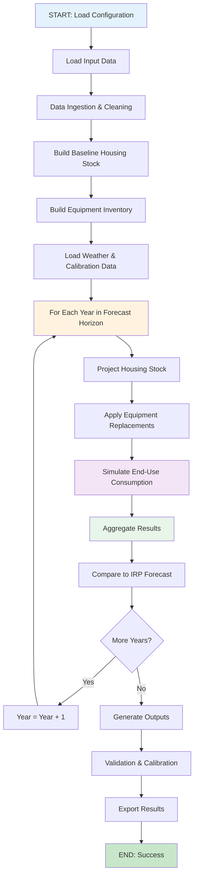
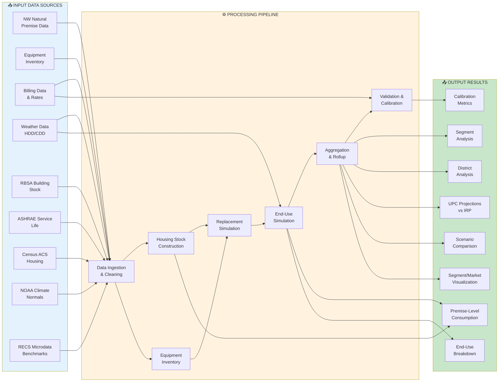
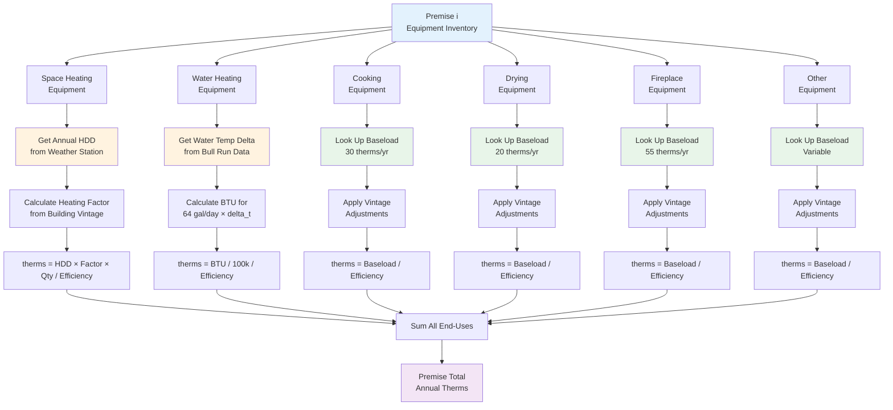
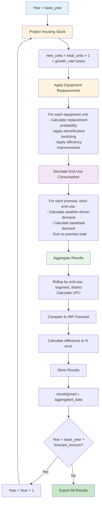

# Algorithm: NW Natural End-Use Forecasting Model

## Overview

The NW Natural End-Use Forecasting Model is a bottom-up residential natural gas demand simulation engine that disaggregates demand by end-use category (space heating, water heating, cooking, drying, fireplace, other). The algorithm constructs a synthetic housing stock, simulates equipment lifecycles, calculates end-use consumption driven by weather and equipment characteristics, and aggregates results to system-level demand projections.

---

## High-Level Algorithm Flow



---

## Input-to-Output Mapping



---

## Detailed Algorithm Steps

### 1. Data Ingestion & Cleaning

**Input**: Raw CSV files from `Data/` directory

**Process**:
1. Load premise data (650,000+ active residential premises)
2. Load equipment inventory (1,000,000+ equipment records)
3. Load segment data (customer segment, vintage, subsegment)
4. Load equipment codes (mapping to end-use categories)
5. Load billing data (historical consumption for calibration)
6. Load weather data (daily temperatures 1985-2025)
7. Load water temperature data (Bull Run supply)
8. Load RBSA building stock characteristics (proxy distributions)
9. Load ASHRAE service life data (equipment replacement timing)
10. Load tariff rates and WACOG history (billing conversion)
11. Load Census ACS data (housing vintage, heating fuel, structure type)
12. Load NOAA climate normals (weather normalization)
13. Load RECS microdata (end-use validation benchmarks)

**Output**: Cleaned, validated DataFrames ready for modeling

**Data Quality Checks**:
- Filter premises to active residential only (custtype='R', status_code='AC')
- Validate all foreign key joins (blinded_id, equipment_type_code)
- Flag missing or anomalous values
- Log data quality warnings

---

### 2. Build Baseline Housing Stock

**Input**: Cleaned premise and segment data

**Process**:
```
For each unique blinded_id in premise_data:
    1. Extract premise location (service_state, district_code_IRP)
    2. Extract segment (RESSF, RESMF, MOBILE)
    3. Extract vintage (year set/connected)
    4. Count as 1 housing unit
    
Aggregate:
    - total_units = count of unique blinded_ids
    - units_by_segment = count by segment type
    - units_by_district = count by IRP district
```

**Output**: `HousingStock` dataclass with:
- `year`: Base year (e.g., 2025)
- `premises`: DataFrame of all premises
- `total_units`: Total residential premises
- `units_by_segment`: Dict of units per segment
- `units_by_district`: Dict of units per district

**Example Output** (2025 baseline):
```
Total Units: 650,000
By Segment:
  RESSF: 520,000 (80%)
  RESMF: 100,000 (15%)
  MOBILE: 30,000 (5%)
By District:
  PORC: 200,000
  EUGN: 150,000
  ... (15+ districts)
```

---

### 3. Build Equipment Inventory

**Input**: Equipment data, equipment codes, ASHRAE service life data

**Process**:
```
For each equipment record (blinded_id, equipment_type_code, qty):
    1. Look up equipment_class from equipment_codes
    2. Map to end_use using END_USE_MAP (config)
    3. Derive efficiency:
       - Use ASHRAE data if available (state-specific)
       - Fall back to DEFAULT_EFFICIENCY from config
    4. Derive install_year:
       - Use segment.setyear as proxy
       - Assume equipment age = current_year - install_year
    5. Derive useful_life:
       - Use ASHRAE service life (state-specific)
       - Fall back to USEFUL_LIFE from config
    6. Compute Weibull parameters:
       - eta = useful_life / (ln(2))^(1/beta)
       - beta = WEIBULL_BETA[end_use] from config
    7. Create EquipmentProfile record
    
Aggregate:
    - equipment_inventory = all EquipmentProfile records
    - total_equipment_units = sum of qty across all records
```

**Output**: Equipment inventory DataFrame with columns:
- `blinded_id`, `equipment_type_code`, `end_use`, `qty`
- `efficiency`, `install_year`, `useful_life`, `fuel_type`
- `weibull_eta`, `weibull_beta`, `age`

**Example Output** (sample premise):
```
blinded_id=123456:
  Space Heating (RFAU): qty=1, efficiency=0.85, age=15, eta=20.5, beta=3.0
  Water Heating (RAWH): qty=1, efficiency=0.60, age=12, eta=13.0, beta=3.0
  Cooking (RRGE): qty=1, efficiency=0.40, age=20, eta=16.3, beta=2.5
  Drying (RDRY): qty=1, efficiency=0.80, age=8, eta=14.1, beta=2.5
```

---

### 4. Equipment Replacement Simulation

**Input**: Equipment inventory, target year, scenario config

**Process** (for each year in forecast horizon):
```
For each equipment unit:
    1. Calculate age = target_year - install_year
    2. Calculate Weibull survival probability:
       S(t) = exp(-(age / eta)^beta)
    3. Calculate replacement probability:
       P_replace = 1 - S(age) / S(age-1)
    4. Draw random number u ~ Uniform(0,1)
    5. If u < P_replace:
       a. Mark unit for replacement
       b. Apply scenario electrification rate:
          - If random() < electrification_rate[end_use]:
            - Switch fuel type (gas → electric)
            - Update efficiency to electric equivalent
          - Else:
            - Keep fuel type (gas)
            - Apply efficiency improvement from scenario
       c. Update install_year = target_year
       d. Recalculate eta and age
    6. Else:
       - Keep existing equipment
       - Apply efficiency improvement from scenario
```

**Output**: Updated equipment inventory with replaced/upgraded units

**Example** (space heating replacement):
```
Original: RFAU, efficiency=0.85, fuel=gas, age=25
Random draw: u=0.45, P_replace=0.52 → REPLACE
Electrification check: random()=0.3 < 0.02 → NO SWITCH
New equipment: RFAU, efficiency=0.92, fuel=gas, age=0
```

---

### 4.1 Heat Pump Integration in Equipment Replacement

**Context**: Heat pumps represent a critical decarbonization pathway for residential heating and water heating. The algorithm models heat pump adoption through equipment replacement and electrification scenarios.

**Heat Pump Types Modeled**:
- **Air-Source Heat Pumps (ASHP)**: Primary space heating replacement for gas furnaces
- **Ground-Source Heat Pumps (GSHP)**: Alternative for space heating (higher efficiency, higher cost)
- **Heat Pump Water Heaters (HPWH)**: Replacement for gas water heaters

**Process** (during equipment replacement):

```
For each space heating or water heating equipment unit marked for replacement:
    1. Check electrification scenario:
       - If random() < electrification_rate[end_use]:
         a. Determine heat pump type based on scenario config:
            - ASHP: 85-95% of heat pump adoptions (lower cost)
            - GSHP: 10-15% of heat pump adoptions (higher efficiency)
            - HPWH: 100% of water heating electrification
         
         b. Apply heat pump efficiency:
            - ASHP COP (Coefficient of Performance):
              * Baseline COP = 2.5-3.5 (depends on climate zone)
              * Gorge region: COP reduced by 15% (colder climate)
              * Vintage adjustment: newer systems +5% COP
            - GSHP COP:
              * Baseline COP = 3.5-4.5 (ground-coupled advantage)
              * No climate penalty (stable ground temperature)
            - HPWH EF (Energy Factor):
              * Baseline EF = 2.5-3.0 (vs. 0.60 for gas water heaters)
         
         c. Convert efficiency to gas-equivalent for comparison:
            - gas_equivalent_efficiency = COP / 3.412
              (3.412 = conversion factor for electric to gas BTU)
            - Example: ASHP with COP=3.0 → gas_equivalent=0.88
         
         d. Update equipment record:
            - fuel_type = "electric"
            - efficiency = COP (for ASHP/GSHP) or EF (for HPWH)
            - equipment_type_code = "HPSH" (heat pump space heating)
                                  or "HPWH" (heat pump water heating)
            - install_year = target_year
            - Recalculate Weibull parameters with new useful_life
              (heat pumps typically 15-20 year lifespan)
    
    2. Else (no electrification):
       - Keep fuel_type = "gas"
       - Apply efficiency improvement from scenario
       - Update install_year = target_year
```

**Heat Pump Performance Adjustments**:

| Factor | Impact | Modeling |
|--------|--------|----------|
| Climate Zone | Gorge region colder | -15% COP for ASHP |
| Building Vintage | Older homes need more heating | Heating factor adjustment |
| Backup Heating | Cold climate backup | Modeled as reduced COP below threshold |
| Ductwork Quality | Poor ducts reduce efficiency | Vintage-based adjustment |
| Thermostat Control | Smart controls improve efficiency | +5% COP for newer systems |

**Example Heat Pump Replacement** (space heating):
```
Original Equipment:
  Type: RFAU (gas furnace)
  Efficiency: 0.85 AFUE
  Fuel: gas
  Age: 25 years

Replacement Decision:
  Weibull probability: 0.52 → REPLACE
  Electrification check: random()=0.08 < 0.15 → ELECTRIFY

New Equipment (Heat Pump):
  Type: HPSH (air-source heat pump)
  COP: 3.0 (baseline) × 0.85 (Gorge penalty) = 2.55
  Gas-equivalent efficiency: 2.55 / 3.412 = 0.75
  Fuel: electric
  Age: 0 years
  Useful life: 18 years (vs. 20 for gas furnace)
```

**Consumption Calculation with Heat Pumps**:

For space heating with heat pump:
```
therms_equivalent = (annual_hdd × heating_factor × qty) / gas_equivalent_efficiency

Where:
  gas_equivalent_efficiency = COP / 3.412
  
This allows direct comparison with gas heating in the same units (therms).
For actual electricity consumption:
  kWh = (annual_hdd × heating_factor × qty) / COP
```

For water heating with heat pump:
```
therms_equivalent = BTU / 100,000 / gas_equivalent_efficiency

Where:
  gas_equivalent_efficiency = EF / 3.412
  EF = Energy Factor (typically 2.5-3.0 for HPWH)
```

**Scenario Parameters** (configurable):

```yaml
electrification_rates:
  space_heating: 0.02-0.15  # % of replacements that electrify
  water_heating: 0.05-0.25  # % of replacements that electrify
  
heat_pump_types:
  ashp_fraction: 0.85       # % of heat pumps that are air-source
  gshp_fraction: 0.15       # % of heat pumps that are ground-source
  
heat_pump_efficiency:
  ashp_cop_baseline: 3.0
  gshp_cop_baseline: 4.0
  hpwh_ef_baseline: 2.75
  gorge_penalty: 0.85       # Multiplier for Gorge region
  
heat_pump_lifespan:
  ashp_years: 18
  gshp_years: 25
  hpwh_years: 15
```

**Validation Checks**:
- Heat pump COP must be > 1.0 (physical constraint)
- Gas-equivalent efficiency must be > 0.0
- Heat pump adoption cannot exceed electrification rate
- Backup heating modeled implicitly through reduced COP

---

### 5. Weather Data Processing

**Input**: Daily weather data, water temperature data, NOAA normals

**Process**:
```
For target year:
    1. Load daily weather data for all 11 stations
    2. For each day:
       a. Calculate HDD = max(0, 65 - daily_avg_temp)
       b. Calculate CDD = max(0, daily_avg_temp - 65)
    3. Sum daily HDD to get annual_hdd for the year
    4. Load Bull Run water temperature data
    5. Calculate water_heating_delta_t:
       delta_t = target_hot_water_temp (120°F) - avg_cold_water_temp
    6. Load NOAA climate normals for the year
    7. Calculate weather_adjustment_factor:
       factor = actual_annual_hdd / normal_annual_hdd
       (used to normalize baseline to typical weather)
```

**Output**: Weather metrics by station and year:
- `annual_hdd`: Annual heating degree days
- `annual_cdd`: Annual cooling degree days
- `water_heating_delta_t`: Temperature differential for water heating
- `weather_adjustment_factor`: Ratio of actual to normal HDD

**Example Output** (KPDX station, 2025):
```
annual_hdd: 4,850 degree-days
annual_cdd: 150 degree-days
water_heating_delta_t: 45°F (120°F target - 75°F avg cold water)
weather_adjustment_factor: 1.02 (2% warmer than normal)
```

---

### 6. End-Use Energy Simulation

**Input**: Equipment inventory, weather data, baseload factors, scenario config

**Process** (for each premise, each end-use):

#### Space Heating
```
For each space heating equipment unit:
    1. Get annual_hdd from weather data for premise's station
    2. Get equipment efficiency
    3. Calculate heating_factor (depends on building characteristics):
       - Base factor from RBSA or config
       - Adjust for building age/vintage
       - Adjust for climate zone (Gorge multiplier 1.15x)
    4. Calculate therms:
       therms = (annual_hdd × heating_factor × qty) / efficiency
    5. Apply weather adjustment factor (if normalizing to typical weather)
```

#### Water Heating
```
For each water heating equipment unit:
    1. Get water_heating_delta_t from weather data
    2. Get equipment efficiency
    3. Assume gallons_per_day = 64 (default residential)
    4. Calculate BTU needed:
       BTU = gallons_per_day × 8.34 lb/gal × delta_t × 365 days
    5. Convert BTU to therms (1 therm = 100,000 BTU):
       therms = BTU / 100,000 / efficiency
```

#### Baseload End-Uses (Cooking, Drying, Fireplace, Other)
```
For each baseload equipment unit:
    1. Look up annual consumption from Baseload Consumption Factors.csv
       - Cooking: 30 therms/yr
       - Drying: 20 therms/yr
       - Fireplace: 55 therms/yr
       - Other: varies
    2. Apply vintage adjustment (if applicable):
       - Pre-2015 equipment: add pilot light load (46-82 therms)
       - Water heater standby: 75/55/40/20 therms by vintage
    3. Apply climate adjustment:
       - Gorge region: 1.15x multiplier
       - Thermosiphon penalty: 1.2x multiplier
    4. Apply efficiency adjustment:
       therms = annual_consumption / efficiency
```

**Output**: Simulation results DataFrame with columns:
- `blinded_id`, `year`, `end_use`, `annual_therms`
- `equipment_type_code`, `efficiency`, `scenario_name`

**Example Output** (sample premise, 2025):
```
blinded_id=123456, year=2025:
  space_heating: 385 therms
  water_heating: 125 therms
  cooking: 30 therms
  drying: 20 therms
  fireplace: 55 therms
  other: 10 therms
  TOTAL: 625 therms
```

---

### 7. Aggregation & Rollup

**Input**: Simulation results, premises data

**Process**:

#### Aggregate by End-Use
```
For each end_use:
    total_therms = sum(annual_therms) for all premises
    customer_count = count of premises with this end_use
    use_per_customer = total_therms / customer_count
```

#### Aggregate by Segment
```
For each segment (RESSF, RESMF, MOBILE):
    For each end_use:
        total_therms = sum(annual_therms) for premises in segment
        customer_count = count of premises in segment with end_use
        use_per_customer = total_therms / customer_count
```

#### Aggregate by District
```
For each district_code_IRP:
    For each end_use:
        total_therms = sum(annual_therms) for premises in district
        customer_count = count of premises in district with end_use
        use_per_customer = total_therms / customer_count
```

#### Compute Use Per Customer (UPC)
```
total_system_therms = sum(annual_therms) for all premises, all end-uses
total_customers = count of unique premises
system_upc = total_system_therms / total_customers
```

**Output**: Aggregated results DataFrames:
- `aggregated_by_enduse.csv`
- `aggregated_by_segment.csv`
- `aggregated_by_district.csv`
- `upc_comparison.csv` (model vs. IRP forecast)

---

### 8. Validation & Calibration

**Input**: Simulation results, billing data, IRP forecast

**Process**:

#### Billing-Based Calibration
```
For each premise with billing data:
    1. Load historical billing records (dollars)
    2. Convert to therms using historical rate table:
       therms = dollars / rate_per_therm
    3. Compare to simulated therms:
       error = simulated_therms - billed_therms
       pct_error = error / billed_therms × 100
    4. Compute calibration metrics:
       - mean_absolute_error = avg(|error|)
       - mean_bias = avg(error)
       - rmse = sqrt(mean(error^2))
       - r_squared = correlation^2(simulated, billed)
```

#### IRP Forecast Comparison
```
For each year in forecast horizon:
    1. Calculate model UPC = total_therms / total_customers
    2. Load IRP forecast UPC for same year
    3. Compare:
       difference = model_upc - irp_upc
       pct_difference = difference / irp_upc × 100
    4. Flag if |pct_difference| > 5% for investigation
```

#### Property-Based Test Validation
```
Validate correctness properties:
    1. Non-negativity: all annual_therms >= 0
    2. Conservation: sum(end_uses) == total_demand
    3. UPC calculation: use_per_customer == total / count
    4. Consistency: premise-level rows sum to aggregated totals
    5. Completeness: all forecast years present
```

**Output**: Calibration metrics and validation report

---

## Detailed Simulation Flow Diagram



---

## Scenario Projection Loop

The algorithm repeats the following steps for each year in the forecast horizon:



---

## Key Mathematical Formulas

### Weibull Survival Model
```
S(t) = exp(-(t/eta)^beta)

Where:
  S(t) = Probability of survival to age t
  t = Equipment age (years)
  eta = Scale parameter (derived from median service life)
  beta = Shape parameter (default 3.0 for HVAC, 2.5 for appliances)

Replacement Probability:
  P_replace = 1 - S(t) / S(t-1)
```

### Heating Degree Days (HDD)
```
HDD_daily = max(0, 65°F - daily_avg_temp)
HDD_annual = sum(HDD_daily) for all days in year
```

### Space Heating Consumption
```
therms = (annual_hdd × heating_factor × qty) / efficiency

Where:
  heating_factor = building-specific factor (depends on vintage, size, insulation)
  qty = number of heating units
  efficiency = equipment AFUE rating
```

### Water Heating Consumption
```
BTU = gallons_per_day × 8.34 lb/gal × delta_t × 365 days
therms = BTU / 100,000 / efficiency

Where:
  delta_t = target_temp (120°F) - cold_water_temp
  efficiency = equipment EF rating
```

### Use Per Customer (UPC)
```
UPC = total_system_therms / total_customers

Where:
  total_system_therms = sum of all end-uses across all premises
  total_customers = count of unique premises
```

---

## Summary

The algorithm implements a bottom-up residential demand forecasting model that:

1. **Ingests** comprehensive data from 13+ sources
2. **Constructs** a synthetic housing stock with equipment inventories
3. **Simulates** equipment lifecycles using Weibull survival models
4. **Calculates** end-use consumption driven by weather and equipment characteristics
5. **Projects** future demand under scenario-defined technology, policy, and market changes
6. **Aggregates** premise-level results to system-level demand by end-use, segment, and district
7. **Validates** outputs against billing data and IRP forecasts
8. **Produces** detailed outputs for scenario analysis and long-term IRP planning

The modular design allows each component to be tested independently via property-based tests, ensuring correctness and enabling incremental development.

---

## Related Documentation

- **[README](README.md)** — Project overview and quick links
- **[Project Scope](SCOPE.md)** — Project objectives and deliverables
- **[Requirements](requirements.md)** — Functional and non-functional requirements
- **[Design](design.md)** — System architecture and design decisions
- **[Inputs](inputs.md)** — Input data specifications
- **[Outputs](outputs.md)** — Output data specifications
- **[Future Data Sources](FUTURE_DATA_SOURCES.md)** — Additional data sources for enhancement
- **[Tasks](tasks.md)** — Implementation plan
