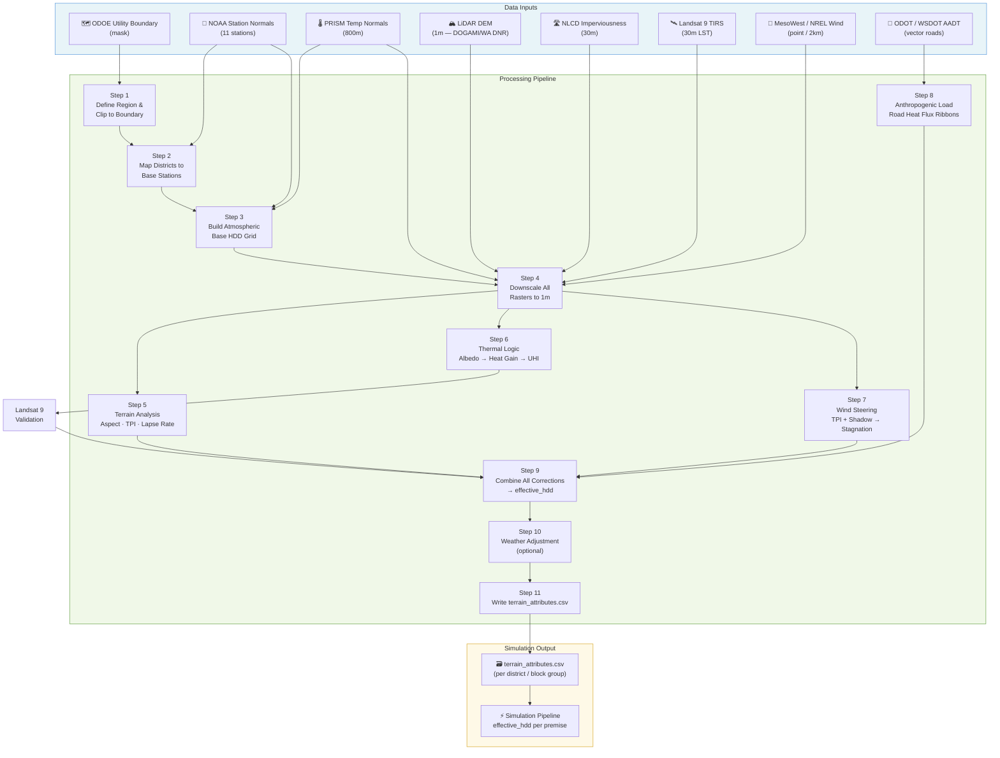
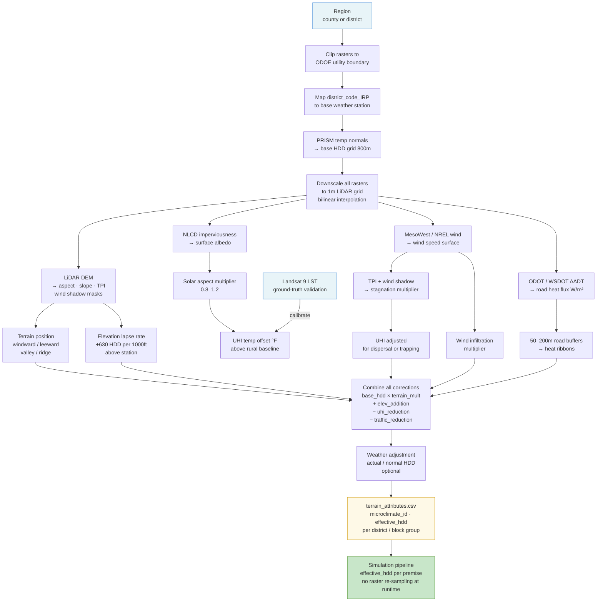
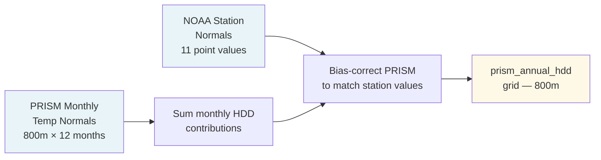
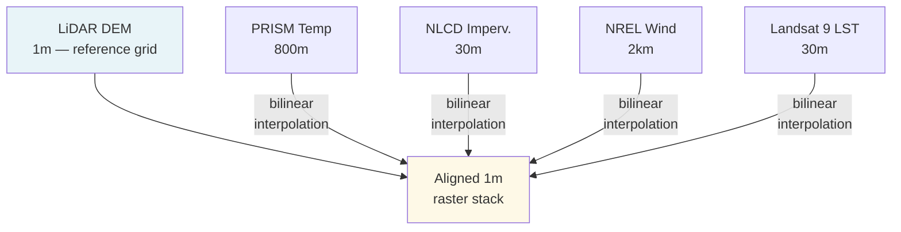
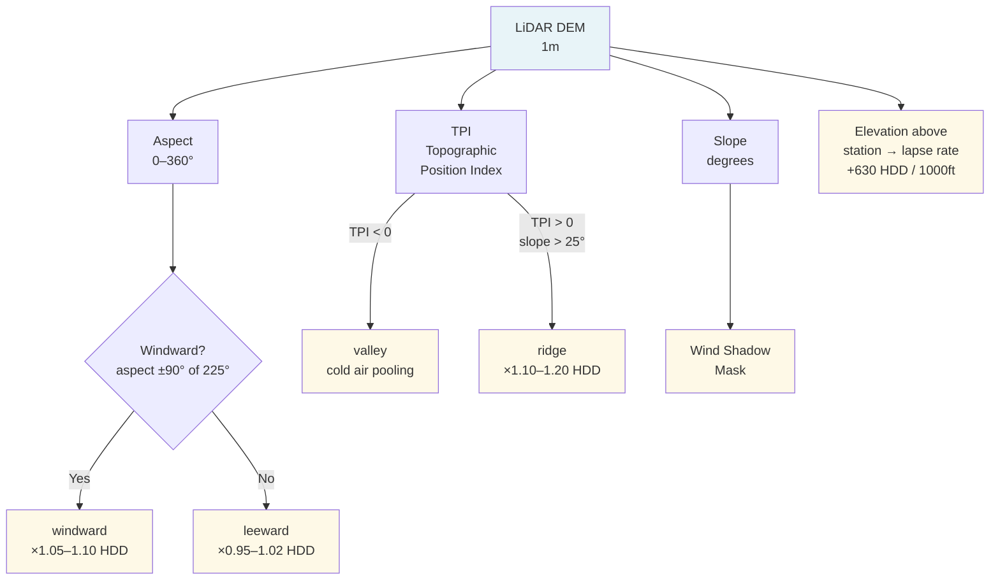
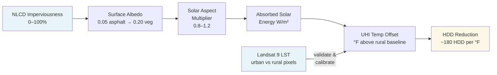
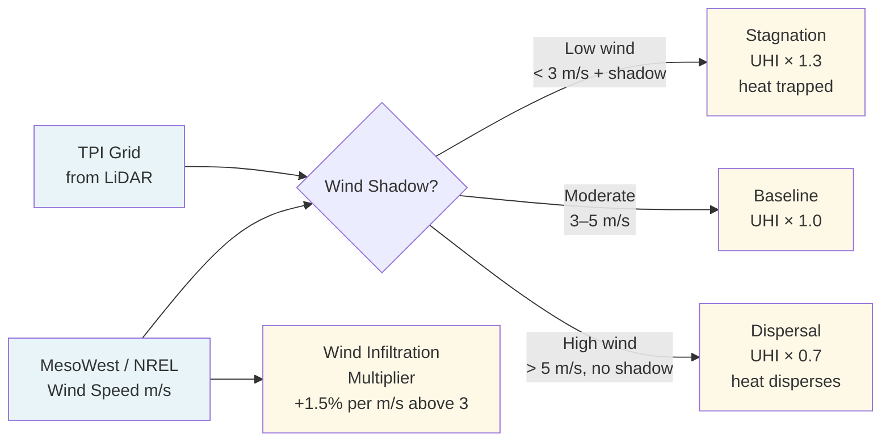
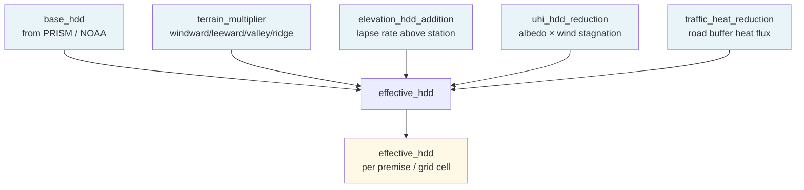
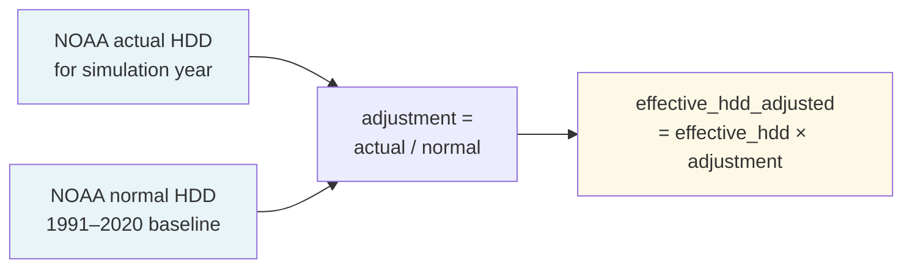
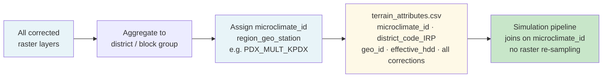

# Regional Microclimate Modeling Engine — NW Natural Service Area

## Overview

This document describes the **Regional Microclimate Modeling Engine**: a Python-based processing pipeline that converts a geographic region in the NW Natural service area into a set of high-resolution microclimate maps. The pipeline integrates terrain, land surface character (asphalt), atmospheric conditions, and human activity (traffic) to simulate temperature and wind variations at sub-district scale, producing an `effective_hdd` value for every premise that replaces the single airport-station HDD used in the base model.

Every premise in NW Natural's service territory belongs to exactly one microclimate area. That assignment starts with a base weather station from `DISTRICT_WEATHER_MAP` and is then refined by five data layers that capture effects the station cannot see.

For the full geographic hierarchy (county → district → microclimate → composite cell), see [REGIONS_AND_CELLS.md](REGIONS_AND_CELLS.md). For data source specifications, see [inputs.md](inputs.md).

---

## Pipeline Overview



---

## Spatial Boundary and Utility Context

**Primary scope**: NW Natural service areas across four climate zones:

| Zone | Counties / Areas | Representative Station |
|------|-----------------|----------------------|
| Willamette Valley | Multnomah, Washington, Clackamas, Marion, Polk, Linn, Lane, Benton, Yamhill | KPDX, KSLE, KCVO, KEUG |
| Oregon Coast | Coos, Lincoln, Clatsop, Columbia | KOTH, KONP, KAST |
| Columbia Gorge | Skamania, Klickitat (WA), Gorge-edge Multnomah | KDLS, KTTD |
| Clark County WA | Clark | KVUO |

**Reference boundary layer**: Oregon Department of Energy (ODOE) Gas Utility service area boundaries are used to mask the analysis region, ensuring raster processing is clipped to NW Natural's actual footprint before any computation. This prevents edge effects from adjacent utility territories from contaminating the output.

**Processing strategy**: Run one region at a time — Portland Metro, The Dalles, Coos Bay, etc. — to keep memory usage manageable. Each region produces its own set of microclimate rasters and a `terrain_attributes.csv` slice that feeds into the simulation pipeline.

---

## Data Layers

Five data layers are combined to produce the final microclimate output. Each is described in detail in [inputs.md](inputs.md) (sources 54–62).

| Layer | Source | Resolution | Role in Pipeline |
|-------|--------|-----------|-----------------|
| Terrain (bare earth elevation) | DOGAMI / WA DNR LiDAR | 1 meter | Aspect, slope, TPI, air drainage, wind steering |
| Thermal battery (asphalt) | NLCD 2021 Imperviousness | 30 meter | Surface albedo → solar heat gain → UHI |
| Atmospheric base (temperature) | PRISM Climate Group | 800 meter | Spatially continuous temperature normals |
| Atmospheric base (wind) | MesoWest / NREL | Point / 2 km | Wind speed for infiltration and heat dispersal |
| Direct observation (validation) | Landsat 9 TIRS | 30 meter | Ground-truth surface temperature for UHI calibration |
| Human heat flux (traffic) | ODOT / WSDOT AADT | Vector (roads) | Engine/exhaust heat ribbons along transit corridors |

---

## Conceptual Model

Weather drives space heating demand, and weather varies meaningfully across the service territory — not just between stations, but *within* a single station's coverage area. Four layers of variation matter:

1. **Station-level climate** — The Gorge (The Dalles) runs ~1,400 HDD colder than the coast (Coos Bay). Captured by `DISTRICT_WEATHER_MAP`.
2. **Terrain position** — Windward slopes receive more wind-driven infiltration and rain-cooling. Leeward slopes are sheltered and subject to Foehn warming. Valleys trap cold air overnight. Ridges are exposed to maximum wind.
3. **Urban surface character** — Dense asphalt absorbs solar radiation and re-emits it as heat at night, raising effective temperatures 2–5°F above the airport baseline. This is the urban heat island (UHI) effect, driven by surface albedo.
4. **Anthropogenic heat** — Vehicle traffic along major corridors (I-5, I-84, US-26) adds a measurable sensible heat flux to the urban boundary layer, further warming dense urban areas.

The full pipeline:



---

## Step 1 — Define the Region and Clip to Utility Boundary


Select the processing region (e.g., "Portland Metro", "The Dalles", "Coos Bay") and clip all input rasters to the ODOE Gas Utility boundary for that region. This is the first operation in every run — it reduces file sizes from statewide tiles to manageable regional subsets.

**Regions and their primary weather stations:**

| Region | Districts | Base Station | Approx. Premises |
|--------|-----------|-------------|-----------------|
| Portland Metro | MULT, WASH, CLAC, YAMI, BENT | KPDX | ~312,000 |
| Salem / Mid-Valley | MARI, POLK | KSLE | ~48,000 |
| Corvallis / Linn | LINN | KCVO | ~22,000 |
| Eugene / Lane | LANE, DOUG | KEUG | ~85,000 |
| Oregon Coast | COOS, LINC | KOTH, KONP | ~28,000 |
| Astoria / Columbia | CLAT, COLU | KAST | ~18,000 |
| Columbia Gorge | SKAM, KLIC | KDLS | ~12,000 |
| Clark County WA | CLAR | KVUO | ~45,000 |

---

## Step 2 — Map Districts to Base Weather Stations


`DISTRICT_WEATHER_MAP` in `src/config.py` is the authoritative lookup. Each IRP district maps to the ICAO code of its nearest representative weather station.

**Current mapping (all 17 districts):**

| District | Station | Location | Notes |
|----------|---------|----------|-------|
| MULT | KPDX | Portland | Multnomah County |
| WASH | KPDX | Portland | Washington County |
| CLAC | KPDX | Portland | Clackamas County |
| YAMI | KPDX | Portland | Yamhill County |
| POLK | KSLE | Salem | Polk County |
| MARI | KSLE | Salem | Marion County |
| LINN | KCVO | Corvallis | Linn County |
| LANE | KEUG | Eugene | Lane County |
| DOUG | KEUG | Eugene | Douglas County |
| COOS | KOTH | North Bend | Coos County |
| LINC | KONP | Newport | Lincoln County |
| BENT | KPDX | Portland | Benton County (proxy) |
| CLAT | KAST | Astoria | Clatsop County |
| COLU | KAST | Astoria | Columbia County |
| CLAR | KVUO | Vancouver | Clark County (WA) |
| SKAM | KDLS | The Dalles | Skamania County (proxy) |
| KLIC | KDLS | The Dalles | Klickitat County |

> **Proxy assignments**: BENT uses KPDX (Corvallis is climatically close to Portland). SKAM uses KDLS (Gorge climate dominates Skamania).

---

## Step 3 — Build the Atmospheric Base (PRISM + NOAA)



The atmospheric base provides the starting temperature field before terrain and surface corrections are applied. Two sources are used together:

**PRISM (800 m gridded normals)**: Monthly mean temperature normals (1991–2020) from the PRISM Climate Group already incorporate terrain effects at 800 m scale — valley inversions, coastal cooling, and Gorge channeling are baked in. Sum the 12 monthly contributions (each monthly mean × days in month) to produce an annual HDD grid. This grid is the spatially continuous alternative to the 11-station point values.

**NOAA station normals (point)**: The 11 NW Natural weather stations provide the calibration anchor. The PRISM grid is bias-corrected so that its value at each station location matches the NOAA normal for that station. This ensures the two sources are consistent.

**Reference HDD values (NOAA 1991–2020 normals, base 65°F):**

| Station | Location | Annual HDD | Climate Character |
|---------|----------|------------|-------------------|
| KPDX | Portland | 4,850 | Mild valley |
| KEUG | Eugene | 4,650 | Mildest valley |
| KSLE | Salem | 4,900 | Mid-valley |
| KAST | Astoria | 5,200 | Cool, wet coast |
| KDLS | The Dalles | 5,800 | Cold Gorge |
| KOTH | North Bend | 4,400 | Mildest (marine coast) |
| KONP | Newport | 4,600 | Marine coast |
| KCVO | Corvallis | 4,750 | Mid-valley |
| KHIO | Hillsboro | 4,900 | West valley |
| KTTD | Troutdale | 5,100 | East Portland / Gorge edge |
| KVUO | Vancouver | 4,950 | SW Washington |

For actual historical years (calibration runs), load `WEATHER_CALDAY` or `WEATHER_GASDAY` and compute HDD directly from daily temperatures. For scenario projections, use the NOAA normals as the "normal weather" baseline.

---

## Step 4 — Downscale to LiDAR Resolution



The PRISM temperature grid (800 m) and NLCD imperviousness (30 m) must be resampled to match the 1 m LiDAR DEM before terrain-based corrections can be applied at full resolution.

**Method**: Bilinear interpolation using `rasterio.reproject`. This preserves smooth gradients in temperature and imperviousness rather than introducing blocky artifacts from nearest-neighbor resampling.

**Downscaling order**:
1. Reproject LiDAR DEM to the target CRS (NAD83 / UTM Zone 10N, EPSG:26910)
2. Resample PRISM temperature rasters to 1 m using bilinear interpolation, snapped to the LiDAR grid
3. Resample NLCD imperviousness to 1 m using bilinear interpolation
4. Resample NREL wind raster (2 km) to 1 m using bilinear interpolation

**Tech stack**: `rasterio` for raster I/O and reprojection, `numpy` for array operations, `scipy.ndimage` for smoothing where needed, `pystac-client` for accessing cloud-hosted Landsat 9 scenes via STAC catalog.

---

## Step 5 — Terrain Analysis (LiDAR DEM)



The 1 m LiDAR DEM from DOGAMI (Oregon) or WA DNR (Washington) drives three terrain-based corrections.

### 5A — Aspect and Windward / Leeward Classification

Terrain aspect (the direction a slope faces) determines whether a premise is on the windward or leeward side of a ridge relative to the prevailing SW wind.

- **Windward** (aspect within ±90° of 225°): Higher wind speeds → greater envelope infiltration → +5–10% effective heating load
- **Leeward** (aspect outside ±90° of 225°): Sheltered; Foehn warming possible on east-facing slopes → −2–5% adjustment
- **Valley** (elevation < 30% of nearest ridgeline): Cold air pooling overnight → +0–5% depending on drainage geometry
- **Ridge** (slope > 25°, exposed): Maximum wind exposure → +10–20%

**Topographic Position Index (TPI)** is used to distinguish valley floors from ridges and mid-slopes. TPI = elevation at a point minus the mean elevation within a surrounding annulus (typically 300–1,000 m radius). Negative TPI = valley; positive TPI = ridge; near-zero = mid-slope.

**HDD multipliers by terrain position:**

| Terrain Position | HDD Multiplier | Rationale |
|-----------------|---------------|-----------|
| Valley | 1.00 – 1.05 | Cold air pooling; station baseline |
| Windward slope | 1.05 – 1.10 | Wind-driven infiltration |
| Leeward slope | 0.95 – 1.02 | Sheltered; Foehn warming possible |
| Ridge / exposed | 1.10 – 1.20 | High wind, cold air pooling at night |

### 5B — Wind Shadow Masks

TPI and aspect are combined to produce a **wind shadow mask** — a binary raster identifying areas where terrain blocks the prevailing wind. Wind shadow areas have reduced infiltration loads (leeward multiplier applies) but may also trap urban heat in valleys, amplifying the UHI effect. The wind shadow mask is used in Step 7 to determine whether urban heat stagnates (low wind, high shadow) or disperses (high wind, low shadow).

### 5C — Elevation Lapse Rate Correction

Temperature drops approximately 3.5°F per 1,000 ft of elevation gain above the weather station. Station elevations:

| Station | Elevation (ft) |
|---------|---------------|
| KPDX | 26 |
| KEUG | 364 |
| KSLE | 214 |
| KAST | 26 |
| KDLS | 247 |
| KOTH | 13 |
| KONP | 160 |
| KCVO | 250 |
| KHIO | 208 |
| KTTD | 26 |
| KVUO | 26 |

Each 1,000 ft above the station adds approximately 630 HDD (3.5°F × 180 HDD/°F). A home at 2,000 ft above KPDX sees roughly +700 HDD — a 14% increase. This matters for foothill communities in the Tualatin Mountains, Cascades foothills east of Salem, and hills above Eugene.

---

## Step 6 — Thermal Logic: Heat Gain from Asphalt (NLCD)



The NLCD 2021 Imperviousness raster (30 m, resampled to 1 m) drives the **Heat Gain algorithm** based on surface albedo and solar aspect.

**Albedo conversion**: Asphalt albedo ≈ 0.05 (absorbs 95% of incoming solar radiation). Vegetated land albedo ≈ 0.20. The impervious fraction blends these two values:

`surface_albedo = 0.20 − impervious_fraction × (0.20 − 0.05)`

**Solar aspect correction**: South-facing slopes (aspect 135°–225°) receive more direct solar radiation in winter than north-facing slopes. The heat gain from asphalt is amplified on south-facing impervious surfaces and reduced on north-facing ones. A solar aspect multiplier (0.8–1.2) is applied to the albedo-derived heat gain based on the LiDAR aspect raster.

**UHI temperature offset**: Lower albedo → more absorbed solar energy → higher surface temperature → warmer overnight air temperature → fewer HDD. The relationship is approximately linear:

`uhi_offset_f = (0.20 − surface_albedo) × solar_irradiance_wm2 / 5.5 × 9/5`

where `solar_irradiance_wm2` ≈ 200 W/m² (mean annual daytime solar irradiance for the PNW).

**Practical impact reference:**

| Land use | Impervious % | Albedo | UHI offset | HDD reduction |
|----------|-------------|--------|-----------|---------------|
| Dense urban core (downtown Portland) | 85% | 0.07 | ~3.4°F | ~612 HDD (−12.6%) |
| Urban residential (inner SE Portland) | 55% | 0.12 | ~2.2°F | ~396 HDD (−8.2%) |
| Suburban (Beaverton, Gresham) | 40% | 0.14 | ~1.6°F | ~288 HDD (−5.9%) |
| Small city / town center | 30% | 0.16 | ~1.2°F | ~216 HDD (−4.5%) |
| Rural / agricultural | 8% | 0.19 | ~0.3°F | ~54 HDD (−1.1%) |

**Landsat 9 validation**: Landsat 9 Band 10 (TIRS, 30 m) provides direct land surface temperature (LST) measurements. Cloud-free summer scenes (July–August) are used to compare observed LST in urban pixels against rural/forested pixels, empirically measuring the actual UHI magnitude for Portland, Salem, and Eugene. The NLCD-derived UHI offsets are calibrated against these Landsat observations. Access Landsat 9 scenes via `pystac-client` querying the Microsoft Planetary Computer STAC catalog.

---

## Step 7 — Wind Steering: TPI and Wind Shadow



Wind speed determines how quickly urban heat disperses. In areas with high TPI (ridges, exposed slopes), wind disperses heat efficiently and the UHI effect is reduced. In areas with low TPI (valley floors, wind shadow zones), heat stagnates and the UHI effect is amplified.

**Wind stagnation multiplier**: Applied to the UHI offset based on the wind shadow mask and mean annual wind speed from MesoWest / NREL:

| Wind condition | UHI amplification |
|---------------|------------------|
| High wind (> 5 m/s mean, no shadow) | UHI offset × 0.7 — heat disperses |
| Moderate wind (3–5 m/s) | UHI offset × 1.0 — baseline |
| Low wind (< 3 m/s, in wind shadow) | UHI offset × 1.3 — heat stagnates |

**Columbia River Gorge special case**: The Gorge acts as a wind tunnel, channeling east-west flow at speeds that regularly exceed 10 m/s. Premises in the KDLS and KTTD microclimate areas on the Oregon side of the Gorge receive a wind infiltration multiplier of 1.15–1.25 on top of the base HDD, partially offsetting the leeward Foehn warming effect.

**MesoWest / NREL wind data**: MesoWest station observations provide point-level wind speed validation. The NREL 2 km gridded wind resource fills gaps in rural areas. Both are resampled to 1 m using bilinear interpolation and combined into a single wind speed surface. Each 1 m/s above 3 m/s (sheltered suburban baseline) adds approximately 1.5% to the effective heating load through increased envelope infiltration.

---

## Step 8 — Anthropogenic Heat Load (ODOT / WSDOT Traffic)


Vehicle traffic generates waste heat through engine exhaust, brake friction, and tire-road friction. ODOT (Oregon) and WSDOT (Washington) AADT (Annual Average Daily Traffic) shapefiles provide the road geometry and traffic volume needed to calculate heat flux ribbons along transit corridors.

**Heat flux calculation**: Each vehicle dissipates approximately 150 kJ/km as waste heat. For a road segment with known AADT and width:

`heat_flux_wm2 = (AADT / 86400) × 150 kJ/km × (segment_length_m / 1000) × 1000 / road_area_m2`

**Road buffer**: A spatial buffer of 50–200 m is applied around each road segment (wider for higher AADT) to distribute the heat flux into the surrounding air mass. The buffered heat flux is added to the UHI temperature offset for premises within the buffer zone.

**Practical impact**: I-5 through Portland (~150,000 vehicles/day) produces ~8 W/m² of road surface heat flux, contributing ~0.1–0.3°F to local air temperature. This is modest individually but additive with asphalt albedo and building HVAC effects in the urban core. The effect is most significant along I-84 through the Gorge, where traffic heat combines with Foehn warming and low wind dispersal.

**Key corridors in NW Natural service territory:**

| Corridor | AADT (approx.) | Heat contribution |
|----------|---------------|------------------|
| I-5 Portland urban | 150,000 | ~0.2°F |
| I-84 Gorge | 35,000 | ~0.05°F (amplified by low dispersal) |
| US-26 Sunset Hwy | 80,000 | ~0.1°F |
| I-205 | 120,000 | ~0.15°F |
| OR-99W (Willamette Valley) | 25,000 | ~0.03°F |

---

## Step 9 — Combine All Corrections into Effective HDD



All corrections are combined to produce the `effective_hdd` for each premise or 1 m grid cell:

```
effective_hdd = base_hdd
              × terrain_multiplier          (from LiDAR aspect + TPI)
              + elevation_hdd_addition      (from lapse rate above station)
              − uhi_hdd_reduction           (from NLCD albedo × wind stagnation)
              − traffic_heat_hdd_reduction  (from ODOT/WSDOT road buffers)
```

**Example — three premises all assigned to KPDX (base HDD 4,850):**

| Premise | Location | Terrain | Elevation | Impervious | Wind | Traffic | Effective HDD | vs. Base |
|---------|----------|---------|-----------|------------|------|---------|---------------|---------|
| A | Downtown Portland | valley | 50 ft | 85% | low (shadow) | I-5 buffer | 3,980 | −17.9% |
| B | West Hills (windward) | windward | 900 ft | 20% | high | none | 5,082 | +4.8% |
| C | Troutdale (leeward/Gorge) | leeward | 100 ft | 30% | very high | I-84 | 4,590 | −5.4% |

All three premises share the same base weather station (KPDX) but end up with meaningfully different effective HDD values driven by terrain, surface character, wind, and traffic.

---

## Step 10 — Weather Adjustment Factor (Optional)



When running a simulation for a specific historical year, adjust for how that year's weather differed from normal. Apply this after all terrain and surface corrections so the adjustment scales the already-refined effective HDD.

`effective_hdd_adjusted = effective_hdd × (actual_station_hdd / normal_station_hdd)`

For example, if 2024 was 8% colder than normal at KPDX, multiply all KPDX-area effective HDD values by 1.08.

---

## Step 11 — Write to Terrain Attributes CSV



The final output of the pipeline for each region is a row in `Data/terrain/terrain_attributes.csv` for each IRP district or Census block group. This pre-computed lookup table is loaded at simulation runtime — the pipeline does not re-sample rasters during a model run.

**Key output columns** (see [inputs.md](inputs.md) source 62 for the full schema):

| Column | Description |
|--------|-------------|
| `microclimate_id` | Unique identifier — format `{region_code}_{district_code_IRP}_{base_station}` (e.g., `PDX_MULT_KPDX`, `DLS_SKAM_KDLS`). Used to join microclimate data back to premises and composite cells. |
| `geo_id` | District code or Census block group GEOID |
| `district_code_IRP` | NW Natural IRP district code (e.g., `MULT`, `LANE`, `SKAM`) — the primary join key back to the premise-equipment table |
| `region` | Processing region name (e.g., `portland_metro`, `the_dalles`, `coos_bay`) |
| `base_station` | NOAA weather station ICAO code (e.g., `KPDX`) |
| `terrain_position` | `windward`, `leeward`, `valley`, or `ridge` |
| `mean_wind_ms` | Mean annual surface wind speed (m/s) |
| `wind_infiltration_mult` | HDD multiplier from wind-driven infiltration |
| `prism_annual_hdd` | PRISM-derived annual HDD (°F-days, base 65°F) |
| `lst_summer_c` | Mean summer land surface temperature from Landsat 9 (°C) |
| `mean_impervious_pct` | Mean NLCD impervious surface % |
| `uhi_offset_f` | UHI temperature offset (°F), wind-stagnation adjusted |
| `road_heat_flux_wm2` | Traffic waste heat flux (W/m²) |
| `effective_hdd` | Final adjusted HDD for simulation |

---

## Data Sources Summary

| Layer | Source | Resolution | Download |
|-------|--------|-----------|----------|
| Terrain (bare earth) | DOGAMI / WA DNR LiDAR | 1 meter | [DOGAMI Lidar Viewer](https://gis.dogami.oregon.gov/maps/lidarviewer/) / [WA DNR](https://lidarportal.dnr.wa.gov/) |
| Utility boundary mask | ODOE Gas Utility boundaries | Vector | [Oregon Dept of Energy GIS](https://www.oregon.gov/energy/Get-Involved/Pages/GIS-Data.aspx) |
| Temperature normals | PRISM Climate Group | 800 meter | [prism.oregonstate.edu](https://prism.oregonstate.edu/normals/) |
| Surface temperature (validation) | Landsat 9 TIRS Band 10 | 30 meter | [USGS EarthExplorer](https://earthexplorer.usgs.gov/) or via `pystac-client` |
| Wind (stations) | MesoWest / Synoptic | Point | [developers.synopticdata.com](https://developers.synopticdata.com/mesonet/) |
| Wind (gridded) | NREL Wind Resource | 2 km | [NREL Wind Prospector](https://maps.nrel.gov/wind-prospector/) |
| Asphalt / imperviousness | NLCD 2021 | 30 meter | [MRLC.gov](https://www.mrlc.gov/data) |
| Traffic volume (Oregon) | ODOT AADT shapefiles | Vector | [ODOT GIS Data](https://www.oregon.gov/odot/data/pages/gis.aspx) |
| Traffic volume (Washington) | WSDOT AADT shapefiles | Vector | [WSDOT GIS Open Data](https://gisdata-wsdot.opendata.arcgis.com/) |
| NOAA station normals | NOAA CDO | Point (11 stations) | `Data/noaa_normals/` (pre-downloaded) |

**Tech stack**: `rasterio` (raster I/O and reprojection), `geopandas` (vector operations and road buffers), `numpy` (array math), `scipy` (interpolation and smoothing), `pystac-client` (Landsat 9 scene access via STAC).

---

## Adding a New District or Station

1. Add the ICAO → GHCND mapping to `ICAO_TO_GHCND` in `src/config.py`
2. Add the district → station mapping to `DISTRICT_WEATHER_MAP`
3. Add the station's elevation to `STATION_ELEVATIONS_FT`
4. Download the station's NOAA normals into `Data/noaa_normals/`
5. Re-run the terrain attributes pipeline for the affected region
6. Re-run the config completeness property test (`python -m src.validation.run_config_completeness`)

---

## Relationship to Other Geographic Levels

```
County
  └── District (district_code_IRP)
        └── Microclimate Area (station + PRISM + LiDAR + NLCD + wind + traffic)  ◄── this document
              └── Composite Cell (microclimate × microresidential × adoption cohort)
```

A single microclimate area can span multiple districts (e.g., KPDX covers MULT, WASH, CLAC, YAMI, BENT). Within that area, the terrain and surface corrections produce premise-level `effective_hdd` values without requiring additional weather stations.

---

## Pipeline Step Summary

| Step | Action | Data source | Key output |
|------|--------|------------|-----------|
| 1 | Define region, clip to ODOE utility boundary | ODOE Gas Utility boundaries | Clipped raster extents |
| 2 | Map districts to base weather stations | `DISTRICT_WEATHER_MAP` | Base station ICAO per district |
| 3 | Build atmospheric base HDD grid | PRISM + NOAA normals | `prism_annual_hdd` grid (800 m) |
| 4 | Downscale all rasters to 1 m LiDAR grid | LiDAR DEM (bilinear interp.) | Aligned 1 m raster stack |
| 5 | Terrain analysis: aspect, TPI, wind shadow, lapse rate | LiDAR DEM | `terrain_position`, `hdd_elev_addition` |
| 6 | Thermal logic: albedo → solar heat gain → UHI | NLCD + Landsat 9 | `uhi_offset_f`, `surface_albedo` |
| 7 | Wind steering: TPI + wind shadow → stagnation multiplier | MesoWest / NREL | `wind_infiltration_mult`, UHI adjustment |
| 8 | Anthropogenic load: road buffers → heat flux | ODOT / WSDOT AADT | `road_heat_flux_wm2`, `road_temp_offset_f` |
| 9 | Combine all corrections → effective HDD | All sources | `effective_hdd` per premise |
| 10 | Weather adjustment factor (optional) | NOAA actual vs. normal | `effective_hdd_adjusted` |
| 11 | Write terrain_attributes.csv | All sources | `microclimate_id`, `effective_hdd`, lookup table for simulation runtime |

---

## Future Work

The current pipeline produces a working `effective_hdd` for every district in the NW Natural service territory. The items below represent known gaps that should be addressed as the model matures.

### 1 — Output Validation and QA Step

There is currently no automated check that the pipeline output is physically reasonable before it enters the simulation. A dedicated QA step should be added between Step 11 and the simulation handoff that:

- Flags any `effective_hdd` values outside a plausible range (e.g., < 2,000 or > 8,000 for the PNW)
- Compares `effective_hdd` against billing-derived therms per customer for the same district — large divergences (> 15%) should trigger a warning
- Checks that the direction of corrections is sensible (urban districts should have lower effective HDD than their rural neighbors; windward districts should be higher than leeward)
- Produces a QA report in `output/microclimate/` as HTML + MD, consistent with the rest of the validation suite

### 2 — Output Versioning

`terrain_attributes.csv` currently has no metadata about when it was produced or which data vintages were used. Every row should carry:

- `run_date` — ISO timestamp of when the pipeline was executed
- `pipeline_version` — semantic version string (e.g., `1.0.0`)
- `lidar_vintage` — year of the LiDAR DEM used (DOGAMI tiles are updated irregularly)
- `nlcd_vintage` — NLCD release year (2019, 2021, etc.)
- `prism_period` — climate normal period (e.g., `1991-2020`)

Without these fields, there is no way to tell whether a cached CSV reflects current data or a stale run from a previous NLCD release.

### 3 — Premises Without Coordinates

The pipeline assumes raster sampling at premise-level lat/lon coordinates. NW Natural's blinded data may not include geographic coordinates. The current fallback — assigning district-level proxy values from `DISTRICT_IMPERVIOUS_DEFAULTS` — loses all sub-district variation. Two improvements are needed:

- Document the fallback explicitly in the pipeline (currently only mentioned in `inputs.md`)
- Explore whether Census block group centroids or address geocoding (using the blinded zip code + street type) can provide approximate coordinates for raster sampling without exposing PII

### 4 — Precipitation and Moisture Effects

PRISM provides precipitation normals at the same 800 m resolution as temperature. Windward slopes receive significantly more precipitation than leeward slopes, which affects:

- Latent cooling load on building envelopes (wet walls lose more heat)
- Soil moisture and evapotranspiration, which modulates the UHI effect
- Snow accumulation at elevation, which adds insulation to roofs and reduces heating load

A `mean_annual_precip_mm` column should be added to `terrain_attributes.csv` and a precipitation-based envelope moisture multiplier incorporated into the effective HDD calculation.

### 5 — Monthly Effective HDD Profiles

`effective_hdd` is currently an annual scalar. The simulation uses it as a single multiplier, but space heating demand is highly seasonal — most heating occurs November through March. Producing 12 monthly `effective_hdd` values per district would:

- Enable calibration against monthly billing data rather than just annual totals
- Improve accuracy for shoulder-season months (October, April) where terrain and UHI effects differ from the winter peak
- Support future monthly load shape modeling

The PRISM monthly temperature grids already support this — the pipeline just needs to retain the monthly breakdown rather than summing to annual.

### 6 — Cold Air Drainage Quantification

The TPI-based valley classification identifies where cold air pooling is likely but does not quantify the magnitude. The current multiplier table gives "+0–5%" for valleys with no method for choosing within that range. A more rigorous approach would:

- Use the LiDAR DEM to compute a drainage flow accumulation grid, identifying valley floors that receive cold air from upslope
- Correlate drainage area with observed temperature inversions from MesoWest stations in valley locations (e.g., KSLE in the Willamette Valley floor)
- Derive an empirical cold air pooling penalty (°F) as a function of drainage area and valley depth

### 7 — UTM Zone Boundary Handling

The NW Natural service territory spans two UTM zones: Zone 10N (Oregon and most of Washington) and Zone 11N (eastern Washington, including parts of Klickitat County). The current pipeline specifies EPSG:26910 (NAD83 / UTM Zone 10N) as the target CRS without addressing the distortion introduced for Zone 11N areas. Options:

- Use a single equal-area projection for the entire service territory (e.g., Oregon Lambert, EPSG:2992) to avoid zone boundary artifacts
- Process Zone 11N districts (KLIC, eastern SKAM) in EPSG:26911 and reproject only at the final merge step

### 8 — Cooling Degree Days (CDD) Output

The pipeline is entirely HDD-focused. As heat pump adoption grows, cooling load becomes relevant for summer peak demand and equipment sizing. The pipeline should produce a parallel `effective_cdd` output using the same terrain and surface corrections applied in reverse:

- Urban areas (high impervious fraction) have *higher* effective CDD — the UHI increases cooling load
- Windward slopes have lower effective CDD due to evaporative cooling
- Valleys may have higher CDD due to trapped heat on calm summer nights

Adding `effective_cdd` to `terrain_attributes.csv` would position the model for future cooling load analysis without requiring a separate pipeline run.

### 9 — Error Propagation and Uncertainty Bounds

Each correction layer carries uncertainty: PRISM temperature normals have ±0.5–1.5°C RMSE; NLCD imperviousness has ±5–10% accuracy; MesoWest wind observations have station-specific biases. These errors compound through the pipeline. A future version should:

- Quantify the uncertainty on `effective_hdd` for each district (e.g., ±200 HDD for urban districts, ±400 HDD for high-elevation districts)
- Add `effective_hdd_low` and `effective_hdd_high` columns representing the 10th and 90th percentile estimates
- Propagate these bounds through the simulation to produce uncertainty ranges on simulated therms per customer

### 10 — Pipeline Re-Run Cadence

There is no documented policy for when to re-run the terrain attributes pipeline. Recommended triggers:

| Event | Action |
|-------|--------|
| New NLCD release (every 2–3 years) | Re-run Steps 6–11 for all regions |
| New LiDAR tiles available (DOGAMI updates) | Re-run Steps 4–11 for affected regions |
| Major wildfire changes land cover | Re-run Steps 6–11 for affected districts |
| New weather station added to NWN network | Re-run Steps 2–11 for affected districts |
| PRISM normal period updated (e.g., 1991–2020 → 2001–2030) | Re-run Steps 3–11 for all regions |
| Annual model calibration cycle | Re-run Step 10 (weather adjustment) only |

The `run_date` and `*_vintage` columns added in item 2 above make it straightforward to identify which rows are stale after any of these events.
