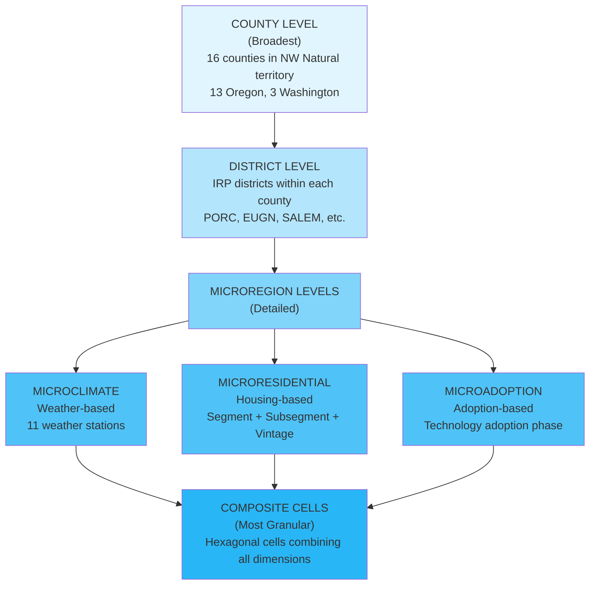
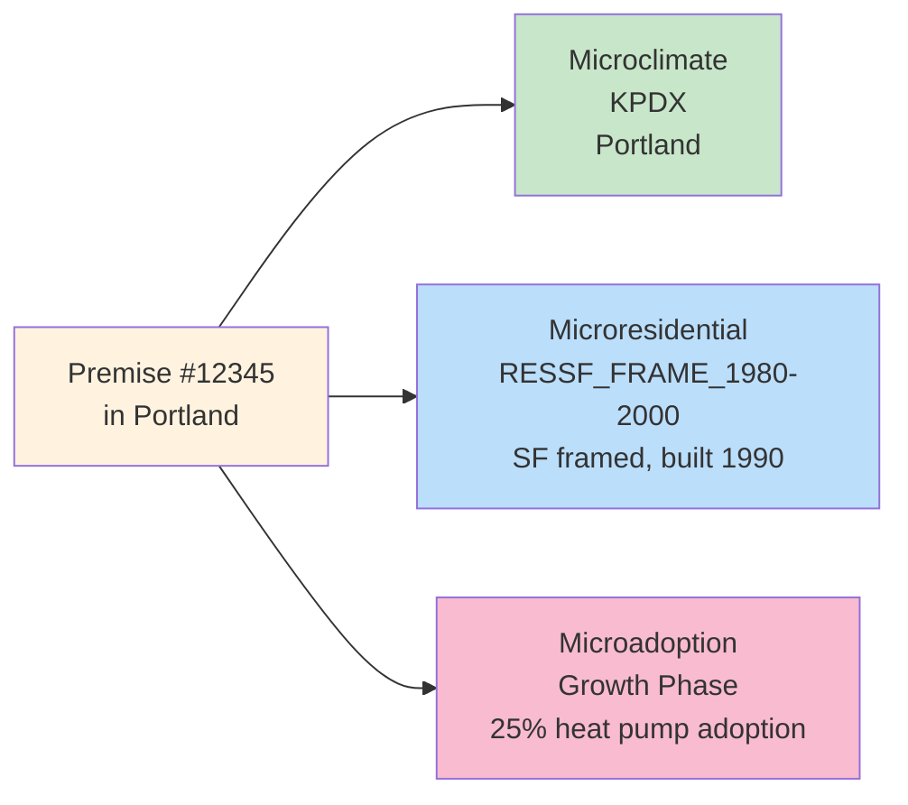
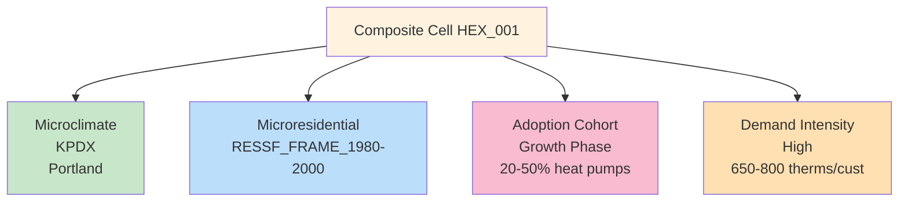
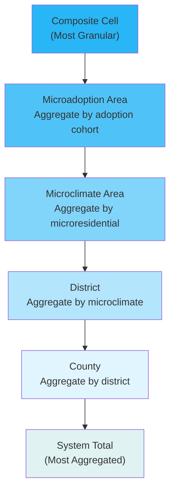

# Regions and Cells: Geographic Analysis Framework

## Overview

The NW Natural End-Use Forecasting Model uses a hierarchical geographic framework to analyze residential energy demand across multiple dimensions. This document explains the different geographic levels, how they relate to each other, and how to use them for analysis.

## Geographic Hierarchy

The model supports analysis at five distinct geographic levels, arranged in a hierarchy from broad to granular:



## Level 1: County

**Definition**: County-level geographic boundaries from the U.S. Census Bureau.

**Coverage**: 16 counties in NW Natural service territory:
- **Oregon (13 counties)**: Multnomah, Washington, Clackamas, Lane, Marion, Yamhill, Polk, Benton, Linn, Columbia, Clatsop, Lincoln, Coos
- **Washington (3 counties)**: Clark, Skamania, Klickitat

**Typical Metrics**:
- Total demand (therms/year)
- Use per customer (therms/customer)
- Customer count
- End-use breakdown
- Electrification rate

**Use Cases**:
- High-level system planning
- Regulatory reporting
- Public communication
- Scenario comparison at system level

**Example**: "Multnomah County demand is projected to decline 12% by 2035 under the Aggressive Electrification scenario"

---

## Level 2: District

**Definition**: IRP districts within each county, representing utility service areas or geographic clusters.

**Coverage**: Approximately 20-30 districts across the service territory (varies by county).

**Key Districts**:
- **PORC**: Portland area (Multnomah County)
- **EUGN**: Eugene area (Lane County)
- **SALEM**: Salem area (Marion County)
- **KLAMATH**: Klamath Falls area (Klamath County)
- **COAST**: Coastal areas (Coos, Lincoln, Clatsop counties)
- **GORGE**: Columbia River Gorge (Wasco County)

**Typical Metrics**:
- Total demand (therms/year)
- Use per customer (therms/customer)
- Customer count
- End-use breakdown
- Electrification rate

**Use Cases**:
- District-level planning
- Infrastructure investment decisions
- Targeted policy programs
- Regional market analysis

**Example**: "The Gorge district has higher heating demand (5,800 HDD) compared to coastal areas (4,400 HDD)"

---

## Level 3: Microregions (Three Dimensions)

Microregions break down districts into three independent dimensions, each capturing a different aspect of the market:

### 3A: Microclimate Areas

**Definition**: Geographic zones defined by weather patterns and climate characteristics.

**Basis**: Weather station service territories (11 stations across NW Natural territory).

**The 11 Weather Stations**:

| Station | ICAO | Location | Region | Annual HDD | Coverage |
|---------|------|----------|--------|------------|----------|
| Portland | KPDX | Portland, OR | Willamette Valley | 4,850 | Multnomah, Washington, Yamhill, Clackamas (north) |
| Eugene | KEUG | Eugene, OR | Willamette Valley | 4,650 | Lane, Benton (south) |
| Salem | KSLE | Salem, OR | Willamette Valley | 4,900 | Marion, Polk, Linn (south) |
| Astoria | KAST | Astoria, OR | Coast | 5,200 | Clatsop, Columbia |
| The Dalles | KDLS | The Dalles, OR | Gorge | 5,800 | Wasco (Gorge region, coldest) |
| Coos Bay | KOTH | North Bend, OR | Coast | 4,400 | Coos, Lincoln (coast, mildest) |
| Newport | KONP | Newport, OR | Coast | 4,600 | Lincoln (coast) |
| Corvallis | KCVO | Corvallis, OR | Willamette Valley | 4,750 | Benton (north) |
| Hillsboro | KHIO | Hillsboro, OR | Willamette Valley | 4,900 | Washington (west) |
| Troutdale | KTTD | Troutdale, OR | Gorge | 5,100 | Multnomah (east), Hood River area |
| Vancouver | KVUO | Vancouver, WA | Willamette Valley | 4,950 | Clark, Skamania, Klickitat |

**Key Characteristics**:
- **Coldest**: The Dalles (KDLS) with 5,800 HDD — Gorge region with extreme cold
- **Mildest**: Coos Bay (KOTH) with 4,400 HDD — Coastal region with moderate winters
- **Variation**: 1,400 HDD difference between coldest and mildest (32% variation)

**Typical Metrics**:
- Annual heating degree days (HDD)
- Annual cooling degree days (CDD)
- Water heating temperature differential
- Space heating demand intensity

**Use Cases**:
- Climate-driven demand analysis
- Weather normalization
- Regional efficiency programs
- Climate adaptation planning

**Example**: "Homes in the Gorge (KDLS) have 32% higher heating demand than coastal homes (KOTH) due to climate differences"

---

### 3B: Microresidential Areas

**Definition**: Housing characteristic clusters defined by building type, construction type, and vintage.

**Dimensions**:

1. **Segment** (from NW Natural data):
   - **RESSF**: Single-family residential (typically 80% of market)
   - **RESMF**: Multi-family residential (typically 15% of market)
   - **MOBILE**: Mobile homes (typically 5% of market)

2. **Subsegment** (construction type):
   - **FRAME**: Framed construction (wood frame, most common)
   - **MASONRY**: Masonry construction (brick, concrete)
   - **MFG**: Manufactured (mobile homes)

3. **Vintage Cohort** (construction year):
   - **Pre-1980**: Older homes, lower efficiency, higher demand
   - **1980-2000**: Mid-age homes, moderate efficiency
   - **2000-2010**: Newer homes, higher efficiency
   - **2010+**: Very new homes, high efficiency, heat pump ready

**Cluster ID Format**: `{segment}_{subsegment}_{vintage_cohort}`

**Examples**:
- `RESSF_FRAME_Pre-1980` = Single-family framed homes built before 1980
- `RESMF_MASONRY_2000-2010` = Multi-family masonry homes built 2000-2010
- `MOBILE_MFG_1980-2000` = Mobile homes built 1980-2000

**Typical Metrics**:
- Total demand (therms/year)
- Use per customer (therms/customer)
- Customer count
- Building count
- Average square footage
- Equipment efficiency

**Use Cases**:
- Housing type-specific analysis
- Equity and affordability analysis
- Retrofit program targeting
- Market segmentation

**Example**: "Multi-family homes (RESMF) have 20% lower per-unit demand than single-family homes (RESSF) due to shared walls and smaller size"

---

### 3C: Microadoption Areas

**Definition**: Technology adoption clusters defined by heat pump penetration and electrification rates.

**Adoption Cohorts** (based on heat pump penetration):

1. **Early Adopters** (0-20% heat pump penetration):
   - First-mover regions
   - Policy-driven adoption
   - High incentive uptake
   - Example: Portland urban core with early heat pump programs

2. **Growth Phase** (20-50% heat pump penetration):
   - Mainstream adoption
   - Cost-competitive with gas
   - Market-driven growth
   - Example: Suburban areas with growing adoption

3. **Mature Phase** (50-80% heat pump penetration):
   - Market saturation
   - Replacement-driven adoption
   - Declining gas equipment sales
   - Example: Areas with mature heat pump markets

4. **Saturation** (80%+ heat pump penetration):
   - Near-complete electrification
   - Gas equipment rare
   - Minimal new gas connections
   - Example: Forward-looking policy areas

**Cluster ID Format**: `{microclimate}_{microresidential}_{adoption_cohort}`

**Examples**:
- `KPDX_RESSF_FRAME_1980-2000_Growth` = Single-family framed homes built 1980-2000 in Portland with 20-50% heat pump adoption
- `KDLS_RESMF_MASONRY_2000-2010_Early_Adopters` = Multi-family masonry homes built 2000-2010 in Gorge with <20% heat pump adoption

**Typical Metrics**:
- Heat pump penetration (%)
- Electrification rate (%)
- Average equipment efficiency
- Adoption trajectory (% change per year)
- Demand reduction vs. baseline

**Use Cases**:
- Policy effectiveness measurement
- Adoption barrier identification
- Incentive program targeting
- Market transformation tracking

**Example**: "Early adopter areas (KPDX) have 35% heat pump penetration, while laggard areas (KDLS) have only 8%, indicating regional policy differences"

---

## Level 4: Composite Cells

**Definition**: Multi-dimensional analytical units that combine all microregion layers into a single geographic cell.

**Cell Composition**: Each cell represents a unique intersection of:
- **Microclimate**: Weather station service area (11 options)
- **Microresidential**: Housing characteristics cluster (50+ combinations)
- **Adoption Cohort**: Technology adoption phase (4 phases)
- **Demand Intensity**: Demand level category (4 levels)

**Cell ID Format**: `HEX_{hex_id}_{microclimate}_{microresidential}_{adoption_cohort}_{demand_intensity}`

**Example**: `HEX_001_KPDX_RESSF_FRAME_1980-2000_Growth_High`
- Hexagonal cell #001
- Portland microclimate (KPDX)
- Single-family framed homes built 1980-2000
- Growth phase adoption (20-50% heat pumps)
- High demand intensity (650-800 therms/customer)

**Cell Geometry**:
- **Hexagonal Grid**: H3 library or custom implementation
- **Cell Size**: ~5-10 km² (adjustable for zoom level)
- **Aggregation**: All premises within geographic bounds
- **Visualization**: Color-coded by composite score, size proportional to demand

**Composite Score** (0-100):
Multi-dimensional metric combining:
- **Demand Intensity** (40% weight): Higher demand = higher score (opportunity for savings)
- **Adoption Rate** (30% weight): Lower adoption = higher score (opportunity for growth)
- **Efficiency Gap** (20% weight): Difference between current and potential efficiency
- **Climate Severity** (10% weight): HDD-based climate factor (colder = higher score)

**Formula**:
```
Composite Score = (demand_intensity_score × 0.4) + 
                  ((100 - adoption_rate) × 0.3) + 
                  (efficiency_gap_score × 0.2) + 
                  (climate_severity_score × 0.1)
```

**Derived Scores**:

1. **Opportunity Score** (0-100):
   - Identifies high-potential areas for electrification
   - Formula: `(demand_intensity × 0.6) + ((100 - adoption_rate) × 0.4)`
   - High opportunity: High demand + Low adoption
   - Example: Rural Gorge area with 8% adoption and 700 therms/customer = high opportunity

2. **Success Score** (0-100):
   - Identifies successful transitions
   - Formula: `(adoption_rate × 0.6) + ((100 - demand_intensity) × 0.4)`
   - High success: High adoption + Low demand
   - Example: Portland urban area with 45% adoption and 580 therms/customer = high success

**Typical Metrics**:
- Total demand (therms/year)
- Use per customer (therms/customer)
- Customer count
- Heat pump penetration (%)
- Electrification rate (%)
- Average equipment efficiency
- Composite score (0-100)
- Opportunity score (0-100)
- Success score (0-100)

**Use Cases**:
- Opportunity identification (high-demand, low-adoption cells)
- Success analysis (high-adoption, low-demand cells)
- Equity targeting (underserved populations)
- Infrastructure planning
- Market segmentation
- Policy effectiveness measurement
- Comparative analysis across similar cells

**Example**: "Cell HEX_001 (Portland SF homes, 1980-2000, Growth phase) has an opportunity score of 72, indicating high potential for targeted electrification incentives"

---

## Relationships Between Levels

### How Microregions Relate

The three microregion dimensions are **independent** — each premise belongs to exactly one of each:



### How Cells Combine Microregions

Composite cells are the **intersection** of all dimensions:



### Aggregation Hierarchy

Results can be aggregated at any level:



---

## Choosing the Right Level for Analysis

### Use County Level When:
- Presenting to executives or regulators
- Comparing across service territory
- Long-term strategic planning
- Public communication

### Use District Level When:
- Planning infrastructure investments
- Designing regional programs
- Analyzing market segments
- Comparing similar regions

### Use Microclimate When:
- Analyzing weather-driven demand
- Planning climate adaptation
- Comparing regional efficiency
- Understanding HDD variation

### Use Microresidential When:
- Targeting specific housing types
- Designing retrofit programs
- Analyzing equity issues
- Understanding demographic variation

### Use Microadoption When:
- Measuring policy effectiveness
- Identifying adoption barriers
- Targeting incentive programs
- Tracking market transformation

### Use Composite Cells When:
- Identifying high-opportunity areas
- Analyzing success patterns
- Segmenting market for targeted programs
- Detailed scenario analysis
- Understanding multi-dimensional variation

---

## Example Analysis Workflows

### Workflow 1: Identify High-Opportunity Areas for Heat Pump Incentives

1. Start at **Composite Cell** level
2. Filter for cells with:
   - High demand intensity (>700 therms/customer)
   - Low adoption rate (<20% heat pumps)
   - High opportunity score (>70)
3. Results: Cells in Gorge region (KDLS) with older SF homes (Pre-1980)
4. Action: Design targeted incentive program for these cells

### Workflow 2: Understand Regional Demand Differences

1. Start at **Microclimate** level
2. Compare demand across 11 weather stations
3. Results: Gorge (KDLS) has 32% higher demand than coast (KOTH)
4. Drill down to **Microresidential** level
5. Results: Difference driven by both climate (HDD) and housing type (older homes in Gorge)
6. Action: Design climate-specific efficiency programs

### Workflow 3: Measure Policy Effectiveness

1. Start at **Microadoption** level
2. Compare adoption rates across adoption cohorts
3. Results: Early adopter areas (KPDX) have 35% adoption vs. laggard areas (KDLS) with 8%
4. Drill down to **Composite Cell** level
5. Results: Success score shows Portland cells transitioning successfully
6. Action: Study Portland's policies and replicate in laggard areas

### Workflow 4: Plan Infrastructure Retirement

1. Start at **District** level
2. Project electrification rates to 2035
3. Results: Some districts reach 60%+ electrification by 2035
4. Drill down to **Composite Cell** level
5. Results: Identify specific cells with highest electrification rates
6. Action: Plan gas infrastructure retirement in high-electrification cells

---

## Data Availability by Level

| Level | Data Source | Granularity | Availability |
|-------|-------------|-------------|--------------|
| County | Census Bureau | County boundaries | 100% coverage |
| District | NW Natural | IRP district codes | 100% coverage |
| Microclimate | Weather stations | 11 stations | 100% coverage |
| Microresidential | NW Natural + RBSA | Segment + subsegment + vintage | ~95% coverage |
| Microadoption | Model output | Adoption cohort | 100% coverage (model-derived) |
| Composite Cell | Model output | Hexagonal grid | 100% coverage (model-derived) |

---

## Visualization Tips

### For County/District Level:
- Use choropleth maps with county/district boundaries
- Color by demand intensity or electrification rate
- Show time-series trends

### For Microclimate Level:
- Overlay weather station service areas (Voronoi or buffered circles)
- Color by HDD or demand intensity
- Show weather station locations

### For Microresidential Level:
- Use hexagonal bins or custom polygons
- Color by housing type or vintage
- Show building density

### For Microadoption Level:
- Use hexagonal bins or custom polygons
- Color by adoption rate or opportunity score
- Show adoption trajectory over time

### For Composite Cells:
- Use hexagonal grid
- Color by composite score (gradient from blue to red)
- Size proportional to customer count or demand
- Show cell evolution animation over time

---

## Summary

The hierarchical geographic framework provides flexibility for analysis at multiple scales:

- **County**: Broad system-level planning
- **District**: Regional program design
- **Microclimate**: Weather-driven demand analysis
- **Microresidential**: Housing-type specific analysis
- **Microadoption**: Technology adoption tracking
- **Composite Cells**: Multi-dimensional opportunity identification

Choose the appropriate level based on your analysis goals, and drill down for more detail as needed.
