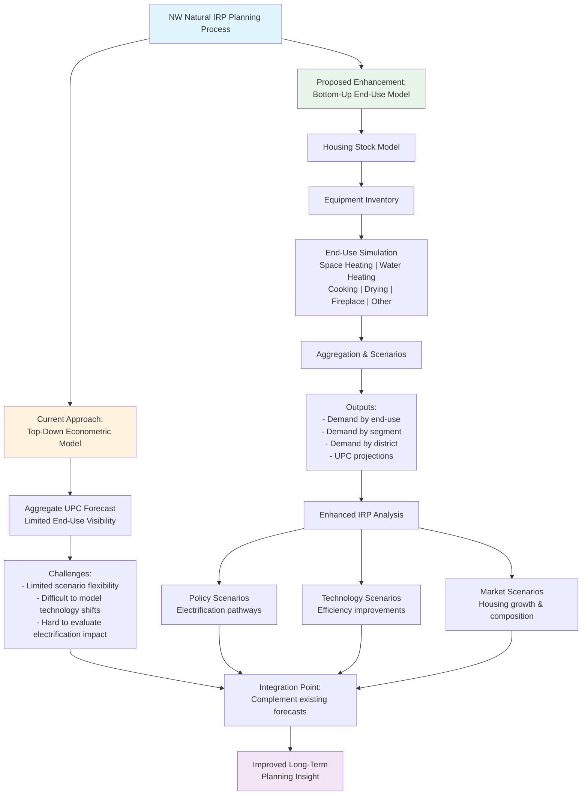
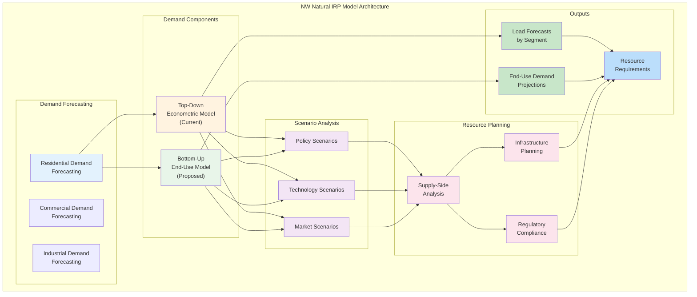

# Final Project Scope: NW Natural End-Use Forecasting Model

**2026 MSADSB Capstone Project**  
*Improving IRP demand forecasting through a bottom-up approach*

---

## Background

Northwest Natural (NW Natural) is a regulated natural gas utility serving approximately two million customers across Oregon and Southwest Washington. As part of its long-term planning obligations, NW Natural develops an Integrated Resource Plan (IRP) to evaluate future demand, infrastructure needs, and compliance with evolving policy and regulatory requirements.

A critical input in the planning process is the load forecast (or demand forecast). NW Natural currently develops residential demand forecasts for Integrated Resource Planning (IRP) primarily through top-down econometric models that estimate use per customer (UPC) as a function of historical consumption, weather, and macroeconomic drivers.

While this approach has historically supported system planning, it provides limited visibility into underlying demand drivers. Structural changes in demand—including end-use consumption patterns, equipment efficiency improvements, technology adoption, and policy-driven electrification—may reshape natural gas demand over the long planning horizons required for IRP analysis.

Many utilities have begun supplementing traditional econometric models with bottom-up residential end-use models that represent the housing stock and simulate energy consumption across appliances and end uses. These models allow planners to evaluate structural changes in demand under alternative policy, technology, and electrification scenarios.

This project explores the development of a prototype residential housing-stock end-use model that could complement NW Natural's existing load forecasting toolkit and enhance scenario analysis within the IRP process.

### NW Natural IRP Model Architecture

The diagram below illustrates how the proposed bottom-up end-use model fits within NW Natural's broader IRP model architecture:

---

## Project Objective

The objective of this project is to design and evaluate a bottom-up natural gas demand forecasting framework for NW Natural's Integrated Resource Planning process that disaggregates residential demand by end use, improving long-term scenario analysis and planning insight under evolving technology, policy, and market conditions.

## Problem Statement

NW Natural's current residential forecasting approach primarily models demand at an aggregate level, which limits the ability to directly evaluate how structural changes in the housing stock and appliance technologies influence future natural gas demand.

A housing-stock end-use modeling approach allows demand to be simulated from the bottom up by explicitly representing:

- The number and type of housing units
- The prevalence of gas-using appliances
- Energy consumption per appliance
- Equipment replacement cycles and fuel switching

This framework enables more robust scenario analysis and improves the ability to evaluate policy, technology, and electrification pathways within the IRP planning horizon.

---

## In Scope / Out of Scope

### In Scope

- Review of NW Natural's existing IRP load forecasting process and model map
- Evaluation of available historical billing, equipment, and weather data for end-use modeling
- Identification of key demand drivers and end-use attributes by customer segment
- Design of a transparent bottom-up forecasting framework suitable for long-term IRP analysis
- Development of a proof-of-concept residential end-use simulation model to project future demand scenarios
- Comparison of bottom-up model outputs to existing aggregate load forecasts
- Recommendation for how an end-use model could integrate into NW Natural's IRP model architecture

### Out of Scope

- Production-level model deployment or automation (integration with production-level workflow would require additional work on NW Natural's part, given that this model is being built as standalone)
- Operational integration with existing forecasting systems
- Use of the model for formal regulatory filings
- Implementation of customer-specific or premise-level forecasts

---

## Work Plan

The project will be executed through a series of overlapping phases designed to progress from discovery and data exploration to model development, validation, and delivery.

### Project Phases

1. **Project initiation and technical onboarding**
2. **Data exploration and end-use research**
3. **Model design and development**
   - Model outputs
   - Model inputs
   - Model structure
   - Data flow and design documentation
4. **Validation, refinement, and comparison to existing forecasts**
5. **Final synthesis, recommendations, and presentation**

To ensure alignment before proceeding to further project phases, the project team will check in with NW Natural (e.g., model outputs, inputs, structure).

The detailed project timeline will adjust as-needed to ensure successful on-time delivery.

---

## Deliverables

The project will produce the following deliverables:

1. **Data exploration and trend analysis** — Summarizing key findings from historical billing, equipment, and weather data
2. **End-use forecasting methodology documentation** — Including assumptions, data sources, structure, outputs, limitations, and justification for selected modeling approaches
   - See [Inputs](inputs.md) for comprehensive data source specifications
   - See [Outputs](outputs.md) for detailed output format specifications
3. **Illustrative bottom-up end-use simulation model** — Demonstrating how demand projections can be generated by customer segment and end use
4. **Comparative analysis** — Highlighting similarities and differences between the bottom-up framework and NW Natural's existing load forecast
5. **Recommendation for model placement** — How the end-use model could integrate into NW Natural's IRP model map
6. **Final written report** — Documenting findings, insights, and recommendations
7. **Management-level presentation** — Summarizing results and proposed next steps for NW Natural's forecasting evolution

---

## Research Plan

### Secondary Research

Secondary research will include a review of industry literature and utility best practices related to bottom-up and end-use demand forecasting, including end-use appliance performance. This research will inform model structure, end-use definitions, and scenario design, with a focus on long-term planning applications in regulated utility environments.

### Primary Research

Primary research will consist of structured interviews with NW Natural subject matter experts to validate assumptions, interpret data, and align model design with business needs. Some of this primary research has already been completed via the technical deep-dive session in January.

Interviews will focus on understanding:
- Current forecasting workflows
- Data limitations
- Use-case priorities
- How an end-use model could best support scenario analysis

An interview tracker will be maintained to monitor interview status, and a structured codebook will be used to capture and synthesize key insights across interviews.

---

## Team Structure

The student team will operate under a defined project structure to ensure accountability and clear communication.

### Roles

- **Project Coordinator** — Responsible for timeline management and stakeholder communication
- **Research Coordinator** — Responsible for managing research activities, interviews, and insight synthesis

NW Natural can expect communication to flow between either Danny or Laurie.

Additional responsibilities will be assigned across data analysis, modeling, and documentation tasks.

### Communication

- Weekly internal team meetings to track progress and coordinate work
- Regular check-ins with faculty advisor and NW Natural stakeholders to review interim findings, validate assumptions, and ensure alignment with project objectives

---

## Student Team

### Laurie Kelly
Laurie is a Financial Analyst at the Bonneville Power Administration with 10 years of experience in the energy sector, primarily working in finance. She is the program manager for the Lease-Purchase Program, which arranges financing for Transmission capital construction projects. Outside of her experience with Bonneville, Laurie has worked for the Portland VA Medical Center, where she has used her customer service skills to meet the needs of internal and external stakeholders, keep communication lines open between multiple parties, and resolve conflicts.

### Chad Koehnen
With 17 years of experience in systems integration, Chad thrives on bridging the gap between legacy tech and scalable, modern architectures for mission-critical industries like aviation and defense. He is a lifelong "builder" who has led high-stakes operations at the Port of Portland and Weston Industries, specializing in unifying complex OEM software with automated, precision-driven workflows. Beyond the code, he leverages his fluency in English, Spanish, and Turkish to lead global teams and inspire the next generation of engineers through creative hardware-software integration.

### Matthew Morataya
Matthew is passionate about networking and learning from diverse perspectives to solve complex business challenges. Whether analyzing customer service gaps or building data models, he drives innovation through open communication and rigorous analysis. He is eager to connect with professionals in the data and marketing space who value curiosity and creative problem-solving. Matthew is in the early stages of his career, currently working part-time at Buffalo Wild Wings and previously holding customer service and point-of-sale roles. He holds a bachelor's degree in Business of Technology and Analytics from Portland State University.

### Danny Politoski
Danny is an Energy Supply Optimization Analyst at PacifiCorp, supporting energy trading, load and renewables forecasting, and resource optimization. He has 5 years of experience in analytics, problem identification, and creative solution design in the energy industry. He holds a Bachelor's degree in Economics and Environmental Science from the University of Portland.

---

## NW Natural Team

- **Tamy Linver** — Sr. Director, Strategic Planning
- **Andrew Sprott** — Director, Integrated Resource Planning
- **Kyle Putnam, PhD** — Economist, Integrated Resource Planning
- **Taylor Toews** — Energy Systems Modeler, lead PLEXOS modeler

---

*Project Date: March 5, 2026*

---

## Related Documentation

- **[README](README.md)** — Project overview and quick links
- **[Requirements](requirements.md)** — Functional and non-functional requirements
- **[Design](design.md)** — System architecture and design decisions
- **[Algorithm](ALGORITHM.md)** — Detailed algorithm explanation
- **[Inputs](inputs.md)** — Input data specifications
- **[Outputs](outputs.md)** — Output data specifications
- **[Future Data Sources](FUTURE_DATA_SOURCES.md)** — Additional data sources for enhancement
- **[Tasks](tasks.md)** — Implementation plan
