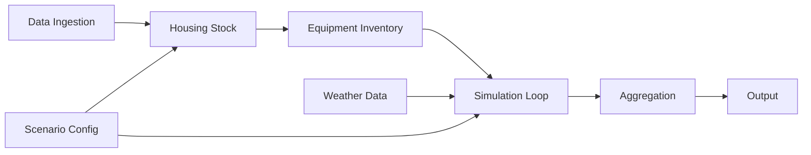
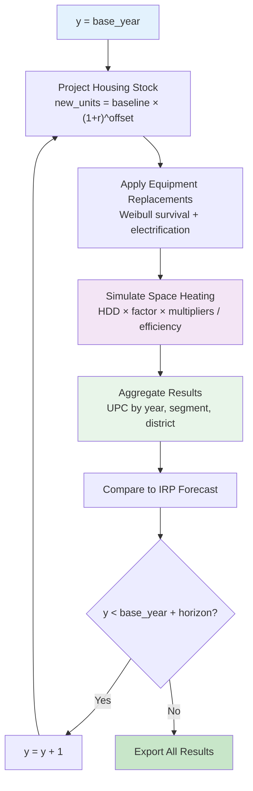
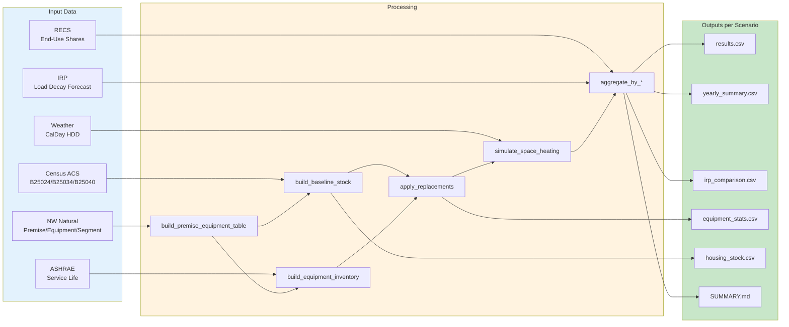

# Algorithm: NW Natural End-Use Forecasting Model

## Overview

The NW Natural End-Use Forecasting Model is a bottom-up residential natural gas demand simulation engine. It constructs a housing stock from NW Natural's blinded premise and equipment data, simulates equipment lifecycles using a Weibull survival model, calculates space heating consumption driven by weather and equipment characteristics, and aggregates results to system-level demand projections.

**Current scope**: Space heating only. Water heating, cooking, clothes drying, fireplaces, and other end-uses are excluded from the current simulation (planned for future work). Non-heating end-uses are estimated using RECS Pacific division ratios when `use_recs_ratios=true` in the scenario config.

---

## High-Level Pipeline



### Pipeline Stages

1. **Data Ingestion** — Load and clean all data sources. Build the unified premise-equipment table.
2. **Housing Stock** — Construct baseline housing stock from premise/segment data. Project forward using scenario growth rate.
3. **Equipment Inventory** — Build equipment inventory with Weibull parameters from ASHRAE service life data.
4. **Simulation Loop** — For each year in the forecast horizon: apply equipment replacements, simulate space heating consumption.
5. **Aggregation** — Roll up premise-level results to system totals by end-use, segment, district, and year.
6. **Output** — Export CSVs, generate SUMMARY.md, compare against IRP forecast.

---

## Step 1: Data Ingestion

**Inputs**: CSV/XLS files from `Data/`, Census API, NOAA API

**Process**:
1. Load NW Natural data: premise, equipment, equipment codes, segment, weather (CalDay), water temperature, billing, snow
2. Load external data: RBSA 2022/2017, ASHRAE service life (OR/WA), IRP load decay forecast, historical UPC, baseload factors, NW energy proxies, Census B25034/B25040/B25024, PSU forecasts, WA OFM housing, NOAA climate normals, EIA RECS microdata, tariff/rate data
3. Filter premises to active residential only: `custtype='R'` AND `status_code='AC'`
4. Build premise-equipment table by joining premise + equipment + segment + equipment_codes on `blinded_id` and `equipment_type_code`
5. Derive `end_use` via `END_USE_MAP`, `efficiency` via `DEFAULT_EFFICIENCY`, `weather_station` via `DISTRICT_WEATHER_MAP`
6. Log warnings for unmapped equipment codes, missing weather station assignments, zero efficiency

**Output**: Cleaned premise-equipment DataFrame with ~213K premises and ~247K equipment records

---

## Step 2: Build Baseline Housing Stock

**Input**: Premise-equipment table, base year

**Process**:
```
For each unique blinded_id:
    - Extract district_code_IRP, segment (RESSF/RESMF/MOBILE), set_year (vintage)
    - Count as 1 housing unit

Aggregate:
    total_units = count of unique blinded_ids
    units_by_segment = count by segment type
    units_by_district = count by IRP district
```

**Output**: `HousingStock` dataclass with `year`, `premises`, `total_units`, `units_by_segment`, `units_by_district`

---

## Step 3: Build Equipment Inventory

**Input**: Premise-equipment table, ASHRAE service life data

**Process**:
```
For each equipment record (blinded_id, equipment_type_code, qty):
    1. Map to end_use via END_USE_MAP
    2. Assign efficiency:
       - Use ASHRAE data if available (state-specific OR/WA)
       - Fall back to DEFAULT_EFFICIENCY from config
    3. Derive install_year from segment.set_year (premise vintage as proxy)
    4. Assign useful_life:
       - Use ASHRAE median service life (state-specific)
       - Fall back to USEFUL_LIFE from config
    5. Compute Weibull scale parameter:
       eta = useful_life / (ln(2))^(1/beta)
       beta = WEIBULL_BETA[end_use] from config
```

**Output**: Equipment inventory DataFrame with columns: `blinded_id`, `equipment_type_code`, `end_use`, `qty`, `efficiency`, `install_year`, `useful_life`, `fuel_type`, `weibull_eta`, `weibull_beta`

---

## Step 4: Simulation Loop

For each year `y` from `base_year` to `base_year + forecast_horizon`:

### 4a. Project Housing Stock

```
new_units(y) = baseline_units × (1 + housing_growth_rate)^(y - base_year)
```

Segment shares shift over time using Census B25024 historical SF→MF trend rates (computed in `census_integration.py`).

### 4b. Apply Equipment Replacements

```
For each equipment unit at age t = y - install_year:
    1. Compute survival probability:
       S(t) = exp(-(t / eta)^beta)
    2. Compute replacement probability:
       P_replace = 1 - S(t) / S(t-1)
    3. Draw u ~ Uniform(0, 1)
    4. If u < P_replace:  → REPLACE
       a. If random() < electrification_rate:
          - Switch fuel_type to "electric"
          - Update efficiency to electric equivalent
       b. Else:
          - Keep fuel_type = "gas"
          - Apply efficiency_improvement from scenario
       c. Set install_year = y, recalculate eta
    5. Else:  → KEEP
       - Apply annual efficiency degradation (0.5%/yr)
```

### 4c. Simulate Space Heating Consumption

```
For each space heating equipment unit at premise i:
    1. Get annual_hdd for premise's weather station in year y
    2. Apply vintage multiplier: VINTAGE_HEATING_MULTIPLIER[set_year]
    3. Apply segment multiplier: SEGMENT_HEATING_MULTIPLIER[segment]
    4. Calculate therms:
       therms(i,y) = (annual_hdd × heating_factor × vintage_mult × segment_mult × qty) / efficiency
```

**Note**: Water heating, cooking, drying, fireplace, and other end-uses are not simulated. If `use_recs_ratios=true`, non-heating end-uses are estimated using RECS Pacific division ratios applied to the space heating total.

---

## Step 5: Aggregation

```
For each year y:
    total_therms(y) = sum(therms(i,y)) for all premises i
    premise_count(y) = count of unique blinded_ids
    upc(y) = total_therms(y) / premise_count(y)

Aggregate by end_use, segment, district for detailed breakdowns.
```

---

## Step 6: IRP Comparison

```
For each year y:
    irp_upc(y) = 648 × (1 - 0.0119)^(y - 2025)
    diff_therms(y) = model_upc(y) - irp_upc(y)
    diff_pct(y) = diff_therms(y) / irp_upc(y) × 100
```

---

## Scenario Projection Loop



---

## Data Flow: Inputs to Outputs



---

## Key Design Decisions

### Why Weibull (not deterministic age cutoff)?
A deterministic cutoff would replace all equipment of the same vintage in the same year, creating artificial demand spikes. The Weibull model produces a realistic spread of replacements over time — some units fail early, most fail near the median life, a few last much longer.

### Why district-level weather station assignment?
NW Natural's premise data includes `district_code_IRP` but not GPS coordinates. The `DISTRICT_WEATHER_MAP` in `src/config.py` maps each district to its nearest representative weather station. This is a simplification — future work could use NOAA PRISM gridded temperature data for sub-district resolution.

### Why vintage and segment multipliers?
A single heating factor calibrated to the fleet average would over-predict demand for new efficient homes and under-predict for old leaky ones. The `VINTAGE_HEATING_MULTIPLIER` (1.35× for pre-1980, 0.70× for 2015+) and `SEGMENT_HEATING_MULTIPLIER` (1.05× for SF, 0.70× for MF) capture the most important sources of within-fleet variation without requiring premise-level building shell data.

### Why RECS ratios for non-heating end-uses?
The current model only simulates space heating. Rather than leaving total UPC undefined, RECS Pacific division data provides empirically grounded ratios of non-heating to space heating consumption. These are applied as a multiplier when `use_recs_ratios=true`, producing an estimated total UPC for comparison against the IRP's all-end-use forecast.

---

## Related Documentation

- **[FORMULAS.md](FORMULAS.md)** — All mathematical formulas with variable definitions
- **[EFFICIENCY_MODEL.md](EFFICIENCY_MODEL.md)** — Equipment efficiency degradation, repair, and replacement model
- **[HDD_NORMALIZATION.md](HDD_NORMALIZATION.md)** — Weather year handling and HDD normalization
- **[MODEL_VS_IRP_COMPARISON.md](MODEL_VS_IRP_COMPARISON.md)** — Bottom-up vs top-down forecast comparison
