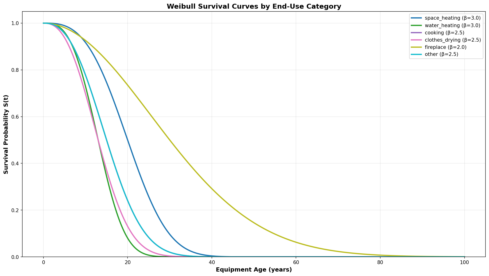
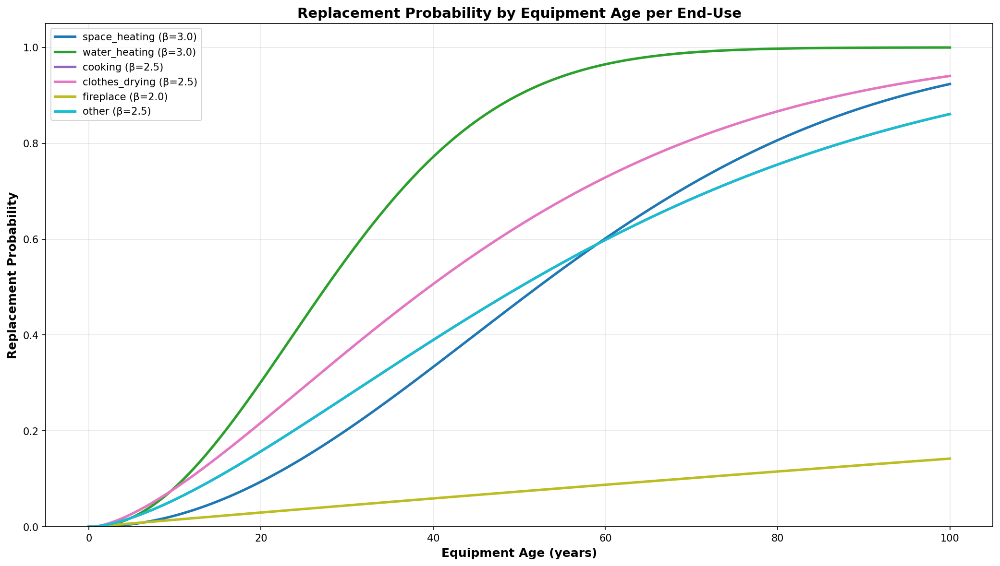
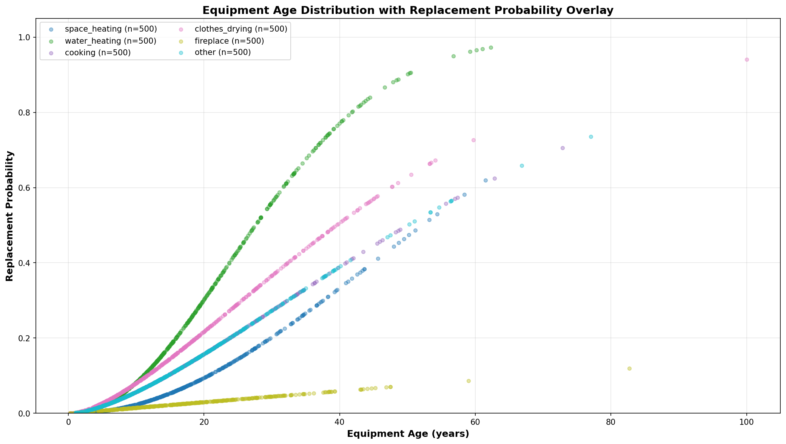

# Property 5: Weibull Survival Monotonicity Report

**Status:** ✓ PASSED

**Generated:** 2026-04-14T14:18:17.440212

**Validates:** Requirements 3.3

## Test Summary

### Property 5: Survival Monotonicity
- **Definition:** S(t) ≤ S(t-1) for all t > 0, and S(0) = 1.0
- **Status:** ✓ PASSED
- **Violations:** 0

### Property 5b: Probability Bounds
- **Definition:** replacement_probability is always in [0, 1]
- **Status:** ✓ PASSED
- **Violations:** 0

## Weibull Parameters and Statistics

| End-Use | β (Shape) | η (Scale) | Useful Life | S(0) | S(median) | S(2×median) |
|---------|-----------|-----------|-------------|------|-----------|-------------|
| space_heating | 3.00 | 22.60 | 20 | 1.000000 | 0.500000 | 0.003906 |
| water_heating | 3.00 | 14.69 | 13 | 1.000000 | 0.500000 | 0.003906 |
| cooking | 2.50 | 17.37 | 15 | 1.000000 | 0.500000 | 0.019821 |
| clothes_drying | 2.50 | 15.05 | 13 | 1.000000 | 0.500000 | 0.019821 |
| fireplace | 2.00 | 36.03 | 30 | 1.000000 | 0.500000 | 0.062500 |
| other | 2.50 | 17.37 | 15 | 1.000000 | 0.500000 | 0.019821 |

## Replacement Probability Bounds

| End-Use | Min P | Max P | P(median) | P(2×median) |
|---------|-------|-------|-----------|-------------|
| space_heating | 0.000000 | 0.923724 | 0.094131 | 0.333408 |
| water_heating | 0.000000 | 0.999915 | 0.137541 | 0.459648 |
| cooking | 0.000000 | 0.861053 | 0.103998 | 0.272855 |
| clothes_drying | 0.000000 | 0.940546 | 0.118127 | 0.306648 |
| fireplace | 0.000000 | 0.142096 | 0.044423 | 0.087575 |
| other | 0.000000 | 0.861053 | 0.103998 | 0.272855 |

## Violations

✓ No violations detected

## Visualizations

### 1. Weibull Survival Curves by End-Use Category
Shows how survival probability decreases with equipment age for each end-use category. 
All curves should be monotonically decreasing and start at S(0) = 1.0.



### 2. Replacement Probability by Equipment Age per End-Use
Shows the conditional probability that equipment fails in the next year, given its current age. 
All values should be in [0, 1].



### 3. Equipment Age Distribution with Replacement Probability Overlay
Scatter plot showing synthetic equipment age distribution with replacement probability for each unit. 
Demonstrates how replacement probability varies across the equipment population.



## Interpretation

- **Monotonicity:** The survival function S(t) represents the probability that equipment survives to age t. 
  It must be monotonically decreasing (or flat) because equipment cannot "un-fail".

- **S(0) = 1.0:** New equipment (age 0) always survives, so S(0) must equal 1.0.

- **Replacement Probability Bounds:** The replacement probability P(t) represents the conditional probability 
  that equipment fails in the next year. It must be in [0, 1] to be a valid probability.

- **Shape Parameter β:** Higher β values (e.g., 3.0 for HVAC) indicate concentrated replacement windows 
  (most equipment fails around the median life). Lower β values (e.g., 2.0 for fireplaces) indicate more gradual failure.

## Mathematical Background

The Weibull survival function is defined as:

```
S(t) = exp(-(t/η)^β)
```

Where:
- t = equipment age (years)
- η = scale parameter (characteristic life)
- β = shape parameter (controls failure rate distribution)

The replacement probability is the conditional probability of failure in the next year:

```
P(t) = 1 - S(t) / S(t-1)
```

This represents the probability that equipment should be replaced at age t.
