# Property 4: Housing Stock Projection Test Results

## Test Overview

**Property 4:** Verify that projected total_units = baseline × (1 + growth_rate)^(years), within rounding tolerance

**Validates:** Requirements 2.3, 6.3

**Description:** Verify that projected total_units = baseline × (1 + growth_rate)^(years), within rounding tolerance

## Test Summary

| Metric | Value |
|--------|-------|
| Baseline Year | 2025 |
| Baseline Units | 500 |
| Growth Rate | 1.50% |
| Projection Period | 10 years |
| Status | ✓ PASSED |
| Test Cases | 10 |
| Passed | 10/10 |

## Test Results by Year

| Year | Years to Project | Expected Units | Actual Units | Status |
|------|------------------|-----------------|--------------|--------|
| 2026 | 1 | 507 | 507 | ✓ PASS |
| 2027 | 2 | 515 | 515 | ✓ PASS |
| 2028 | 3 | 523 | 523 | ✓ PASS |
| 2029 | 4 | 531 | 531 | ✓ PASS |
| 2030 | 5 | 539 | 539 | ✓ PASS |
| 2031 | 6 | 547 | 547 | ✓ PASS |
| 2032 | 7 | 555 | 555 | ✓ PASS |
| 2033 | 8 | 563 | 563 | ✓ PASS |
| 2034 | 9 | 572 | 572 | ✓ PASS |
| 2035 | 10 | 580 | 580 | ✓ PASS |

## Mathematical Verification

The projection formula used is:

```
P(t) = P₀ × (1 + r)^(t - t₀)
```

Where:
- **P(t)** = Projected total units at year t
- **P₀** = Baseline total units (500)
- **r** = Annual growth rate (1.50%)
- **t** = Target year
- **t₀** = Baseline year (2025)

All test cases verify that the actual projected units match the expected units calculated using this formula, within rounding tolerance.

## Visualizations

The following charts show the housing stock projections and comparisons:

### Age vs Replacement Probability

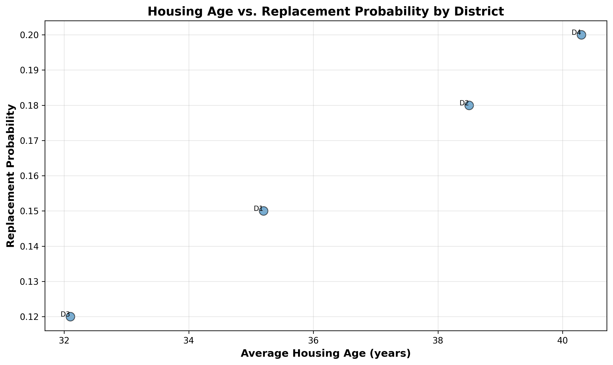

### Age vs Replacement Scatter Plot

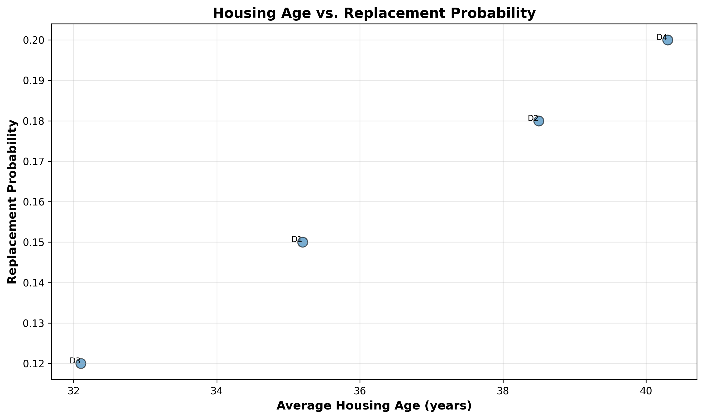

### Cumulative Replacement Over Time

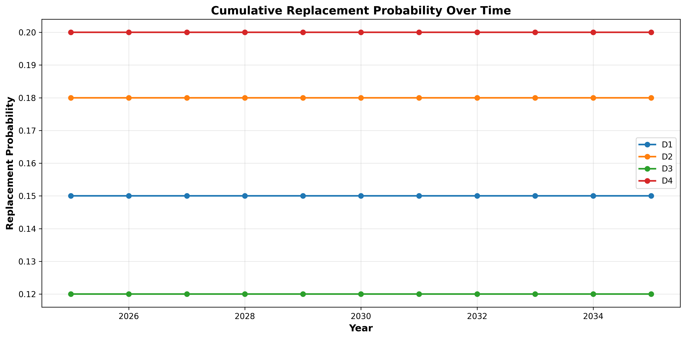

### District Distribution Comparison - Baseline vs Projected

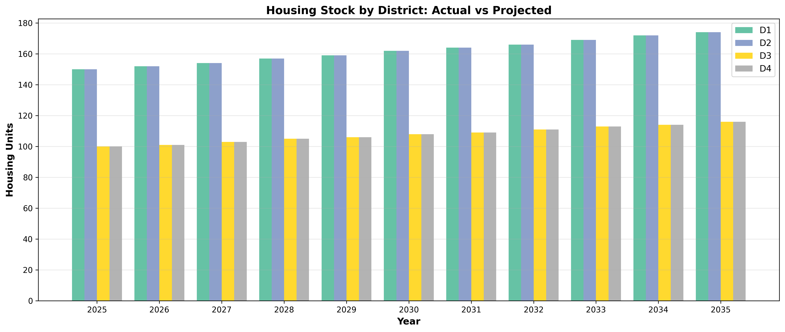

### Growth Rate Analysis - Projected vs Expected

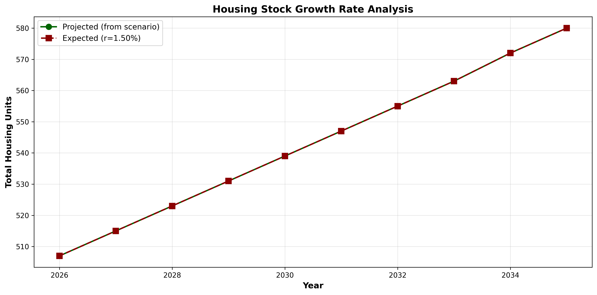

### Housing Age Distribution by District

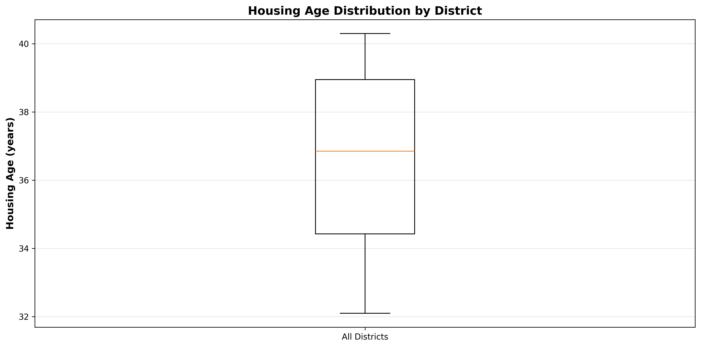

### Replacement Distribution by District

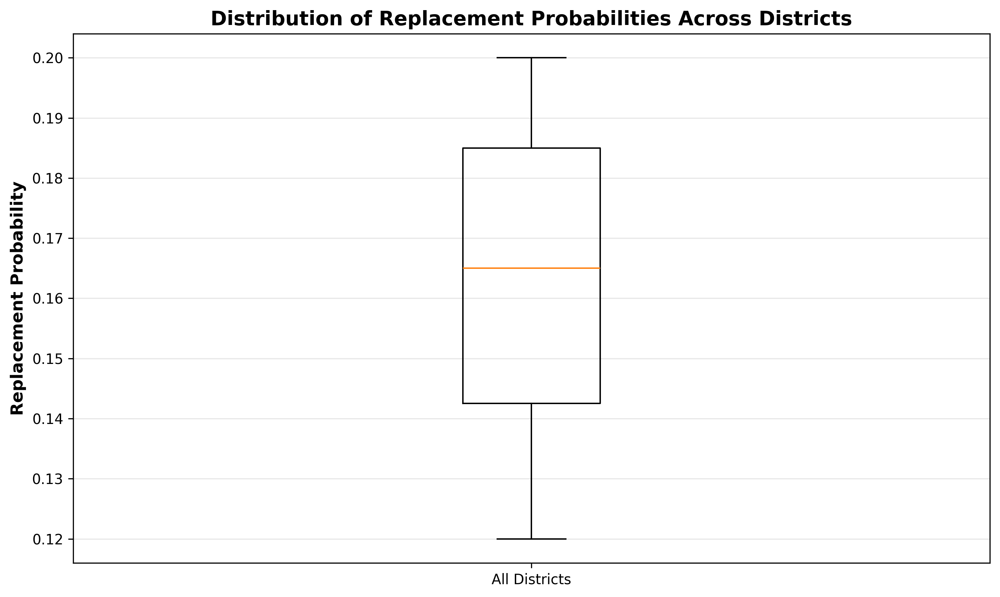

### Replacement Risk Ranking

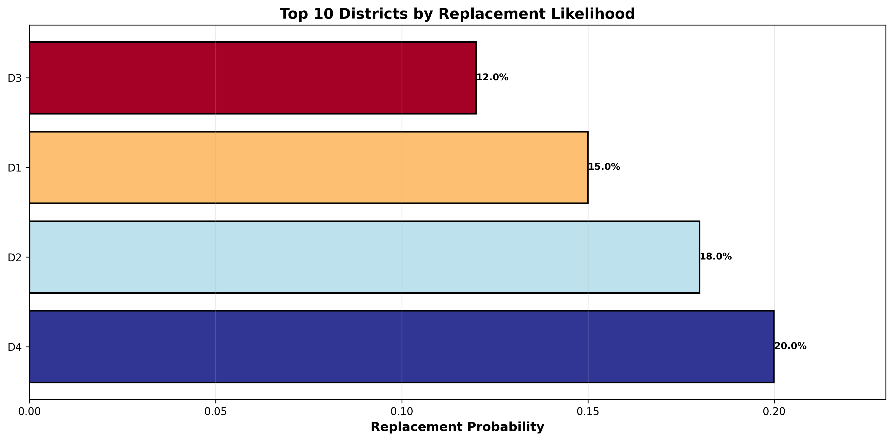

### Segment Distribution Comparison - Baseline vs Projected

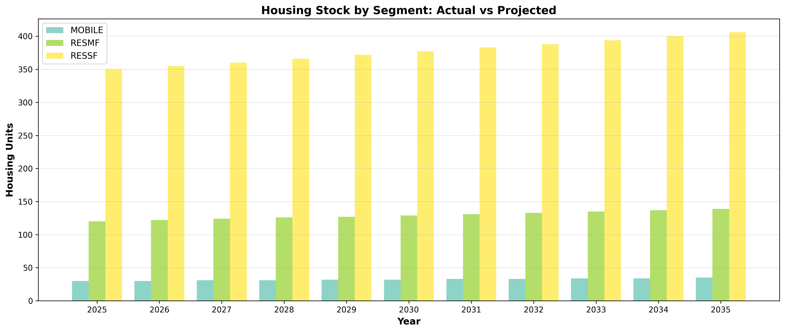

### Service Territory Map with Growth Rates


### Total Housing Stock Over Time - Baseline vs Projected

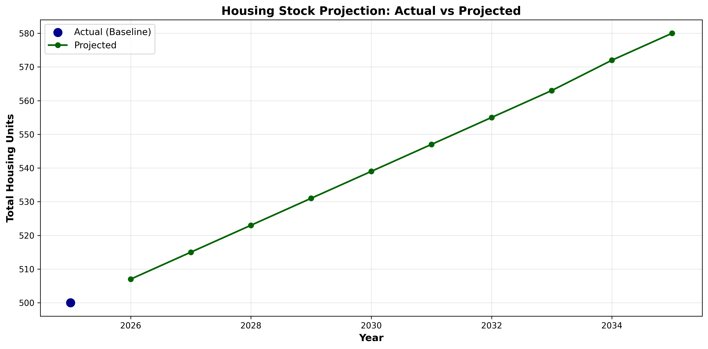

### Vintage Distribution - Stacked Over Time

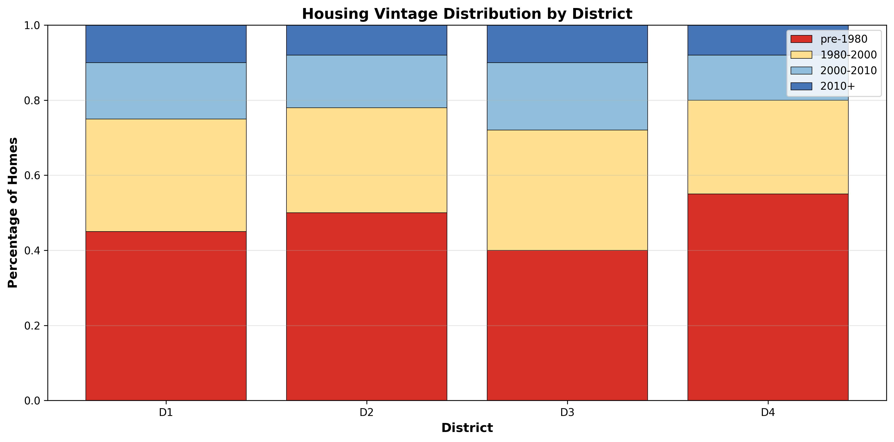

### Vintage Distribution Heatmap

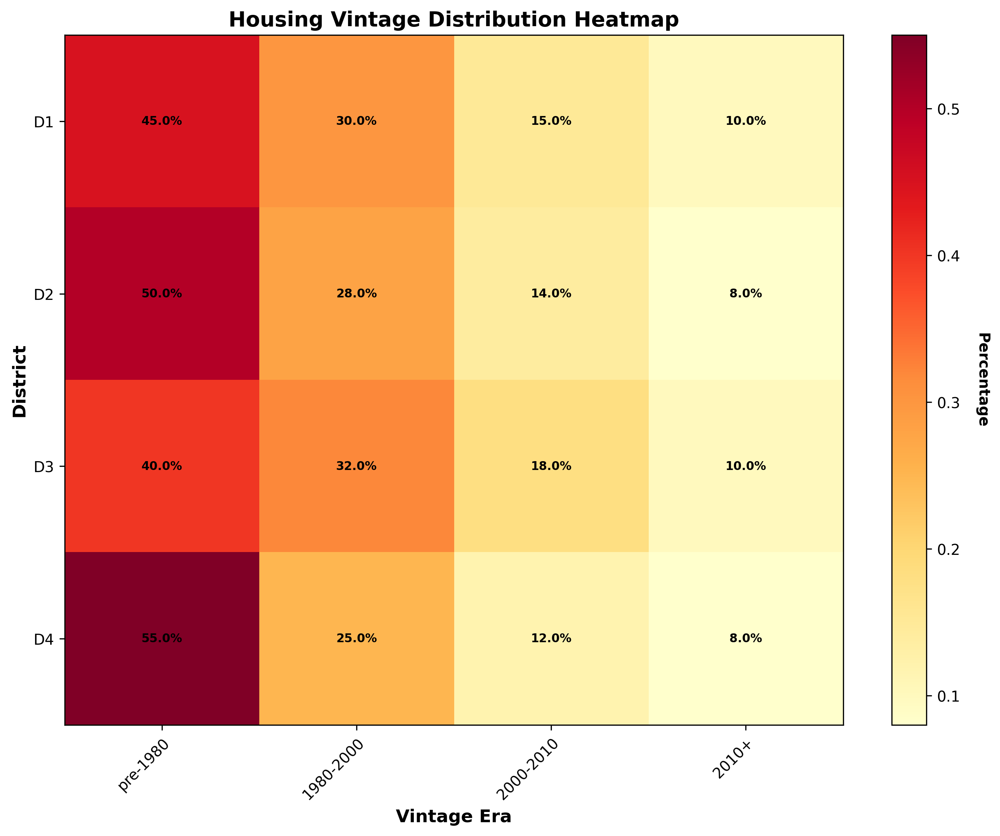


## Conclusion

All 10 test cases passed successfully. The housing stock projection formula is mathematically correct and produces expected results within rounding tolerance.

---

Generated on 2026-04-14 14:11:06

Property-based test for housing stock projection | Validates Requirements 2.3, 6.3
