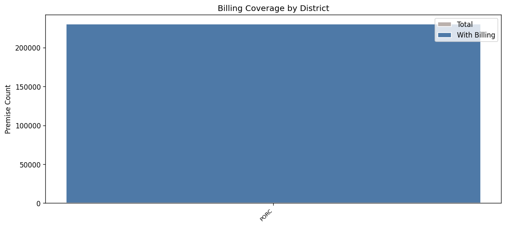
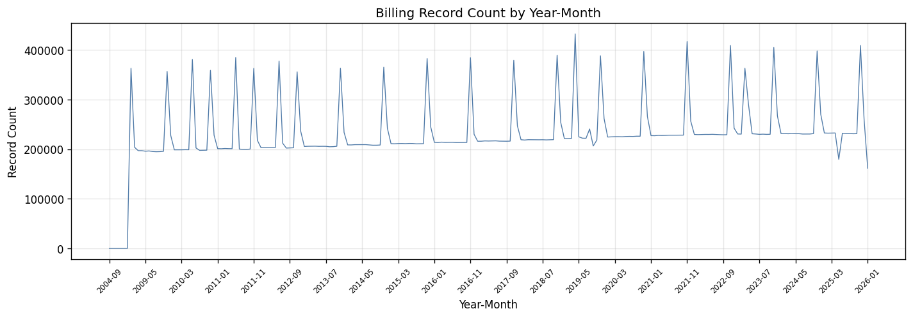
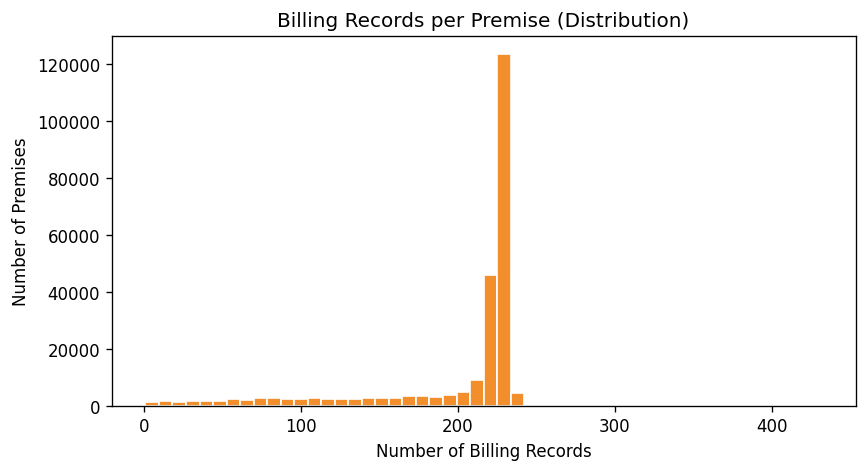

# 15.5 Billing Coverage Analysis
Generated: 2026-04-21T00:44:31.479626

> **Purpose:** Measure what fraction of active residential premises have billing history available.
>
> **Why it matters:** Billing data is the primary calibration target — the model's simulated demand should match observed billing therms. Premises without billing data cannot be validated, and low coverage reduces confidence in calibration. Coverage by district reveals whether certain areas are systematically under-represented.
>
> **How to read:** Coverage should be > 80% for reliable calibration. The district bar chart shows whether coverage is uniform or concentrated in certain areas. The time-series shows billing data availability over time — gaps indicate periods where calibration is weak. The histogram shows billing history depth per premise (more records = better calibration).
>
> **Recommended action:** If coverage < 80%, investigate whether billing data was filtered or truncated during extraction. If certain districts have very low coverage, consider using district-level aggregate billing data as a fallback calibration target.

## Summary

| metric | value |
| --- | --- |
| Total active residential premises | 230,583 |
| Premises with billing data | 230,491 |
| Coverage % | 100.0% |
| Premises without billing | 92 |

