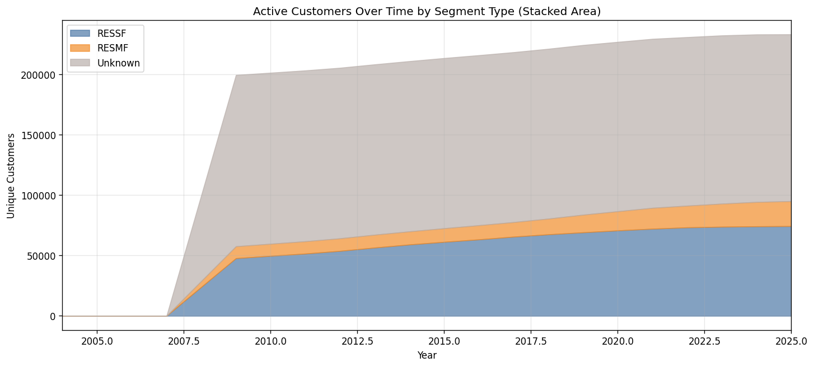
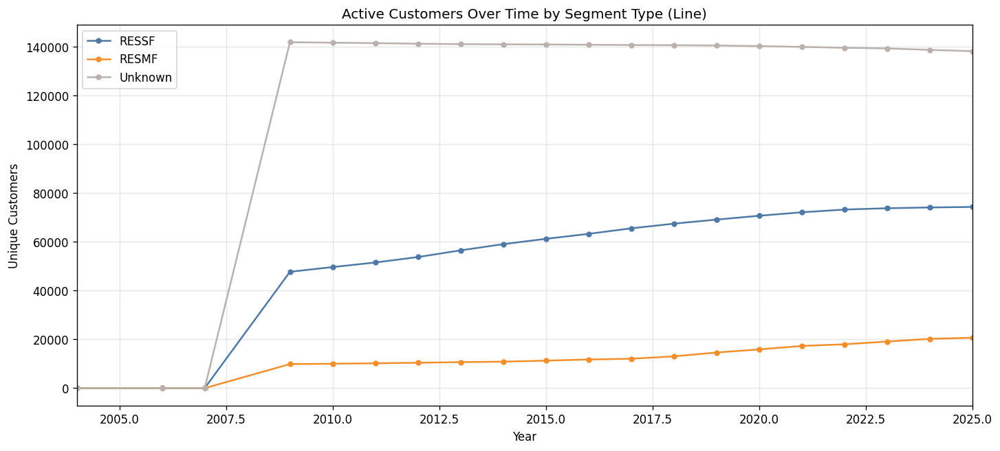
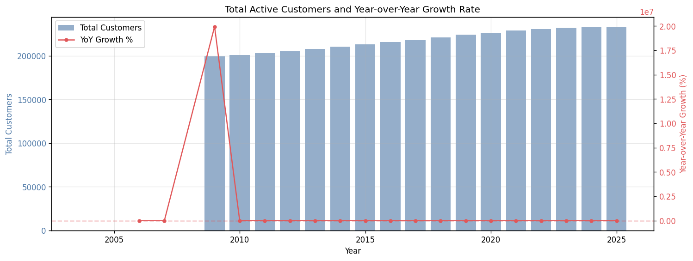
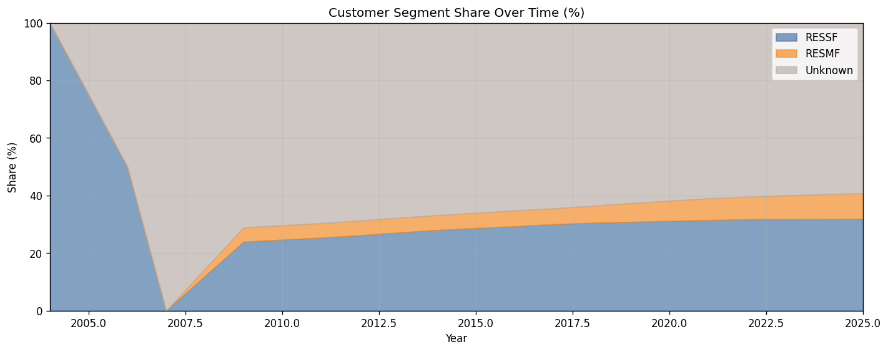

# 15.13 Customer Count Over Time by Segment Type
Generated: 2026-04-21T00:47:26.697580

> **Purpose:** Track the number of unique active customers over time, broken down by segment type (RESSF, RESMF, MOBILE).
>
> **Why it matters:** Understanding how the customer base evolves over time is fundamental to demand forecasting. Growth or decline in specific segments (single-family vs. multi-family vs. mobile home) directly affects total gas demand and the equipment mix. This chart also reveals data completeness — a sudden drop in customer count likely indicates missing billing data rather than actual customer loss.
>
> **How to read:** The stacked area chart shows unique customers per year by segment type. The total should grow gradually over time, consistent with housing growth in the service territory. The line chart shows the same data as individual lines for easier comparison. The table provides exact counts per year and segment. Look for: (a) steady growth matching PSU/OFM housing forecasts, (b) no sudden drops (data gaps), (c) RESSF dominating the mix (~70-80% of customers).
>
> **Recommended action:** If customer counts drop sharply in recent years, check whether billing data is complete for those years. If the RESSF/RESMF/MOBILE mix shifts dramatically, investigate whether segment assignments changed or new construction patterns shifted. Compare growth rates against Census B25024 (Units in Structure) data for validation.

## Summary

| year | RESSF | RESMF | Unknown | total |
| --- | --- | --- | --- | --- |
| 2004 | 1 | 0 | 0 | 1 |
| 2006 | 1 | 0 | 1 | 2 |
| 2007 | 0 | 0 | 1 | 1 |
| 2009 | 47,681 | 9,864 | 141,773 | 199,318 |
| 2010 | 49,618 | 10,008 | 141,563 | 201,189 |
| 2011 | 51,494 | 10,199 | 141,392 | 203,085 |
| 2012 | 53,723 | 10,413 | 141,146 | 205,282 |
| 2013 | 56,464 | 10,671 | 140,971 | 208,106 |
| 2014 | 59,011 | 10,861 | 140,898 | 210,770 |
| 2015 | 61,186 | 11,285 | 140,840 | 213,311 |
| 2016 | 63,226 | 11,744 | 140,726 | 215,696 |
| 2017 | 65,490 | 12,058 | 140,627 | 218,175 |
| 2018 | 67,406 | 13,027 | 140,548 | 220,981 |
| 2019 | 69,070 | 14,606 | 140,420 | 224,096 |
| 2020 | 70,643 | 15,880 | 140,173 | 226,696 |
| 2021 | 72,070 | 17,294 | 139,851 | 229,215 |
| 2022 | 73,183 | 17,982 | 139,484 | 230,649 |
| 2023 | 73,731 | 19,103 | 139,230 | 232,064 |
| 2024 | 74,049 | 20,198 | 138,632 | 232,879 |
| 2025 | 74,260 | 20,657 | 138,087 | 233,004 |

