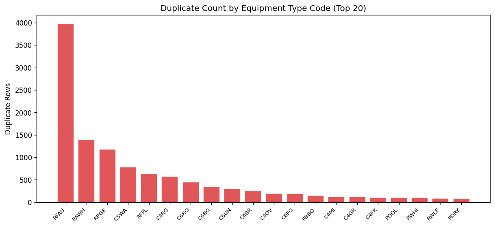
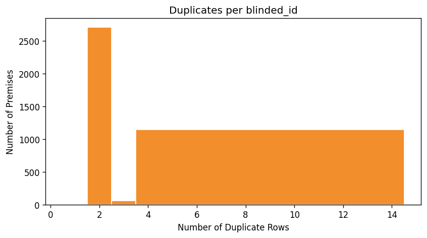

# 15.3 Duplicate Premise-Equipment Detection
Generated: 2026-04-21T00:43:57.052248

> **Purpose:** Detect exact duplicate rows in equipment_data (same blinded_id + equipment_type_code + QTY).
>
> **Why it matters:** Duplicate equipment rows inflate the equipment count per premise, which directly inflates simulated demand. A premise with two identical furnace records will be modeled as having two furnaces, doubling its space heating consumption.
>
> **How to read:** The duplication rate should be low (< 5%). The bar chart shows which equipment types are most duplicated — if a single code dominates, it may be a systematic data entry issue. The histogram shows how many duplicates each affected premise has.
>
> **Recommended action:** Review duplicate_equipment.csv for patterns. If duplicates are systematic (e.g., every premise has exactly 2 rows for the same code), consider deduplicating in the data ingestion pipeline. If sporadic, they may be legitimate (e.g., two identical water heaters in a large home).

## Summary

| metric | value |
| --- | --- |
| Total equipment rows | 741,467 |
| Duplicate rows | 11,394 |
| Unique duplicated blinded_ids | 3,904 |
| Duplication rate | 1.5% |

