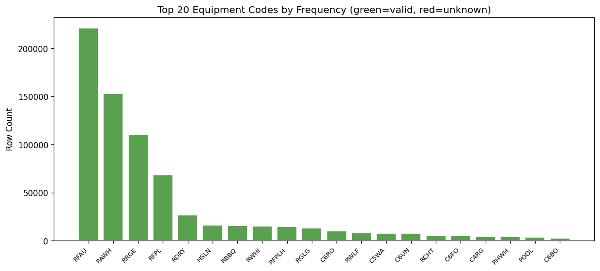
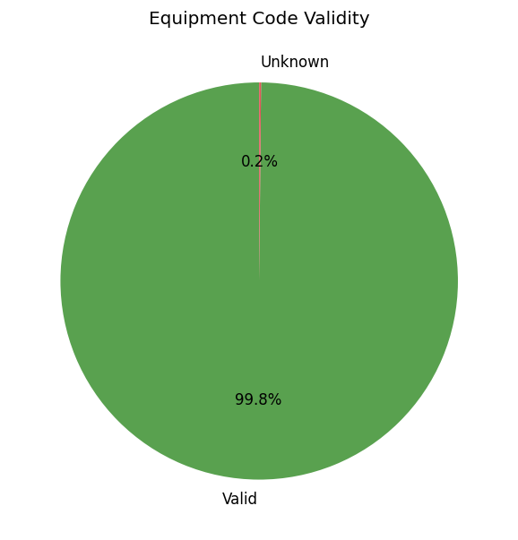

# 15.2 Equipment Code Validity
Generated: 2026-04-21T00:43:56.371294

> **Purpose:** Verify that every equipment_type_code in equipment_data exists in the equipment_codes.csv lookup table.
>
> **Why it matters:** Unknown equipment codes cannot be mapped to an end-use category (space heating, water heating, etc.) via END_USE_MAP. Rows with unknown codes will receive a null end_use and may be excluded from simulation, leading to under-counted demand.
>
> **How to read:** The valid rate should be close to 100%. The bar chart shows the most common codes color-coded green (valid) or red (unknown). The pie chart gives the overall split. The unknown codes table lists specific codes that need to be added to equipment_codes.csv or mapped in END_USE_MAP.
>
> **Recommended action:** If unknown codes represent > 1% of rows, add them to equipment_codes.csv and update END_USE_MAP in src/config.py. Check whether unknown codes are typos, deprecated codes, or genuinely new equipment types.

## Summary

| metric | value |
| --- | --- |
| Total equipment rows | 741,437 |
| Valid codes | 740,311 |
| Unknown codes | 1,126 |
| Valid rate | 99.8% |

## Unknown Codes (top 20)

| code | row_count |
| --- | --- |
| RGLT | 465 |
| CHTG | 235 |
| 4OTO | 176 |
| RFPIT | 101 |
| CAWH | 54 |
| CMSC | 35 |
| CCKG | 34 |
| PTHTR | 13 |
| CFPIT | 7 |
| FURN | 1 |
| SPHT | 1 |
| 6FAF | 1 |
| 06DL | 1 |
| 02FG | 1 |
| 02FS | 1 |

