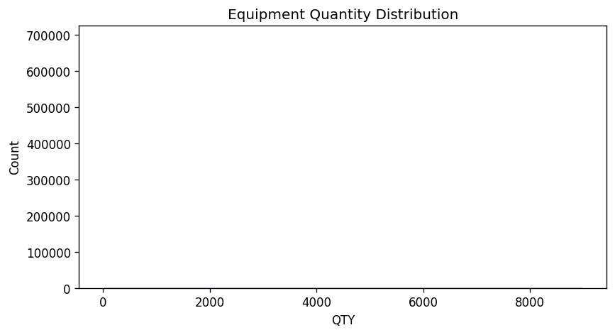
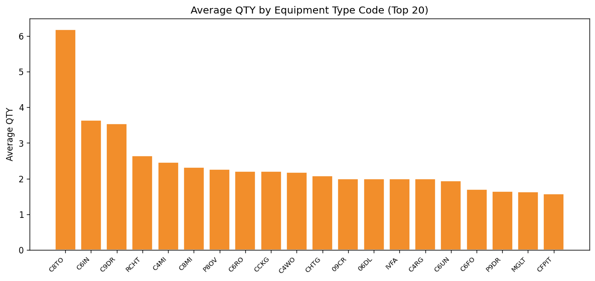

# 15.8 Equipment Quantity Sanity
Generated: 2026-04-21T00:44:35.092333

> **Purpose:** Check QTY_OF_EQUIPMENT_TYPE values for sanity — most premises should have 1-3 units per equipment type.
>
> **Why it matters:** Equipment quantity directly multiplies simulated demand. A QTY of 10 furnaces for a single-family home is almost certainly a data error and would inflate that premise's space heating demand by 10x. Conversely, QTY ≤ 0 is invalid and would produce zero or negative demand.
>
> **How to read:** The histogram should be heavily concentrated at QTY = 1, with a small tail at 2-3. QTY > 5 is flagged as suspicious (exported to suspicious_quantities.csv). QTY ≤ 0 is flagged as invalid. The bar chart shows average QTY by equipment type — types with high averages may have systematic data issues.
>
> **Recommended action:** Review suspicious_quantities.csv. If QTY > 5 rows are concentrated in a single equipment type, it may be a coding convention (e.g., total BTU capacity encoded as quantity). Cap QTY at a reasonable maximum (e.g., 5) or investigate with the data provider.

## Summary

| metric | value |
| --- | --- |
| Total rows | 741,467 |
| Min QTY | 0 |
| Max QTY | 8988 |
| Mean QTY | 1.15 |
| Median QTY | 1.0 |
| QTY > 5 (suspicious) | 2,811 |
| QTY <= 0 (invalid) | 11,473 |

