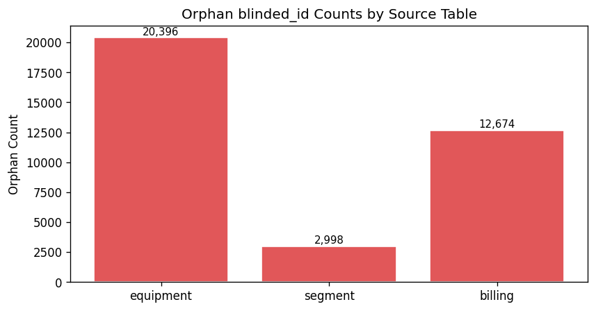
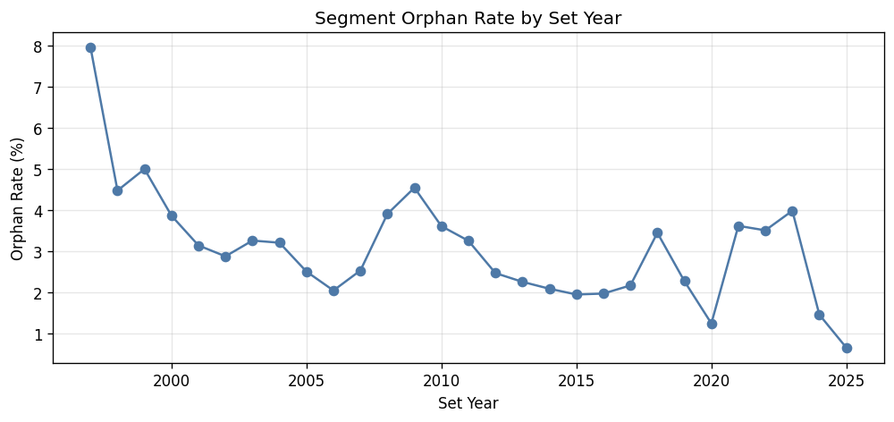

# 15.1 Premise Referential Integrity
Generated: 2026-04-21T00:43:55.292182

> **Purpose:** Verify that every blinded_id referenced in equipment_data, segment_data, and billing_data also exists in premise_data.
>
> **Why it matters:** Orphan IDs indicate records that cannot be linked back to a known premise. These rows will be silently dropped during the premise-equipment join, potentially under-counting equipment or billing history. A high orphan rate may signal a data extract mismatch (e.g., equipment exported for all customers but premises filtered to active-residential only).
>
> **How to read:** The match rate should be close to 100% for each source table. Orphan counts > 0 are common for billing (closed accounts) but should be near zero for equipment and segment. The time-series chart shows whether orphans cluster in specific vintage years, which may indicate a historical data cutoff.
>
> **Recommended action:** If equipment orphan rate > 5%, investigate whether the premise filter (custtype='R', status_code='AC') is too restrictive. If billing orphan rate is high, confirm that billing data includes closed/inactive accounts that are excluded from premise_data.

## Summary

Total active residential premises: 230,583

| source | total_ids | matched | orphans | match_rate |
| --- | --- | --- | --- | --- |
| equipment | 250,621 | 230,225 | 20,396 | 91.9% |
| segment | 97,047 | 94,049 | 2,998 | 96.9% |
| billing | 243,165 | 230,491 | 12,674 | 94.8% |

