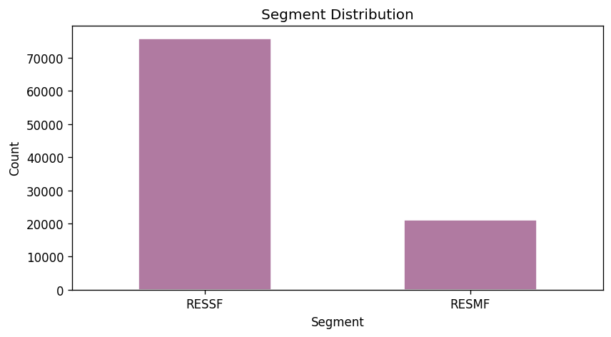
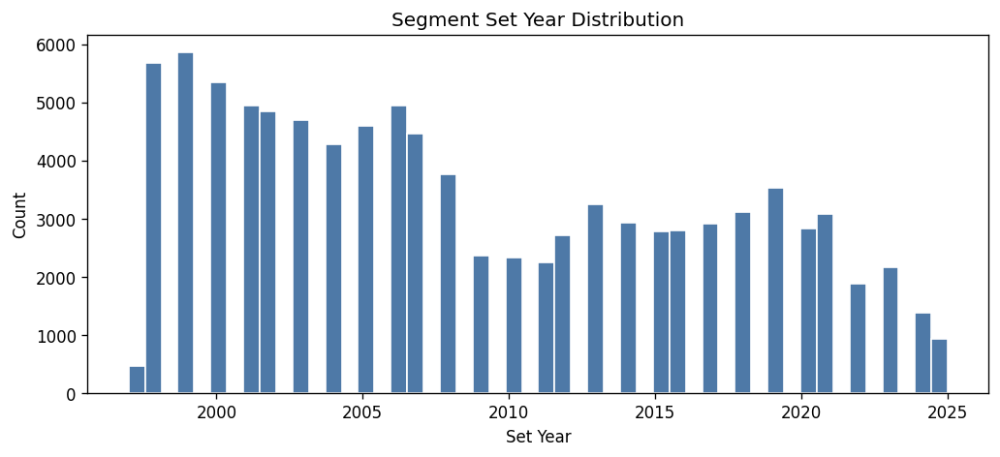
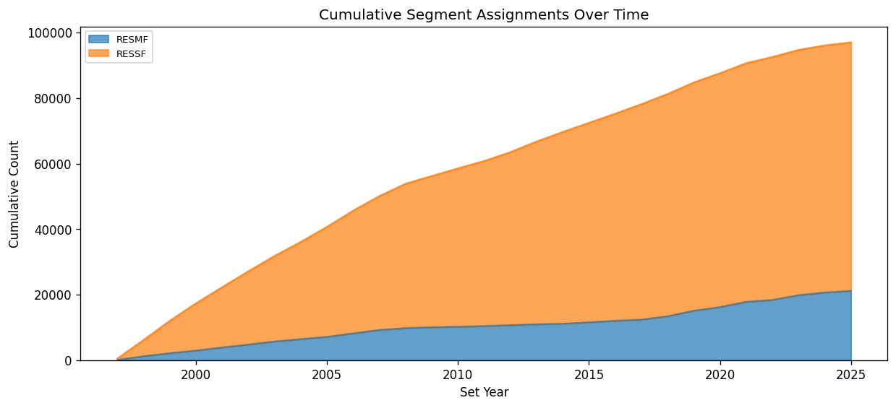

# 15.7 Segment Consistency
Generated: 2026-04-21T00:44:34.444425

> **Purpose:** Verify that every active residential premise has exactly one segment record (RESSF, RESMF, or MOBILE).
>
> **Why it matters:** The segment determines the building type used in simulation (single-family, multi-family, mobile home). Premises with 0 segments cannot be classified and will be excluded. Premises with 2+ segments create ambiguity — the model may double-count them or pick an arbitrary segment.
>
> **How to read:** Ideally: 0 premises with 0 segments, all premises with exactly 1 segment, and 0 premises with 2+ segments. The segment distribution bar chart shows the overall mix. The set-year histogram reveals when segments were assigned — a spike in a single year may indicate a bulk data migration.
>
> **Recommended action:** If premises have 0 segments, check whether the segment_data filter (RESSF/RESMF/MOBILE) is too restrictive. If premises have 2+ segments, deduplicate by keeping the most recent setyear or the segment with the highest confidence.

## Summary

| metric | value |
| --- | --- |
| Total active residential premises | 230,583 |
| Premises with 0 segments | 136,534 |
| Premises with 1 segment | 97,047 |
| Premises with 2+ segments | 0 |

