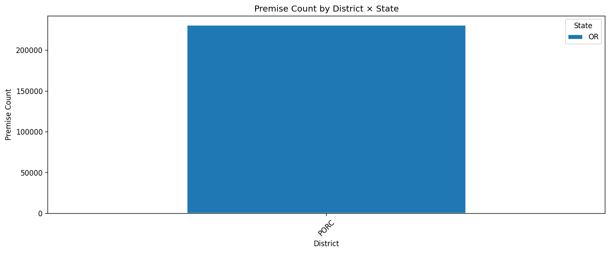

# 15.9 State-District Cross-Check
Generated: 2026-04-21T00:44:35.564940

> **Purpose:** Verify that service_state is consistent with district_code_IRP — Oregon districts should have state='OR', Washington districts should have state='WA'.
>
> **Why it matters:** State determines which tariff rates, ASHRAE service life data, and regulatory assumptions apply. A premise in an Oregon district coded as WA would use the wrong rate schedule and equipment life assumptions, biasing its simulated cost and replacement timing.
>
> **How to read:** Mismatches should be 0. The stacked bar chart shows the state composition of each district — any district with mixed colors has mismatched records. The mismatch table lists specific district-state pairs that are inconsistent.
>
> **Recommended action:** If mismatches exist, determine whether the district or the state is wrong. Cross-reference with the NW Natural service territory map. Fix the incorrect field in the source data or add a correction rule in the data ingestion pipeline.

## Summary

| metric | value |
| --- | --- |
| Total premises checked | 230,583 |
| Total mismatches | 0 |
| Mismatch rate | 0.00% |

