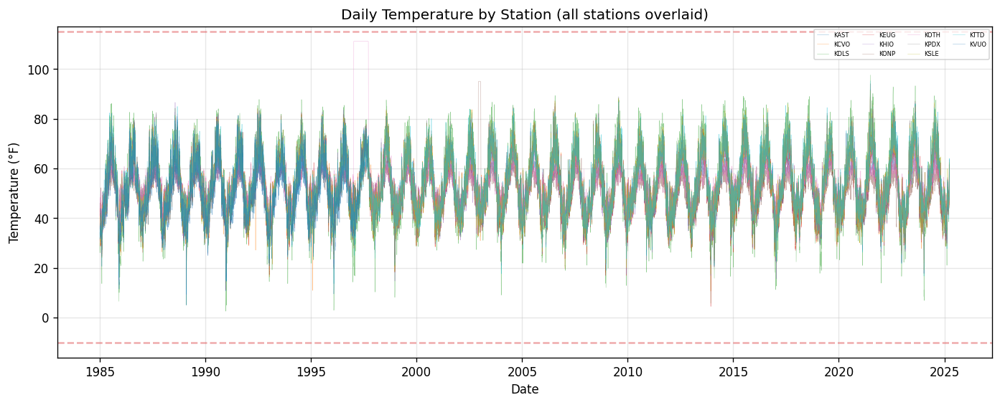
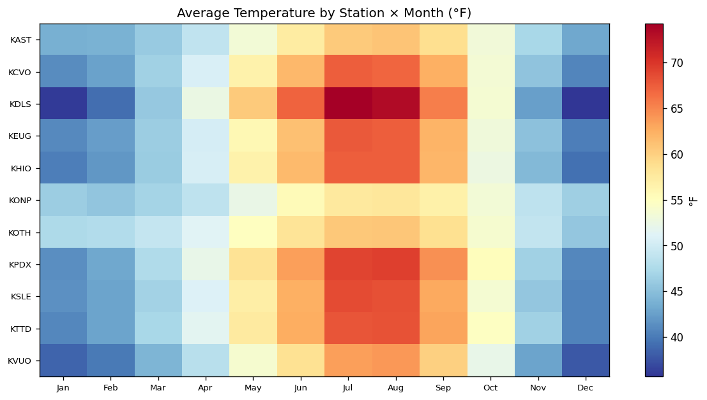
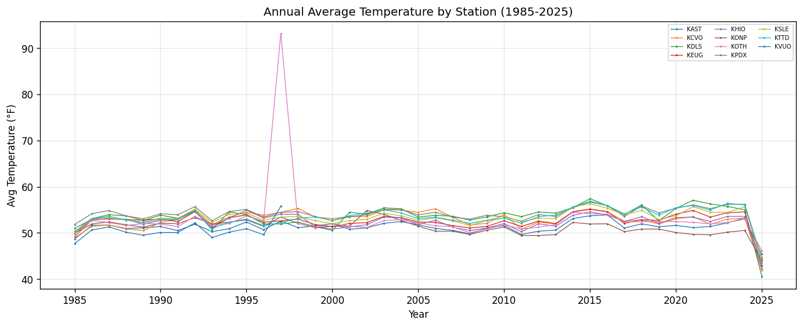
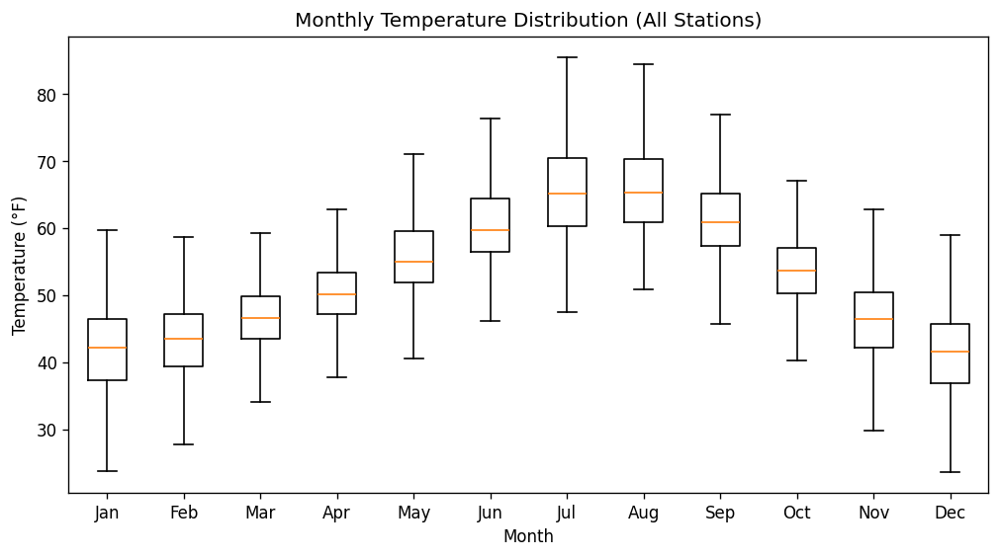

# 15.11 Weather Temperature Bounds
Generated: 2026-04-21T00:45:40.006643

> **Purpose:** Check that daily average temperatures (TempHA) fall within the reasonable Pacific Northwest range of -10°F to 115°F.
>
> **Why it matters:** Out-of-range temperatures produce extreme HDD values that distort space heating simulation. A spurious -50°F reading would generate 115 HDD for that day, massively inflating heating demand. These are almost always sensor errors or data processing artifacts (e.g., missing values coded as -999).
>
> **How to read:** Out-of-range records should be 0 or very few. The daily time-series overlays all stations — red dots mark out-of-range values. The heatmap shows average temperature by station and month — anomalous cells indicate systematic issues. The annual average chart should show a gradual warming trend consistent with climate change.
>
> **Recommended action:** If out-of-range records exist, replace them with interpolated values from the same station (adjacent days) or from NOAA Climate Normals for that date. If a station has many outliers, it may have a sensor calibration issue — consider excluding it and reassigning its premises to a nearby station.

## Summary

| metric | value |
| --- | --- |
| Total temperature records | 151,639 |
| Out-of-range records | 0 |
| Min observed temp (°F) | 2.6 |
| Max observed temp (°F) | 111.2 |

