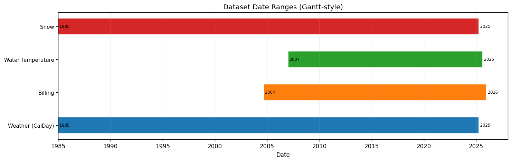
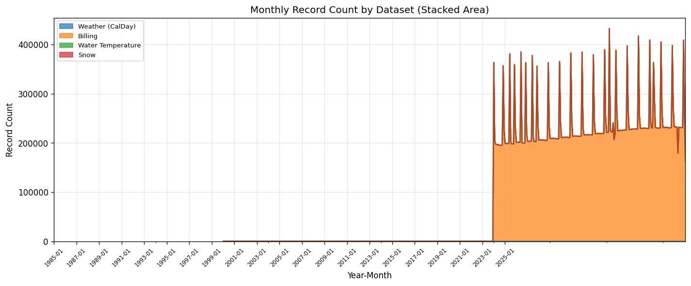
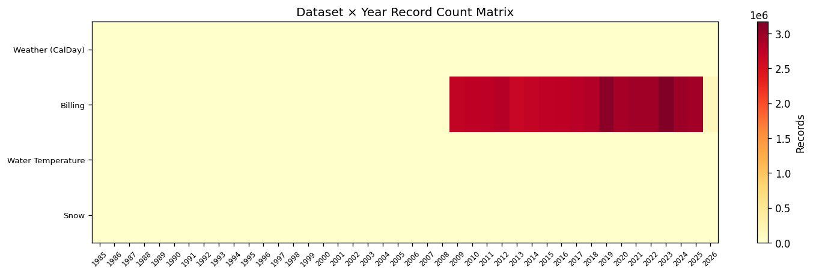

# 15.12 Temporal Alignment Audit
Generated: 2026-04-21T00:46:44.983115

> **Purpose:** Compare date ranges across all time-series datasets (weather, billing, water temperature, snow) to identify overlap and gaps.
>
> **Why it matters:** The simulation requires all time-series datasets to overlap for the analysis period. If weather data ends in 2024 but billing data extends to 2025, the model cannot calibrate the most recent year. If water temperature data starts in 2010 but weather starts in 1985, water heating simulation is limited to the shorter range.
>
> **How to read:** The Gantt chart shows each dataset's date range as a horizontal bar — the overlap region is the usable analysis window. The stacked area chart shows monthly record counts — dips indicate periods where some datasets are missing. The year matrix heatmap shows record density by dataset and year.
>
> **Recommended action:** If the overlap period is shorter than expected, check whether any dataset was truncated during extraction. The model's base year (2025) should fall within the overlap period for all critical datasets (weather + billing at minimum). If a dataset is missing for recent years, request an updated extract from the data provider.

## Summary

Overlap period: 2007-01-01 to 2025-03-31

| dataset | min_date | max_date | records |
| --- | --- | --- | --- |
| Weather (CalDay) | 1985-01-01 | 2025-03-31 | 151,639 |
| Billing | 2004-09-01 | 2026-01-01 | 48,675,554 |
| Water Temperature | 2007-01-01 | 2025-08-20 | 6,807 |
| Snow | 1985-01-01 | 2025-03-31 | 14,700 |

