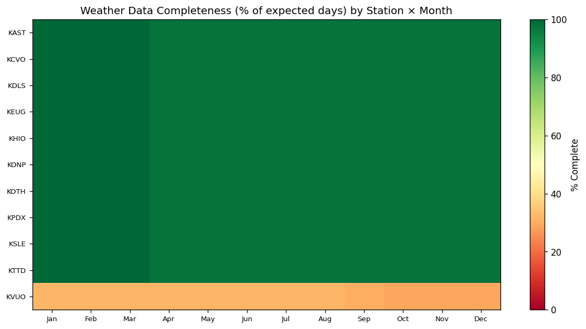
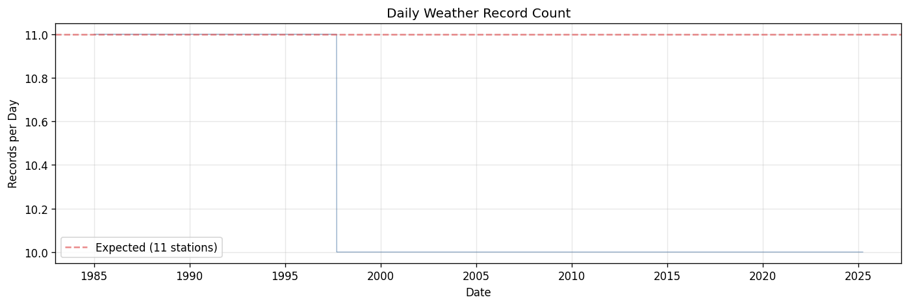
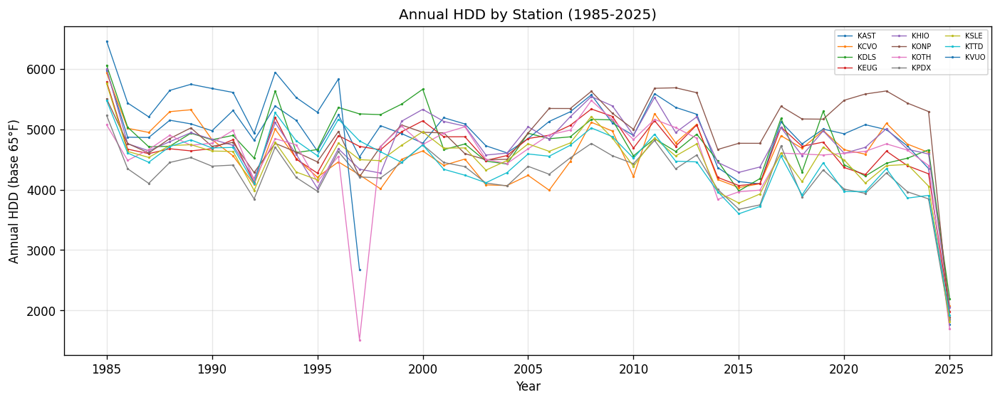

# 15.6 Weather Date Continuity
Generated: 2026-04-21T00:44:33.548609

> **Purpose:** Check for missing dates in the daily weather time series for each weather station.
>
> **Why it matters:** Missing weather days create gaps in HDD calculations. If a cold week is missing, the model will under-estimate space heating demand for that period. Systematic gaps (e.g., a station offline for months) can bias annual HDD totals and distort the weather-normalization process.
>
> **How to read:** Each station should have close to 100% of expected days. The heatmap shows completeness by station and month — red cells indicate months with significant gaps. The daily record count should be a flat line at the number of stations (11). The annual HDD chart should show smooth trends — sudden drops indicate data gaps.
>
> **Recommended action:** If a station has > 30 missing days, consider interpolating from nearby stations or using NOAA Climate Normals as a fill. If the longest gap exceeds 90 days, that station's annual HDD is unreliable for the affected year.

## Summary

| station | min_date | max_date | expected_days | actual_days | missing_days | longest_gap |
| --- | --- | --- | --- | --- | --- | --- |
| KAST | 1985-01-01 | 2025-03-31 | 14,700 | 14,700 | 0 | 0 |
| KCVO | 1985-01-01 | 2025-03-31 | 14,700 | 14,700 | 0 | 0 |
| KDLS | 1985-01-01 | 2025-03-31 | 14,700 | 14,700 | 0 | 0 |
| KEUG | 1985-01-01 | 2025-03-31 | 14,700 | 14,700 | 0 | 0 |
| KHIO | 1985-01-01 | 2025-03-31 | 14,700 | 14,700 | 0 | 0 |
| KONP | 1985-01-01 | 2025-03-31 | 14,700 | 14,700 | 0 | 0 |
| KOTH | 1985-01-01 | 2025-03-31 | 14,700 | 14,700 | 0 | 0 |
| KPDX | 1985-01-01 | 2025-03-31 | 14,700 | 14,700 | 0 | 0 |
| KSLE | 1985-01-01 | 2025-03-31 | 14,700 | 14,700 | 0 | 0 |
| KTTD | 1985-01-01 | 2025-03-31 | 14,700 | 14,700 | 0 | 0 |
| KVUO | 1985-01-01 | 1997-09-13 | 4,639 | 4,639 | 0 | 0 |

