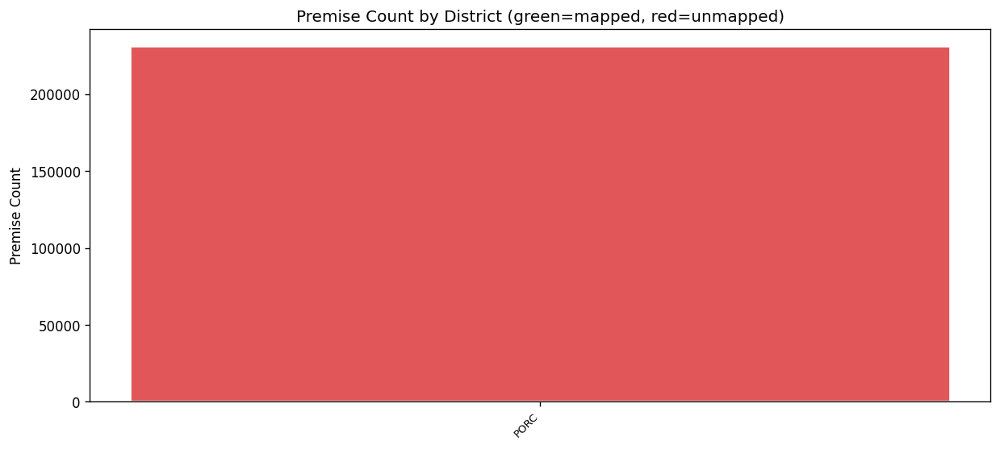

# 15.4 Weather Station Coverage
Generated: 2026-04-21T00:43:57.610116

> **Purpose:** Verify that every district_code_IRP in premise_data maps to a weather station via DISTRICT_WEATHER_MAP.
>
> **Why it matters:** Weather-sensitive end-use simulation (space heating, water heating) requires daily temperature data from a nearby weather station. Premises in unmapped districts will have no weather data and cannot be simulated, creating a gap in demand projections.
>
> **How to read:** All districts should be mapped (0 unmapped). The bar chart shows premise counts by district — unmapped districts in red represent premises that will be excluded from weather-driven simulation.
>
> **Recommended action:** If any districts are unmapped, add them to DISTRICT_WEATHER_MAP in src/config.py. Choose the nearest weather station based on geographic proximity and climate similarity.

## Summary

| metric | value |
| --- | --- |
| Total unique districts | 1 |
| Mapped districts | 0 |
| Unmapped districts | 1 |
| Mapped premise count | 0 |
| Unmapped premise count | 230,583 |

## Unmapped Districts

| district | premise_count |
| --- | --- |
| PORC | 230,583 |

