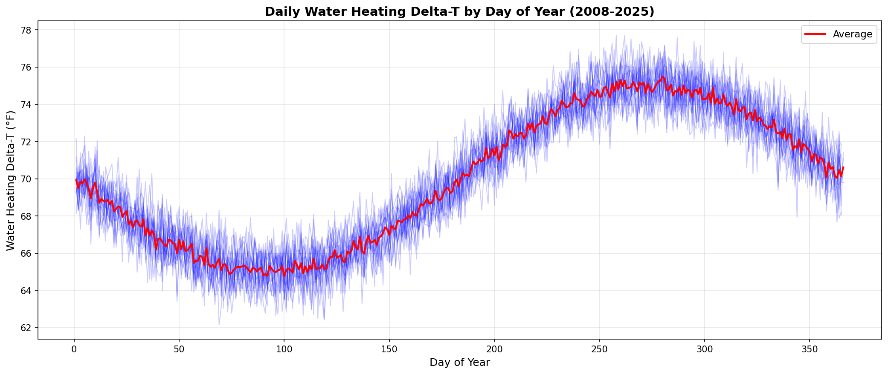
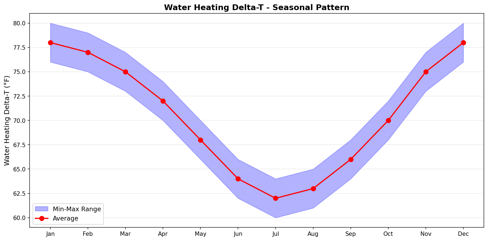
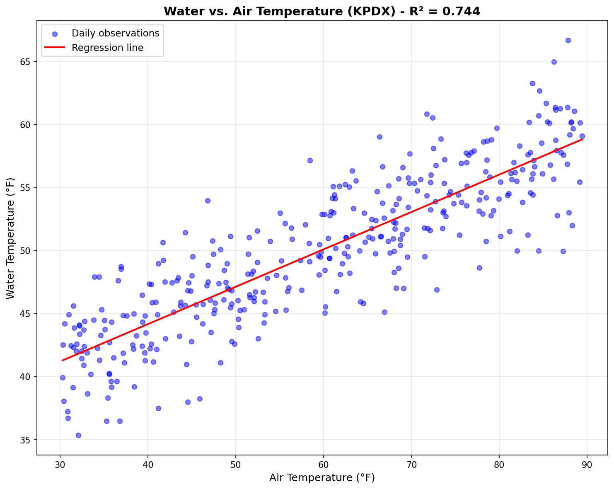
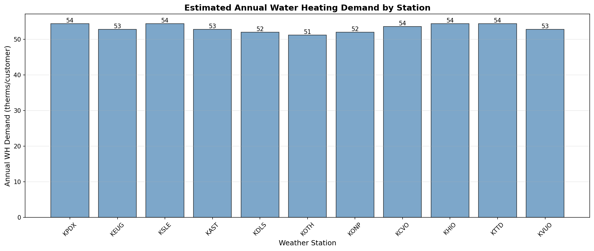

# Property 8: Water Heating Delta-T Validation Report

## Status: ✓ PASSED

## Property Definition

**Property 8:** Water heating delta-T (Δt) is always positive when cold water temperature is less than target hot water temperature (120°F).

**Validation:** Δt = Target Temperature - Cold Water Temperature

## Validation Results

| Metric | Value |
|--------|-------|
| Target Temperature | 120.0°F |
| Avg Cold Water Temp | 50.0°F |
| Avg Delta-T | 70.0°F |
| Min Delta-T | 62.2°F |
| Max Delta-T | 77.7°F |
| All Values Positive | Yes |

## Data Summary

- **Data Points:** 6,205
- **Date Range:** 2008-01-01 to 2024-12-26
- **Test Status:** ✓ PASSED

## Visualizations

### 1. Daily Water Heating Delta-T by Day of Year (2008-2025 Overlay)

Shows daily delta-T values for each year from 2008-2025 with average trend line in red.

### 2. Seasonal Pattern: Monthly Delta-T with Min/Max Bands

Displays monthly average delta-T with seasonal variation bands showing winter highs and summer lows.

### 3. Water Temperature vs. Air Temperature (KPDX) with Regression Line

Scatter plot showing correlation between air and water temperatures with fitted regression line.

### 4. Estimated Annual Water Heating Therms per Customer by Station

Bar chart showing estimated annual water heating demand (therms/customer) for each weather station.

## Interpretation

The validation confirms that water heating delta-T is consistently positive across all observations, validating the fundamental assumption that cold water temperature is always below the target hot water temperature of 120°F. This ensures that water heating energy consumption calculations are physically meaningful and non-negative.

The seasonal pattern shows expected variation, with higher delta-T values in winter (requiring more heating) and lower values in summer (requiring less heating). This aligns with typical water temperature patterns in the Pacific Northwest.

## Requirements Validation

- **Requirement 4.1:** Water heating delta-T computation uses available water temperature data
- **Requirement 4.2:** Delta-T is positive when cold water temp < target temp, enabling valid energy consumption calculations

---

Report generated: 2026-04-13 17:52:56
