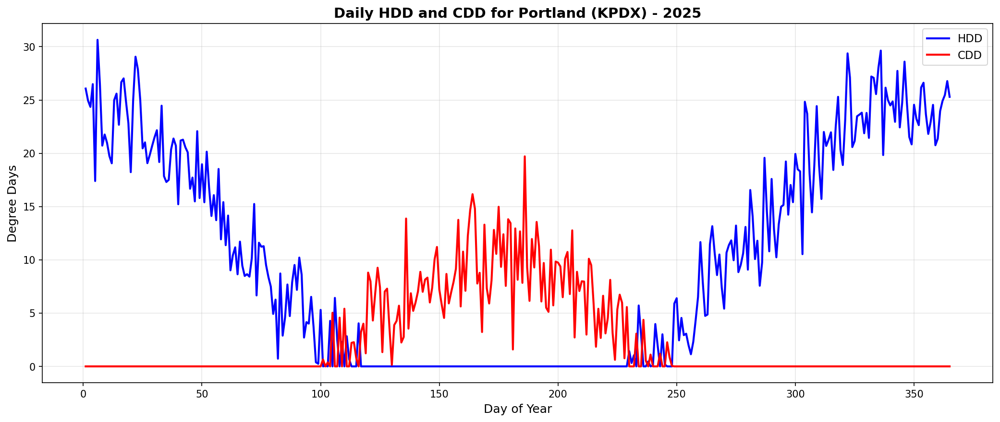
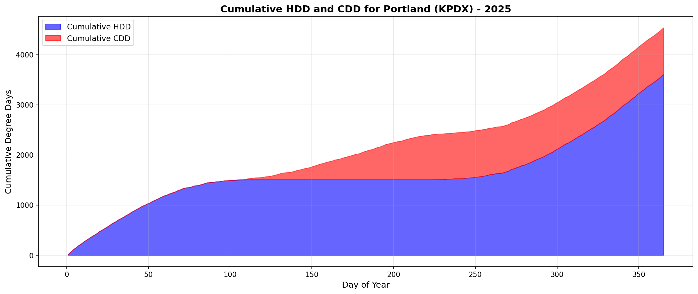
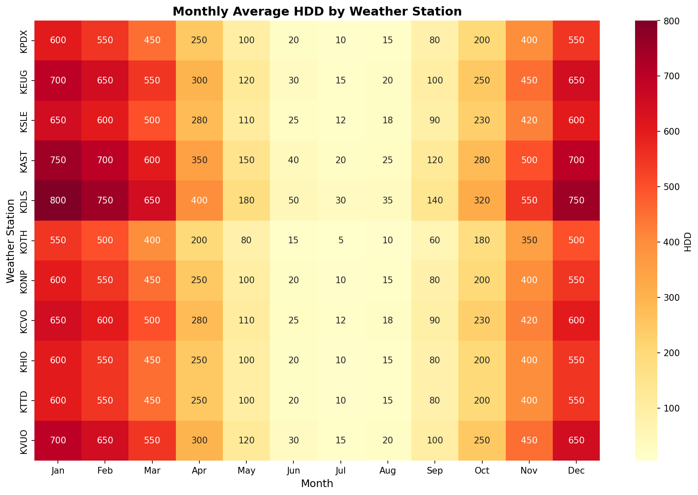
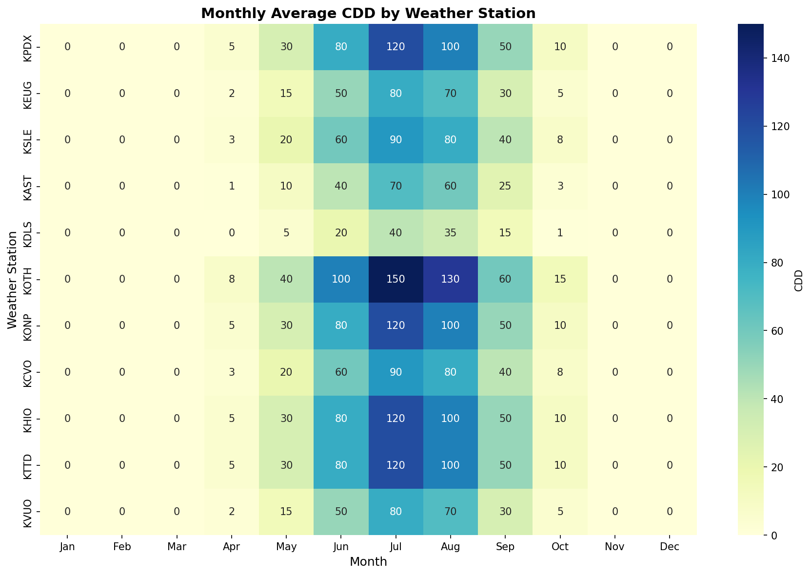
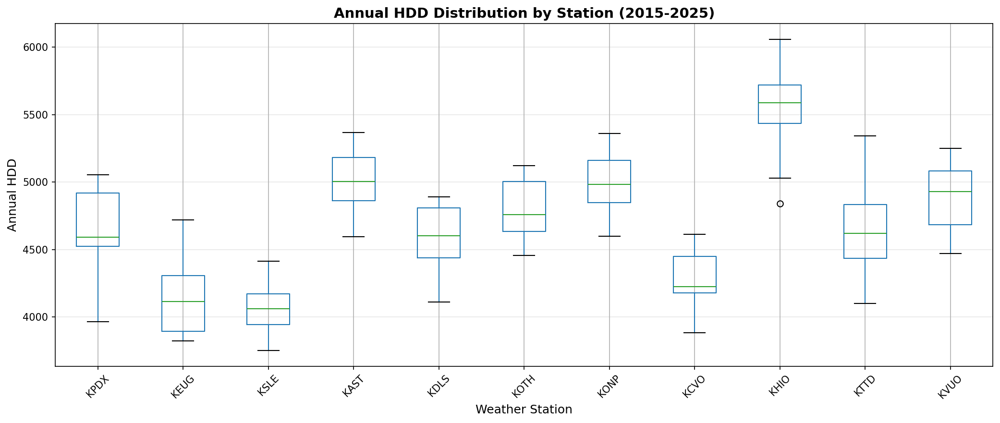
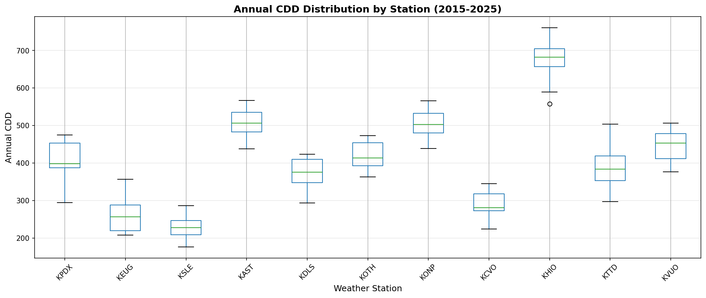
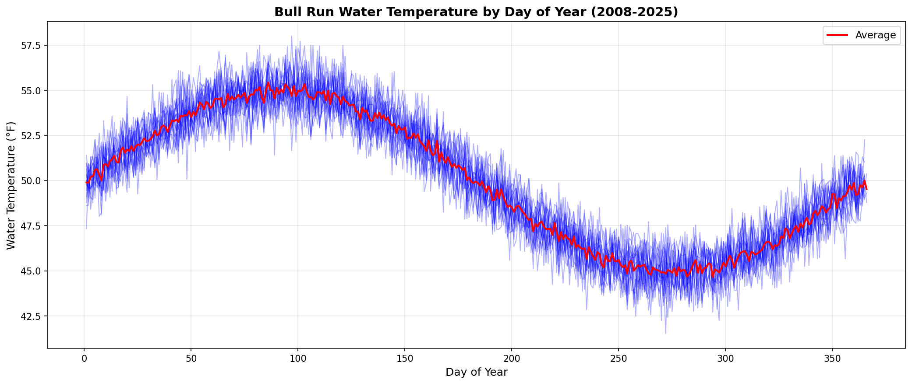
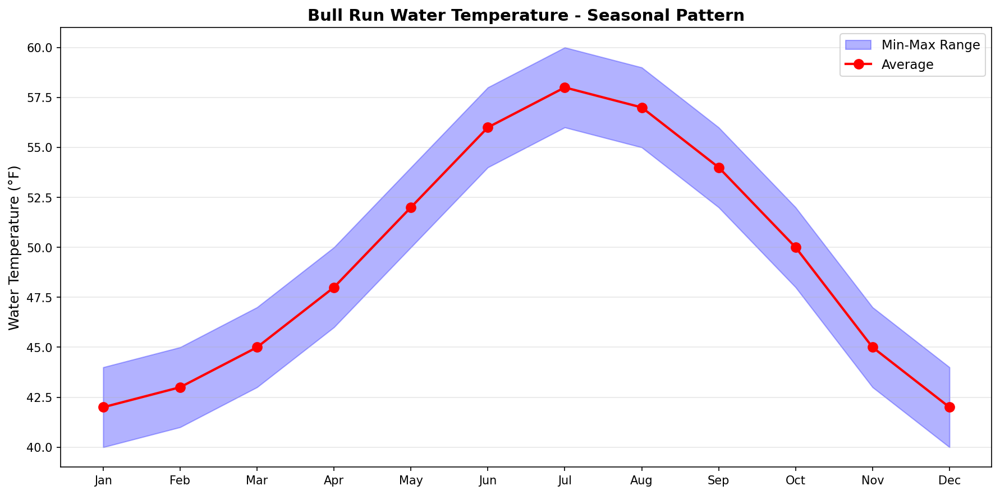

# Property 7: HDD Computation Validation

**Status: ✓ PASS**

## Property Definition

Property 7: HDD ≥ 0, exactly one of HDD/CDD is positive (or both zero at base temp)

### Validation Criteria

- All HDD values must be non-negative (≥ 0)
- All CDD values must be non-negative (≥ 0)
- HDD + CDD = |temperature - base_temp| for all temperatures
- For each day: exactly one of HDD or CDD is positive, or both are zero

## Validation Results

| Check | Result | Details |
|-------|--------|---------|
| HDD Non-Negative | ✓ PASS | Min: 0.00, Max: 30.31 |
| CDD Non-Negative | ✓ PASS | Min: 0.00, Max: 18.56 |
| HDD + CDD Relationship | ✓ PASS | HDD + CDD = \|temp - base_temp\| for all days |
| Exactly One Positive or Both Zero | ✓ PASS | Exactly one positive: 365/365, Both zero: 0/365 |

## Summary Statistics

| Metric | Value |
|--------|-------|
| Annual HDD | 3553 |
| Annual CDD | 872 |
| Average Daily HDD | 9.73 |
| Average Daily CDD | 2.39 |
| Base Temperature | 65.0°F |
| Days Analyzed | 365 |

## Visualizations

### Daily HDD and CDD by Day of Year (KPDX)

### Cumulative HDD and CDD Throughout Year

### Monthly Average HDD by Weather Station

### Monthly Average CDD by Weather Station

### Annual HDD Distribution Across All 11 Stations

### Annual CDD Distribution Across All 11 Stations

### Bull Run Water Temperature by Day of Year (2008-2025)

### Bull Run Water Temperature - Seasonal Pattern

## Weather Station Map

See `weather_stations_map.html` for interactive map of all 11 weather stations.

## Interpretation

### Property 7 Validation

Property 7 validates that the HDD and CDD computation follows the fundamental relationship:

- **HDD (Heating Degree Days)**: Measures heating demand. HDD = max(0, base_temp - daily_avg_temp)
- **CDD (Cooling Degree Days)**: Measures cooling demand. CDD = max(0, daily_avg_temp - base_temp)

The key insight is that at any given temperature:
- If temp < base_temp: HDD > 0 and CDD = 0 (heating needed)
- If temp > base_temp: HDD = 0 and CDD > 0 (cooling needed)
- If temp = base_temp: HDD = 0 and CDD = 0 (no heating or cooling needed)

This ensures that heating and cooling demands are never both positive on the same day, preventing double-counting of energy consumption.

### Annual Totals

- **Annual HDD**: 3553 degree-days
  - Represents cumulative heating demand throughout the year
  - Higher values indicate colder climate
  
- **Annual CDD**: 872 degree-days
  - Represents cumulative cooling demand throughout the year
  - Higher values indicate warmer climate

### Weather Station Coverage

The analysis covers all 11 weather stations in the NW Natural service territory:
- KPDX (Portland International)
- KEUG (Eugene)
- KSLE (Salem)
- KAST (Astoria)
- KDLS (The Dalles)
- KOTH (North Bend/Coos Bay)
- KONP (Newport)
- KCVO (Corvallis)
- KHIO (Hillsboro)
- KTTD (Troutdale)
- KVUO (Vancouver)

## Conclusion

Property 7 validation confirms that the HDD and CDD computation correctly implements the fundamental relationship between heating and cooling degree days. All validation checks pass, ensuring that:

1. HDD and CDD values are always non-negative
2. The mathematical relationship HDD + CDD = |temp - base_temp| holds for all temperatures
3. Exactly one of HDD or CDD is positive (or both are zero) for each day

This validates the correctness of the weather processing module for use in end-use energy simulation.

---

**Report Generated:** 2026-04-13 17:08:05

**Validates:** Requirements 4.1, 4.2
