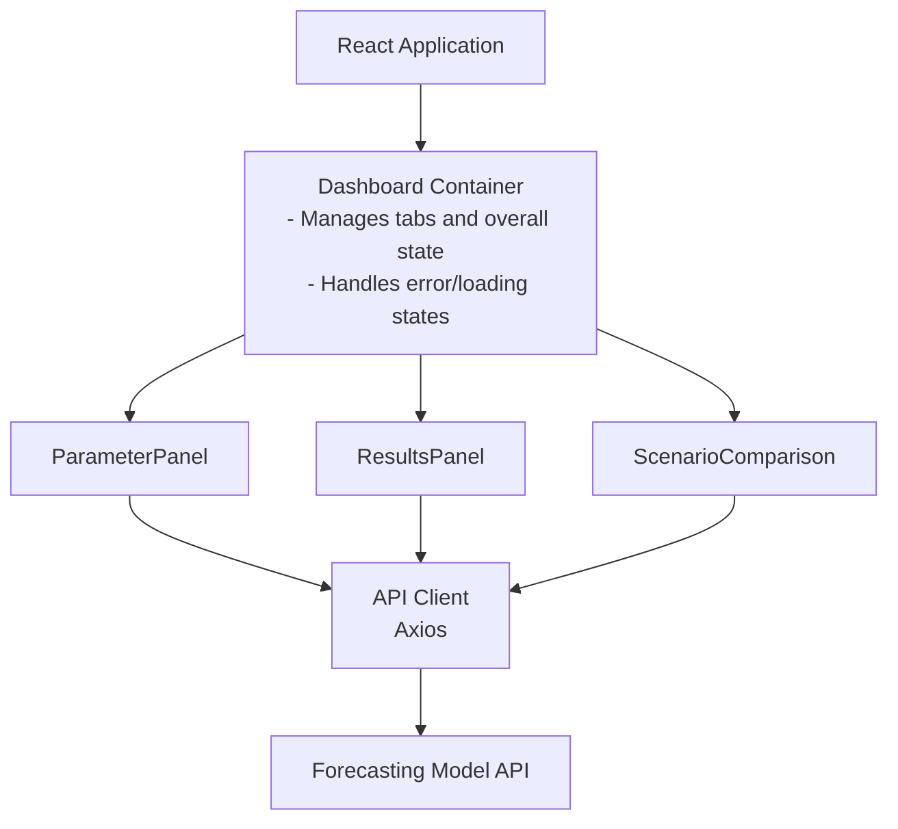
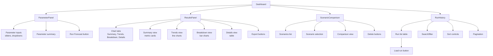
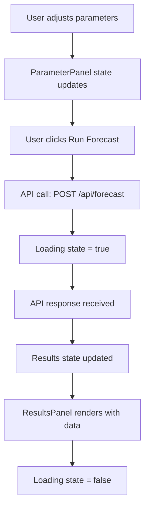
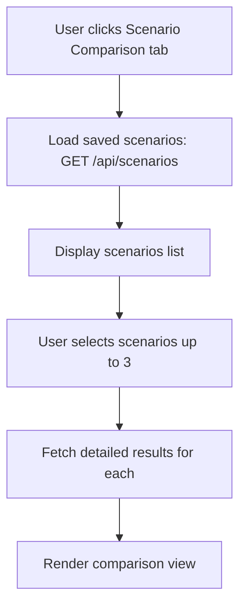
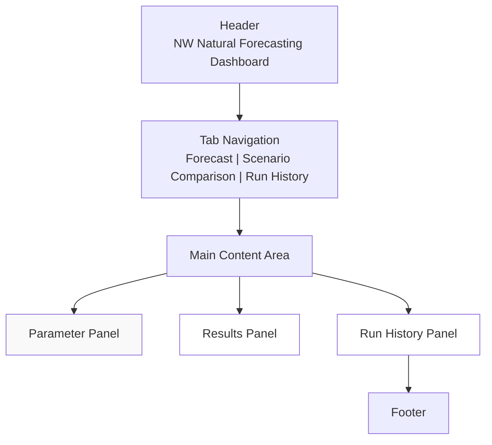
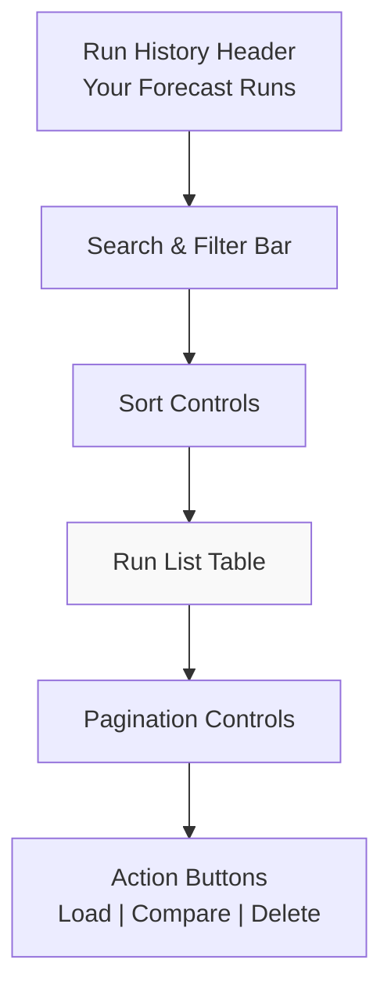

# Web Dashboard Design

## Architecture Overview



## Component Hierarchy



## Data Flow

### Forecast Execution Flow



### Scenario Comparison Flow



## State Management

### Dashboard State
```javascript
{
  results: null,           // Current forecast results
  loading: false,          // API call in progress
  error: null,             // Error message if any
  activeTab: 'forecast',   // Current tab view
  scenarios: []            // List of saved scenarios
}
```

### ParameterPanel State
```javascript
{
  params: {
    base_year: 2025,
    forecast_horizon: 10,
    housing_growth_rate: 0.01,
    electrification_rate: 0.05,
    efficiency_improvement: 0.02,
    weather_assumption: 'normal'
  },
  scenarioName: ''
}
```

### ResultsPanel State
```javascript
{
  activeChart: 'summary'  // Current chart view
}
```

### ScenarioComparison State
```javascript
{
  loading: false,
  selectedScenarios: []   // Array of selected scenario IDs
}
```

## API Endpoints

### POST /api/forecast
Execute forecast with parameters.

**Request:**
```json
{
  "base_year": 2025,
  "forecast_horizon": 10,
  "housing_growth_rate": 0.01,
  "electrification_rate": 0.05,
  "efficiency_improvement": 0.02,
  "weather_assumption": "normal"
}
```

**Response:**
```json
{
  "scenario_id": "abc123",
  "base_year": 2025,
  "forecast_horizon": 10,
  "total_demand_2035": 1500000,
  "upc_2035": 750,
  "demand_change_pct": -5.2,
  "electrification_impact": -8.5,
  "total_premises": 2000,
  "total_equipment": 5000,
  "results_by_year": [
    {
      "year": 2025,
      "total_demand": 1600000,
      "upc": 800,
      "by_segment": {...},
      "by_enduse": {...}
    }
  ]
}
```

### GET /api/scenarios
Get list of saved scenarios.

**Response:**
```json
[
  {
    "id": "scenario1",
    "name": "High Electrification",
    "created_at": "2026-04-10T12:00:00Z",
    "housing_growth_rate": 0.01,
    "electrification_rate": 0.15,
    "efficiency_improvement": 0.02,
    "weather_assumption": "normal"
  }
]
```

### POST /api/scenarios
Save a scenario.

### GET /api/results/{scenario_id}
Get detailed results for a scenario.

### GET /api/results/{scenario_id}/export/csv
Export results as CSV.

### GET /api/results/{scenario_id}/export/json
Export results as JSON.

## UI Layout

### Main Dashboard Layout



### Run History Tab Layout



## Styling System

### Color Palette
- Primary: `#667eea` (purple)
- Secondary: `#764ba2` (dark purple)
- Background: `#f5f5f5` (light gray)
- Surface: `#ffffff` (white)
- Text: `#333333` (dark gray)
- Border: `#dddddd` (light gray)
- Success: `#4caf50` (green)
- Error: `#d32f2f` (red)
- Warning: `#ff9800` (orange)

### Typography
- Font Family: System fonts (Segoe UI, Roboto, etc.)
- Heading 1: 2rem, bold
- Heading 2: 1.3rem, bold
- Heading 3: 1rem, bold
- Body: 0.95rem, regular
- Small: 0.85rem, regular

### Spacing
- Base unit: 0.5rem
- Padding: 1rem, 1.5rem, 2rem
- Margin: 0.5rem, 1rem, 1.5rem, 2rem
- Gap: 0.5rem, 1rem, 1.5rem, 2rem

### Responsive Breakpoints
- Mobile: < 768px
- Tablet: 768px - 1024px
- Desktop: > 1024px

## Component Specifications

### ParameterPanel
- Sticky positioning on desktop
- Scrollable on mobile
- Real-time value display
- Parameter validation
- Reset functionality

### ResultsPanel
- Tab-based navigation
- Multiple chart types
- Responsive grid layout
- Export functionality
- Loading states

### ScenarioComparison
- Grid layout for scenarios
- Multi-select with limit (3)
- Comparison view
- Delete confirmation
- Empty state handling

### RunHistory
- Paginated table of all forecast runs
- Search by scenario name or parameters
- Sort by date, duration, demand, UPC
- Filter by date range, parameter ranges
- Load run button to restore parameters and results
- Compare selected runs (up to 3)
- Delete run with confirmation
- Show run metadata (timestamp, duration, key results)
- Empty state when no runs exist

## RunHistory Component Specification

### Features

**Run List Display**:
- Table with columns: Timestamp, Scenario Name, Duration, Total Demand, UPC, Demand Change %, Actions
- Each row represents one forecast run
- Rows clickable to expand and show full parameters
- Hover effects to highlight row
- Alternating row colors for readability

**Search & Filter**:
- Search box to filter by scenario name or parameter values
- Date range picker (from/to dates)
- Parameter range filters:
  - Housing growth rate (0-5%)
  - Electrification rate (0-100%)
  - Efficiency improvement (0-20%)
  - Weather assumption (dropdown: cold, normal, warm)
- Filter button to apply all filters
- Clear filters button to reset
- Show active filter count

**Sort Controls**:
- Sortable columns: Timestamp, Duration, Total Demand, UPC
- Click column header to sort
- Visual indicator (arrow) showing sort direction
- Default sort: Timestamp descending (newest first)

**Pagination**:
- Show 20 runs per page (configurable)
- Previous/Next buttons
- Page number input
- Show "X of Y" results
- Disable Previous on first page, Next on last page

**Row Actions**:
- Load button: Restore parameters and results to Forecast tab
- Compare button: Select up to 3 runs for comparison
- Delete button: Remove run from history (with confirmation)
- Checkbox to select multiple runs for bulk actions

**Bulk Actions**:
- Select all checkbox in header
- Compare selected (up to 3)
- Delete selected (with confirmation)
- Show count of selected runs

**Empty State**:
- Show message: "No forecast runs yet. Start by running a forecast."
- Show link to Forecast tab
- Show icon or illustration

**Loading State**:
- Show skeleton loaders for table rows
- Show loading spinner
- Disable all interactions

**Error State**:
- Show error message: "Could not load forecast history"
- Show retry button
- Log error to console

### Data Flow

**Load Run History**:
1. User clicks "Run History" tab
2. Call GET /api/user/forecast-history (page 1, default sort)
3. Display results in table
4. Show pagination controls

**Search/Filter**:
1. User enters search term or adjusts filters
2. Debounce input (500ms)
3. Call GET /api/user/forecast-history with query parameters
4. Reset to page 1
5. Update table with results

**Sort**:
1. User clicks column header
2. Toggle sort direction (asc/desc)
3. Call GET /api/user/forecast-history with sort_by and sort_order
4. Update table with results

**Pagination**:
1. User clicks Previous/Next or enters page number
2. Call GET /api/user/forecast-history with page parameter
3. Update table with results
4. Scroll to top of table

**Load Run**:
1. User clicks "Load" button on a run
2. Call GET /api/user/forecast-history/{forecast_id}
3. Restore parameters to ParameterPanel
4. Restore results to ResultsPanel
5. Switch to Forecast tab
6. Show success message: "Forecast loaded"

**Compare Runs**:
1. User selects up to 3 runs via checkboxes
2. Click "Compare" button
3. Switch to Scenario Comparison tab
4. Load comparison view with selected runs
5. Show parameter differences and result overlays

**Delete Run**:
1. User clicks "Delete" button
2. Show confirmation dialog: "Delete this forecast run?"
3. If confirmed:
   - Call DELETE /api/user/forecast-history/{forecast_id}
   - Remove row from table
   - Show success message: "Forecast deleted"
4. If cancelled: Close dialog

### State Management

**RunHistory State**:
```javascript
{
  runs: [],                    // Array of forecast runs
  loading: false,              // API call in progress
  error: null,                 // Error message if any
  page: 1,                     // Current page
  pageSize: 20,                // Results per page
  totalCount: 0,               // Total number of runs
  sortBy: 'timestamp',         // Sort field
  sortOrder: 'desc',           // Sort direction
  searchTerm: '',              // Search query
  filters: {                   // Active filters
    dateFrom: null,
    dateTo: null,
    housingGrowthMin: null,
    housingGrowthMax: null,
    electrificationMin: null,
    electrificationMax: null,
    weatherAssumption: null
  },
  selectedRuns: [],            // Array of selected run IDs
  expandedRunId: null          // Currently expanded run (if any)
}
```

### Correctness Properties for RunHistory

**Property 1: Run List Consistency**
- Runs displayed must match server data exactly
- Pagination must not skip or duplicate runs
- Sort order must be consistent with sort parameters

**Property 2: Search Accuracy**
- Search results must contain search term in scenario name or parameters
- Case-insensitive search
- Partial matches allowed

**Property 3: Filter Correctness**
- Filtered results must satisfy all active filters
- Date range inclusive (from <= date <= to)
- Parameter ranges inclusive (min <= value <= max)

**Property 4: Selection Limit**
- Cannot select more than 3 runs for comparison
- Compare button disabled if < 2 runs selected
- Checkbox disabled if 3 runs already selected

**Property 5: Load Run Fidelity**
- Loaded parameters must exactly match saved parameters
- Loaded results must exactly match saved results
- No data transformation or loss

**Property 6: Delete Idempotency**
- Deleting same run twice should not error
- Deleted run should not appear in list after refresh
- Other runs unaffected by deletion

## Error Handling

### API Errors
- Display user-friendly error message
- Log detailed error to console
- Provide retry option
- Clear error on new action

### Validation Errors
- Highlight invalid inputs
- Show validation message
- Prevent submission
- Clear on correction

### Network Errors
- Detect connection loss
- Show offline message
- Queue requests for retry
- Restore on reconnection

## Performance Optimizations

1. **Code Splitting**: Lazy load components
2. **Memoization**: Prevent unnecessary re-renders
3. **Debouncing**: Throttle parameter changes
4. **Caching**: Cache API responses
5. **Compression**: Gzip static assets
6. **CDN**: Serve static files from CDN

## Accessibility

- WCAG 2.1 AA compliance
- Semantic HTML
- ARIA labels
- Keyboard navigation
- Color contrast ratios
- Focus indicators
- Screen reader support

## Security

- Input validation
- XSS protection
- CSRF tokens (if needed)
- HTTPS only
- API key management
- Rate limiting
- CORS configuration

## Correctness Properties

These properties define the formal correctness guarantees the dashboard must maintain:

### Property 1: Parameter Range Invariant
**Definition**: All parameter values must remain within their defined valid ranges at all times.

**Specification**:
- `housing_growth_rate` ∈ [0, 0.05]
- `electrification_rate` ∈ [0, 1.0]
- `efficiency_improvement` ∈ [0, 0.20]
- `forecast_horizon` ∈ [1, 30]
- `base_year` ∈ [2020, 2030]
- `weather_assumption` ∈ {cold, normal, warm}

**Validation**: UI controls enforce min/max constraints; API rejects out-of-range values with 400 error.

### Property 2: Forecast Consistency
**Definition**: Running a forecast with identical parameters must produce identical results.

**Specification**: For any parameter set P, `forecast(P) = forecast(P)` across multiple executions.

**Validation**: Test suite runs same forecast twice and compares results byte-for-byte.

### Property 3: Scenario Parameter Integrity
**Definition**: Saved scenario parameters must exactly match the parameters used to generate the forecast.

**Specification**: For scenario S with parameters P, `S.parameters = P` always holds.

**Validation**: After saving, retrieve scenario and verify all parameters match original request.

### Property 4: Comparison Accuracy
**Definition**: Scenario comparison must accurately reflect parameter differences.

**Specification**: For scenarios S1 and S2, `comparison.differences[param] = S2[param] - S1[param]` for all parameters.

**Validation**: Compare calculated differences against manual calculation for test scenarios.

### Property 5: Export Data Fidelity
**Definition**: Exported data must exactly match displayed results.

**Specification**: For any result set R, `export(R).data = R` (no data loss or transformation).

**Validation**: Export results, parse exported file, compare with original result object.

### Property 6: Error Handling Completeness
**Definition**: All error conditions must be caught and handled gracefully without data loss.

**Specification**: For any error E, the application must:
1. Display user-friendly error message
2. Log detailed error to console
3. Preserve application state
4. Allow user to retry or navigate away

**Validation**: Inject errors at each API call point and verify all conditions are met.

### Property 7: State Consistency
**Definition**: UI state must always reflect the current data state.

**Specification**: If results exist, ResultsPanel must be visible and populated; if loading, loading indicator must show; if error, error message must display.

**Validation**: State machine testing to verify all state transitions are valid.

## Accessibility Specifications

### Keyboard Navigation

**Parameter Controls**:
- Tab order: Base Year → Forecast Horizon → Housing Growth → Electrification → Efficiency → Weather → Scenario Name
- Sliders: Arrow keys to adjust value (left/down = decrease, right/up = increase)
- Dropdowns: Arrow keys to navigate options, Enter to select
- Buttons: Enter or Space to activate

**Tab Navigation**:
- Tab key cycles through: Forecast tab → Scenario Comparison tab
- Shift+Tab cycles backward
- Active tab indicated by focus ring

**Results Panel**:
- Tab key cycles through chart tabs
- Chart tabs keyboard accessible
- Table rows navigable with arrow keys

**Scenario Selection**:
- Tab through scenario cards
- Space to select/deselect (up to 3)
- Delete button accessible via keyboard

### Screen Reader Support

**Loading States**:
- Announce "Loading forecast results" when API call starts
- Announce "Forecast complete" when results arrive
- Announce error messages immediately

**Chart Content**:
- Provide text alternative for each chart (summary of key data points)
- Announce chart type and data range
- Include data table as alternative to visual chart

**Form Feedback**:
- Announce validation errors immediately
- Announce parameter value changes
- Announce successful save/delete actions

**Focus Management**:
- Move focus to error message when validation fails
- Move focus to results when forecast completes
- Move focus to confirmation dialog when delete is triggered

### Color & Contrast

**Minimum Contrast Ratios**:
- Text on background: 4.5:1 (normal text), 3:1 (large text)
- UI components: 3:1 for borders and focus indicators
- Chart elements: 3:1 between adjacent colors

**Color Independence**:
- Don't rely on color alone to convey information
- Use patterns, icons, or text labels in addition to color
- Ensure charts are readable in grayscale

### Focus Indicators

- Visible focus ring on all interactive elements
- Minimum 2px width, high contrast color
- Not obscured by other elements
- Consistent across all components

## Chart Interactivity Specifications

### Hover Interactions

**Desktop**:
- Tooltip appears on hover showing exact values
- Tooltip includes: value, unit, date/category, percentage change (if applicable)
- Tooltip positioned to avoid obscuring data
- Tooltip disappears on mouse leave

**Mobile**:
- Tap to show tooltip (no hover)
- Tap elsewhere to dismiss tooltip
- Tooltip positioned above finger to avoid obscuring

### Zoom & Pan

**Line Charts (Trends)**:
- Scroll wheel to zoom in/out
- Click and drag to pan horizontally
- Double-click to reset to original view
- Zoom limits: 1x to 10x

**Bar Charts (Breakdown)**:
- Scroll wheel to zoom in/out on Y-axis
- No horizontal panning (categories fixed)
- Double-click to reset

**Stacked Area Charts**:
- Hover over segment to highlight that segment
- Click segment to toggle visibility
- Scroll to zoom Y-axis

### Legend Interaction

- Click legend item to toggle series visibility
- Hover legend item to highlight corresponding data
- Double-click legend item to isolate that series

### Export Chart

- "Download Chart" button exports current view as PNG
- Includes title, legend, and axis labels
- Filename: `forecast-{chart-type}-{date}.png`

### Mobile Touch Interactions

- Two-finger pinch to zoom
- Two-finger drag to pan
- Tap to show tooltip
- Long-press to show context menu (copy, download, etc.)

## Edge Cases & Error Scenarios

### API Errors

**Timeout (> 5 seconds)**:
- Show: "Request timed out. Please try again."
- Provide retry button
- Log timeout to console with timestamp
- Preserve current state

**Network Error (no connection)**:
- Show: "Network connection lost. Please check your connection."
- Queue request for retry when connection restored
- Show offline indicator in header
- Disable Run Forecast button

**400 Bad Request (invalid parameters)**:
- Show: "Invalid parameters. Please check your input."
- Highlight invalid fields in red
- Show specific error for each field (e.g., "Value must be between 0 and 5")
- Prevent submission until corrected

**401 Unauthorized (API key invalid)**:
- Show: "Authentication failed. Please check your API key."
- Log to console (don't expose key)
- Disable all API calls
- Suggest checking .env configuration

**403 Forbidden (rate limited)**:
- Show: "Too many requests. Please wait before trying again."
- Display countdown timer (e.g., "Try again in 30 seconds")
- Disable Run Forecast button until timer expires
- Queue request for automatic retry

**500 Server Error**:
- Show: "Server error. Please try again later."
- Provide retry button
- Log full error response to console
- Suggest contacting support if persists

**Partial Data Response**:
- If some results missing but forecast succeeded:
  - Show available data
  - Display warning: "Some data unavailable"
  - Log missing fields to console
- If critical data missing:
  - Treat as error
  - Show: "Incomplete results received. Please try again."

### Data Handling Edge Cases

**Empty Results**:
- Show: "No results available for this forecast"
- Display parameter summary
- Suggest adjusting parameters
- Keep previous results visible (if any)

**Very Large Datasets (1000+ data points)**:
- Implement data aggregation/sampling for display
- Show: "Large dataset detected. Showing aggregated view."
- Provide option to download full data as CSV
- Limit chart rendering to 500 points max
- Use virtual scrolling for tables

**Missing Data Points**:
- Line charts: Skip missing points (don't interpolate)
- Bar charts: Show empty bar or "N/A"
- Tables: Show "—" for missing values
- Log missing data to console

**Inconsistent Data Types**:
- Validate all numeric fields are numbers
- Validate all date fields are valid ISO dates
- Validate all string fields are non-empty
- Show error if validation fails

### Scenario Management Edge Cases

**Duplicate Scenario Names**:
- Allow duplicate names (append timestamp to ID)
- Show warning: "A scenario with this name already exists"
- Suggest unique name
- Allow user to proceed or cancel

**Delete Scenario While Comparing**:
- If deleted scenario is in comparison:
  - Remove from comparison
  - Show: "Scenario was deleted"
  - Refresh comparison view
- If last scenario deleted:
  - Show: "No scenarios available"
  - Show empty state

**Scenario with Missing Parameters**:
- If scenario missing any parameter:
  - Use default value
  - Log warning to console
  - Show: "Some parameters missing. Using defaults."

**Compare Scenarios with Different Horizons**:
- Show both horizons in comparison
- Align data by year (not by index)
- Show: "Scenarios have different forecast horizons"
- Highlight differences in horizon

### Browser/Session Edge Cases

**Page Refresh During Forecast**:
- Cancel in-flight API request
- Clear loading state
- Show: "Forecast was cancelled"
- Preserve parameter values

**Page Refresh During Export**:
- Cancel export
- Show: "Export was cancelled"
- Provide retry button

**Multiple Tabs Open**:
- Each tab maintains independent state
- Scenarios list may be stale in other tabs
- Refresh scenarios list when switching tabs
- Show: "Scenarios list updated" if changes detected

**Browser Back Button**:
- Preserve parameter values
- Preserve results (if any)
- Preserve active tab
- Don't trigger new forecast

**Session Timeout**:
- If API key expires:
  - Show: "Session expired. Please refresh the page."
  - Disable all API calls
  - Provide refresh button

## API Contract Specifications

### Error Response Format

All error responses follow this format:

```json
{
  "error": {
    "code": "ERROR_CODE",
    "message": "User-friendly error message",
    "details": {
      "field": "parameter_name",
      "reason": "Detailed reason for error"
    },
    "timestamp": "2026-04-10T12:00:00Z",
    "request_id": "req_abc123"
  }
}
```

**Error Codes**:
- `INVALID_PARAMETERS` - One or more parameters out of range
- `MISSING_PARAMETERS` - Required parameter missing
- `API_TIMEOUT` - Request exceeded timeout
- `RATE_LIMITED` - Too many requests
- `UNAUTHORIZED` - Invalid API key
- `SERVER_ERROR` - Internal server error
- `INVALID_SCENARIO_ID` - Scenario not found
- `INVALID_FORMAT` - Request format invalid

### Rate Limiting

**Limits**:
- 60 requests per minute per API key
- 10 concurrent forecast requests per API key
- 1000 requests per hour per API key

**Response Headers**:
- `X-RateLimit-Limit`: Total requests allowed
- `X-RateLimit-Remaining`: Requests remaining
- `X-RateLimit-Reset`: Unix timestamp when limit resets

**Behavior**:
- Return 429 status when limit exceeded
- Include `Retry-After` header with seconds to wait
- Queue requests client-side for automatic retry

### Request/Response Format

**All requests**:
- Content-Type: `application/json`
- Accept: `application/json`
- Include `X-Request-ID` header for tracing

**All responses**:
- Content-Type: `application/json`
- Include `X-Request-ID` header (matches request)
- Include `X-Response-Time` header (milliseconds)

### Timeout Specifications

- Connection timeout: 5 seconds
- Read timeout: 30 seconds
- Total request timeout: 60 seconds
- Retry strategy: Exponential backoff (1s, 2s, 4s, 8s, max 30s)
- Max retries: 3 attempts

### Authentication

**API Key Management**:
- API key passed via `Authorization: Bearer {key}` header
- Never log API key to console
- Rotate key if exposed
- Support multiple keys (for testing)

**Key Validation**:
- Validate key format on client (basic check)
- Server validates key on each request
- Return 401 if key invalid or expired

## State Persistence Strategy

### Server-Side State Persistence

**Persisted State** (stored on server per user):
- Parameter values (all 6 parameters)
- Active tab (Forecast or Scenario Comparison)
- Active chart view (Summary, Trends, Breakdown, Details)
- Chart preferences (zoom level, pan position)
- User preferences (theme, language - future)
- Forecast history (all runs with timestamps)
- User activity log (for analytics)

**Rationale**: Server-side persistence enables:
- Tracking individual user behavior and parameter usage
- Cross-device synchronization (user can switch devices)
- Analytics on which parameters users adjust most
- Audit trail for compliance
- Better error recovery

### API Endpoints for State Management

#### GET /api/user/state
Retrieve user's saved state on page load.

**Response**:
```json
{
  "user_id": "user123",
  "parameters": {
    "base_year": 2025,
    "forecast_horizon": 10,
    "housing_growth_rate": 0.01,
    "electrification_rate": 0.05,
    "efficiency_improvement": 0.02,
    "weather_assumption": "normal"
  },
  "activeTab": "forecast",
  "activeChart": "summary",
  "chartPreferences": {
    "zoomLevel": 1,
    "panX": 0,
    "panY": 0
  },
  "last_updated": "2026-04-10T12:00:00Z"
}
```

#### PUT /api/user/state
Update user's state (debounced, called every 5 seconds or on explicit save).

**Request**:
```json
{
  "parameters": {...},
  "activeTab": "forecast",
  "activeChart": "summary",
  "chartPreferences": {...}
}
```

**Response**: 200 OK with updated state

#### POST /api/user/activity
Log user activity for analytics (called on significant actions).

**Request**:
```json
{
  "action": "forecast_run",
  "parameters": {...},
  "timestamp": "2026-04-10T12:00:00Z",
  "duration_ms": 2500
}
```

**Activity Types**:
- `forecast_run` - User ran a forecast
- `parameter_change` - User adjusted a parameter
- `tab_switch` - User switched tabs
- `chart_view_change` - User changed chart view
- `scenario_save` - User saved a scenario
- `scenario_compare` - User compared scenarios
- `export_csv` - User exported CSV
- `export_json` - User exported JSON

#### GET /api/user/forecast-history
Retrieve user's forecast execution history with pagination and filtering.

**Query Parameters**:
- `page` (default: 1) - Page number
- `page_size` (default: 20) - Results per page
- `sort_by` (default: "timestamp") - Sort field: timestamp, duration, total_demand, upc
- `sort_order` (default: "desc") - asc or desc
- `search` (optional) - Search in scenario name and parameters
- `date_from` (optional) - ISO date, filter runs after this date
- `date_to` (optional) - ISO date, filter runs before this date
- `housing_growth_min` (optional) - Filter by min housing growth rate
- `housing_growth_max` (optional) - Filter by max housing growth rate
- `electrification_min` (optional) - Filter by min electrification rate
- `electrification_max` (optional) - Filter by max electrification rate

**Response**:
```json
{
  "forecasts": [
    {
      "id": "forecast_abc123",
      "scenario_name": "High Electrification",
      "parameters": {
        "base_year": 2025,
        "forecast_horizon": 10,
        "housing_growth_rate": 0.01,
        "electrification_rate": 0.15,
        "efficiency_improvement": 0.02,
        "weather_assumption": "normal"
      },
      "timestamp": "2026-04-10T12:00:00Z",
      "duration_ms": 2500,
      "result_summary": {
        "total_demand": 1500000,
        "upc": 750,
        "demand_change_pct": -5.2,
        "electrification_impact": -8.5
      }
    }
  ],
  "total_count": 42,
  "page": 1,
  "page_size": 20,
  "total_pages": 3
}
```

### GET /api/user/forecast-history/{forecast_id}
Retrieve full details of a specific forecast run.

**Response**:
```json
{
  "id": "forecast_abc123",
  "scenario_name": "High Electrification",
  "parameters": {...},
  "timestamp": "2026-04-10T12:00:00Z",
  "duration_ms": 2500,
  "results": {
    "scenario_id": "abc123",
    "total_demand_2035": 1500000,
    "upc_2035": 750,
    "demand_change_pct": -5.2,
    "electrification_impact": -8.5,
    "total_premises": 2000,
    "total_equipment": 5000,
    "results_by_year": [...]
  }
}
```

### DELETE /api/user/forecast-history/{forecast_id}
Delete a specific forecast run from history.

**Response**: 204 No Content

### Persistence Behavior

**On Page Load**:
1. Call GET /api/user/state
2. If state exists:
   - Restore parameters
   - Restore active tab
   - Restore chart preferences
3. If state missing or error:
   - Use default values
   - Set active tab to "Forecast"
   - Set chart to "Summary"
4. Display state restoration status (silent if successful)

**On Parameter Change**:
- Update local state immediately (for responsiveness)
- Debounce server update (500ms)
- Call PUT /api/user/state when debounce completes
- Show save indicator (subtle, e.g., "Saving...")
- Log activity via POST /api/user/activity (debounced, 5 seconds)

**On Tab Switch**:
- Update local state immediately
- Call PUT /api/user/state immediately
- Log activity via POST /api/user/activity

**On Chart View Change**:
- Update local state immediately
- Call PUT /api/user/state immediately
- Log activity via POST /api/user/activity

**On Forecast Execution**:
- Run forecast via POST /api/forecast
- Log activity via POST /api/user/activity with duration
- Store forecast in history (server-side)
- Update state with latest parameters

**On Page Unload**:
- Flush any pending state updates
- Ensure final state is saved to server
- Cancel in-flight requests gracefully

### Non-Persisted State

**Session-Only State** (cleared on page refresh):
- Current forecast results
- Loading state
- Error messages
- Scenarios list (fetched fresh from API)
- Selected scenarios for comparison

**Rationale**: Results are time-sensitive; scenarios should always be fresh from server.

### Data Retention

**User State**: Indefinite
- Kept until user deletes account
- Rationale: User may return after weeks/months

**Forecast History**: 1 year
- Older forecasts archived or deleted
- Rationale: Reduces storage; users typically care about recent runs

**Activity Log**: 90 days
- Older logs archived for analytics
- Rationale: Sufficient for usage analysis; reduces storage

**Chart Preferences**: Indefinite
- Kept with user state
- Rationale: User preferences should persist

### Conflict Resolution

**If server state unavailable on load**:
- Use default values
- Show warning: "Could not load your saved state. Using defaults."
- Provide retry button
- Continue with defaults (don't block)

**If server state update fails**:
- Keep local state as-is
- Show warning: "Could not save state. Will retry."
- Retry automatically every 5 seconds
- Queue updates for retry

**If multiple tabs open**:
- Each tab fetches state independently on load
- Tabs may have stale state if other tab makes changes
- Provide "Refresh State" button to sync
- Show warning if state is stale (> 5 minutes old)
- Rationale: Simplifies implementation; users typically use one tab

**If state version mismatch**:
- If server state schema version differs from app version:
  - Attempt migration on server
  - If migration fails, discard old state
  - Use defaults
  - Log migration error to console

**If user switches accounts**:
- Clear all local state
- Fetch new user's state from server
- Log out old user session

### Analytics & Monitoring

**Tracked Metrics**:
- Most frequently adjusted parameters
- Average forecast execution time
- Most used chart views
- User session duration
- Feature adoption rates
- Error frequency by type

**Usage Reports** (available to admins):
- Active users per day/week/month
- Parameter usage distribution
- Forecast volume trends
- Common error scenarios
- Performance metrics by user segment

**Privacy Considerations**:
- Don't store actual forecast results (only summaries)
- Don't track user identity beyond user_id
- Comply with data retention policies
- Allow users to opt-out of analytics
- Anonymize data for reporting
